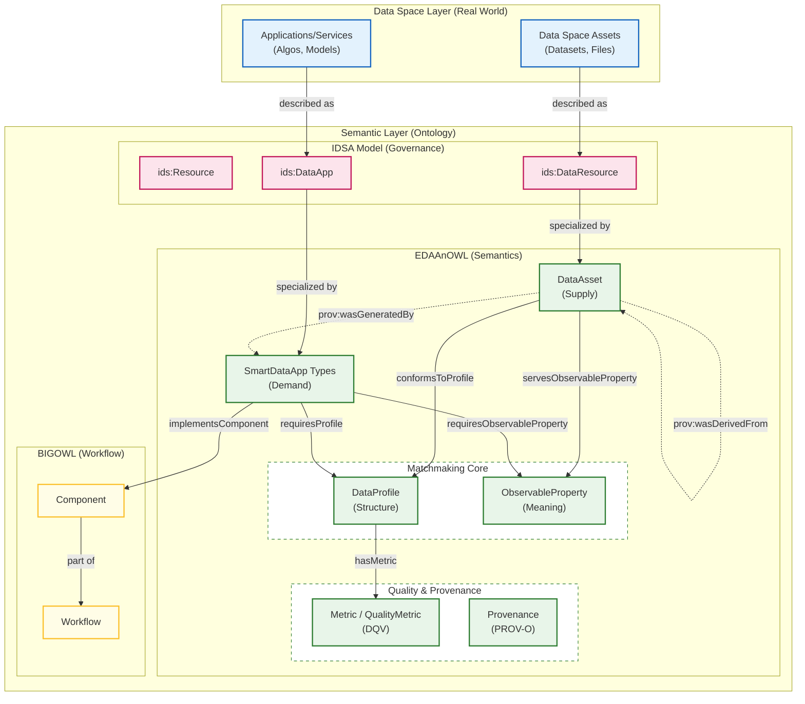
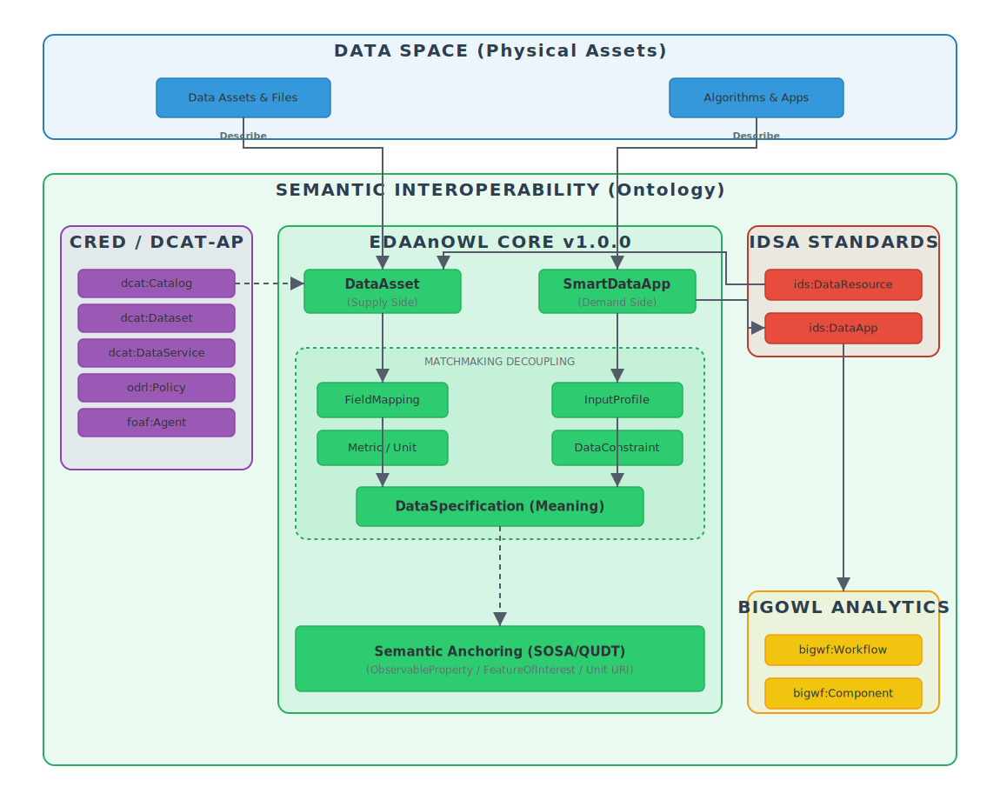

## 📐 Architecture Overview



## 🖼 Architecture diagram



Figure: High-level architecture showing how EDAAnOWL maps IDSA concepts (DataApp/DataResource) to BIGOWL components and publishes artifacts via DCAT, linking policies (ODRL/DPV). The image is stored in `images/` and can be reused in versioned READMEs.

### Architecture overview

The figure below shows how EDAAnOWL connects real-world data-space assets with semantic models from IDSA and BIGOWL.

The **Data Space Layer (Real World)** contains the actual assets:
- **Data Space Assets (Datasets, Files)** represent the raw or curated data made available in the space.
- **Applications/Services (Algos, Models)** represent smart data apps, analytics pipelines, or services that consume or produce data.

These assets are semantically described in the **Semantic Layer (Ontology)**, which combines three main vocabularies: the IDSA Information Model, EDAAnOWL, and BIGOWL.

### Alignment with the IDSA Information Model

In the IDSA model, **`ids:Resource`** is the generic notion of an asset in the data space. It is refined into:
- **`ids:DataResource`**, used to describe data assets (datasets, files, etc.).
- **`ids:DataApp`**, used to describe data-processing applications or services.

In EDAAnOWL, these classes are specialised to capture more domain-specific concepts:
- **`DataAsset`** is aligned with and specialises `ids:DataResource` (supply side).
- **Smart data app types** specialise `ids:DataApp` (demand side).

In practice:
- A real dataset (**Data Space Asset**) is **described as** an `ids:DataResource`, and further specialised as a `DataAsset`.
- A real application or service (**Application/Service**) is **described as** an `ids:DataApp`, and further specialised as a smart data app type.

This keeps compatibility with the IDSA Information Model while allowing EDAAnOWL to add more precise concepts for the project.

### Observable properties: matching supply and demand

EDAAnOWL introduces **`ObservableProperty`** to represent **what is being measured or described** (the semantic “meaning” of the data).

- A **DataAsset** *serves* one or more observable properties  
  – “I provide X” → the dataset contains observations of X.
- A **Smart Data App** *requires* one or more observable properties  
  – “I need X” → the app expects data about X as input.

By connecting both sides to the same `ObservableProperty`, the architecture supports semantic matching between what datasets offer and what applications need.

### Data profiles: structural compatibility

Semantic meaning is not enough; the **structure** of the data also matters. For this, EDAAnOWL defines **`DataProfile`**:

- A **DataAsset** **conformsToProfile** a `DataProfile`, which describes its schema, formats, and structural constraints.
- A **Smart Data App** **requiresProfile** a `DataProfile`, which describes the expected input structure.

This creates a two-dimensional matching space:
- **ObservableProperty** → meaning (what is described).
- **DataProfile** → structure (how it is represented).

Together, they enable more robust discovery and interoperability between data assets and smart data apps.

### Data Quality and Provenance

EDAAnOWL v0.3.1 (building on v0.3.0) provides explicit support for data quality and lineage:

- **Metrics (`Metric`, `QualityMetric`)**: A `DataProfile` can define multiple metrics using `:hasMetric`. These align with `dqv:Metric`, allowing users to specify quality indicators (e.g., completeness, accuracy) or descriptive statistics (e.g., record count) with values and units.
- **Provenance (`prov:wasGeneratedBy`)**: A `DataAsset` can be linked back to the `ids:SmartDataApp` (e.g., a `:PredictionApp`) that created it. This enables full lineage tracing from the raw data, through the processing app, to the derived asset.

### Workflow perspective with BIGOWL

The **BIGOWL** part of the diagram introduces the workflow view:

- **`Workflow`** represents an analytical or data-processing pipeline.
- **`Component`** represents a step, operator, or module within that workflow.

Smart data apps are linked to this workflow layer by:
- **Smart data app types** **implementComponent**, meaning they realise or execute specific BIGOWL components.
- Components are **part of** a workflow, placing the app in the context of a larger analytical or processing chain.

This alignment allows:
- EDAAnOWL to describe assets and apps at the data-space level.
- BIGOWL to describe how those apps participate in concrete analytical workflows.

Together, these layers provide a coherent view from real assets and services, through their semantic descriptions, to their role in executable workflows.

---

## 📁 Repository Structure & Branching Model

This repository uses a `dev` -> `main` -> `gh-pages` git flow.

> [!CAUTION]
> **Do NOT commit directly in `main` branch.** All changes must come from the `dev` branch via a Pull Request.

> [!CAUTION]
> **`gh-pages` branch is AUTO-GENERATED. DO NOT EDIT MANUALLY.**

- **`main` branch**:

  - **Purpose**: This branch represents the most recent _stable, released_ version of the ontology.
  
  - Creating a "Release" from this branch triggers the `gh-pages` deployment.

  - **Structure**:
    - `/src/`
      - `0.0.1/` (Ontology and vocabs for v0.0.1)
      - `0.0.2/` (Ontology and vocabs for v0.0.2)
    - `/.github/workflows/` (The CI/CD workflow)

- **`dev` branch**:

  - **Purpose**: This is the main **development branch**. All new features, fixes, and preparations for the _next_ version happen here.
  - All Pull Requests should be targeted at `dev`.
  
  - **Structure**:
    - Same as `main`, but may contain the _next_ unreleased version folder (e.g., `src/0.0.3/`) while it is in progress.

- **`gh-pages` branch**:

  - **Purpose**: This branch contains the static output of the `release.yml` workflow. It hosts the public-facing documentation and RDF files served by GitHub Pages.

  - **Structure**:

    - `/latest/` (A mirror of the most recent version)
    - `/0.0.1/` (A snapshot of the v0.0.1 documentation and files)
    - `/0.0.2/` (A snapshot of the v0.0.2 documentation and files)
    - `.nojekyll` (Disables Jekyll on GitHub Pages)

- **Feature Branches (e.g., `feat/my-fix`)**:

  - **Purpose**: Temporary branches for new work. They should be based on `dev` and merged back into `dev` via a Pull Request.

---

## 🧪 Local Validation (Docker-based)

This repository includes a Docker-based local validation environment to check the ontology and its vocabularies _before_ creating a new release.

The validation pipeline performs three main checks:

1. **RDF Syntax Validation**

   - Script: `scripts/check_rdf.py`
   - Runs inside a Docker container with Python and `rdflib`.
   - It automatically detects the **latest version folder** under `src/` (e.g. `src/0.0.1/`) and parses all `*.ttl` files in:
     - `src/<version>/`
     - `src/<version>/vocabularies/`
     - `src/<version>/examples/`
     - `src/<version>/shapes/`
   - If any file is not well-formed RDF, the script fails with a non-zero exit code and prints a summary.

2. **SHACL Validation (pySHACL)**

   - Tool: [`pyshacl`](https://github.com/RDFLib/pySHACL) (installed in the Docker image).
   - Validates:
     - Main ontology: `src/<version>/EDAAnOWL.ttl`
     - Against shapes: `src/<version>/shapes/edaan-shapes.ttl`
     - With test data: `src/<version>/examples/test-consistency.ttl`
   - The validation runs with:
     - RDFS inference (`-i rdfs`)
     - Meta-SHACL checks (`-m`)
   - The process prints a SHACL validation report and fails if `Conforms: False`.

3. **OWL Consistency Check (ROBOT + ELK)**
   - Tool: [`ROBOT`](http://robot.obolibrary.org/) with ELK reasoner
   - Validates:
     - Main ontology: `src/<version>/EDAAnOWL.ttl`
     - Test instances: `src/<version>/examples/test-consistency.ttl`
   - Performs:
     - Consistency checking
     - Classification
     - Instance realization
   - If reasoning fails, the validation script reports an error.

### Docker Image

All local validations run in the same Docker image, defined by the root-level `Dockerfile`:

- Base image: `eclipse-temurin:17-jdk-jammy` (JDK 17)
- Installs:
  - `python3`, `python3-pip`
  - Python packages: `rdflib`, `pyshacl`
  - `wget` to download `robot.jar`
- Downloads ROBOT to:
  - `/opt/robot/robot.jar`
- Sets the default working directory to:
  - `/app`, where the repository is mounted at runtime (`-v <repo>:/app`).

### Scripts & Usage

Two convenience scripts are provided to run the full local validation pipeline:

- **Windows**: `scripts/local-validate.bat`
- **Linux/macOS**: `scripts/local-validate.sh`

Both scripts:

1. Build (or rebuild) the Docker image:

   ```bash
   docker build -t edaanowl-validator -f Dockerfile .
   ```

2. Detect the latest version under src/ (e.g. src/0.0.1/).

3. Run:

- `scripts/check_rdf.py` (RDF syntax validation)
- `pyshacl` (SHACL validation)
- `ROBOT reason` (OWL consistency check)

If any step fails, the script prints an error message and exits with a non-zero code.

### How to run

From the repository root:

- On Windows (PowerShell or CMD):

  ```bash
  .\scripts\local-validate.bat
  ```

- On Linux/macOS:

  ```bash
  chmod +x scripts/local-validate.sh
  ./scripts/local-validate.sh
  ```

> [!NOTE]
> These scripts are intended to be used locally by developers before creating a new release, and can also be integrated into CI pipelines if desired.

---

## 🔗 Resolvability (PID)

This repository manages the _source code_. The Persistent Identifiers (PIDs) (e.g., `https://w3id.org/EDAAnOWL/...`) are resolved by the `.htaccess` file located in the [w3id.org repository](https://github.com/perma-id/w3id.org/tree/master/EDAAnOWL).

That `.htaccess` file points all requests to the documentation and files automatically built and published by our CI/CD workflow to the `gh-pages` branch, which is hosted at:

**`https://khaosresearch.github.io/EDAAnOWL/`**
