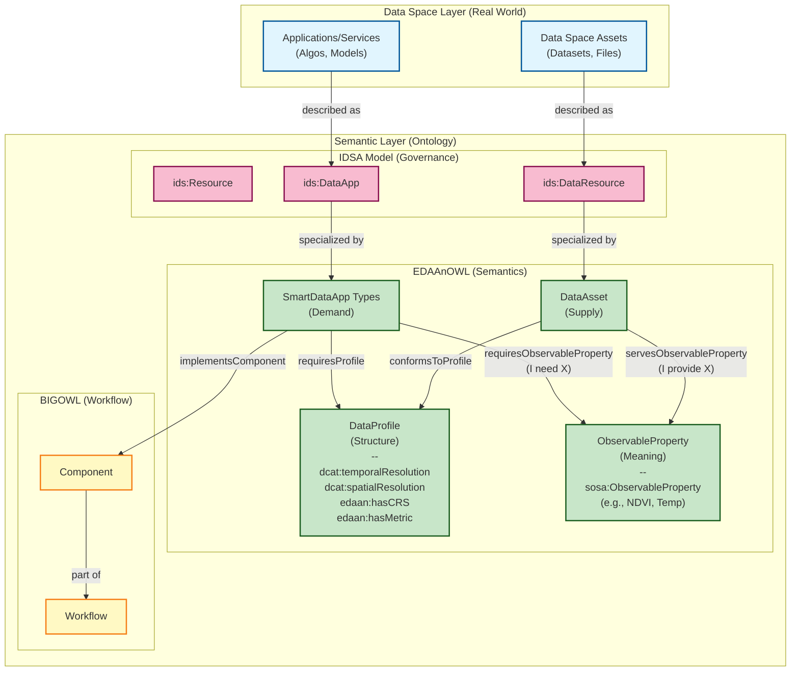

## 📐 Architecture Overview



## 🖼 Architecture diagram


Figure: High-level architecture showing how EDAAnOWL maps IDSA concepts (DataApp/DataResource) to BIGOWL components and publishes artifacts via DCAT, linking policies (ODRL/DPV). The image is stored in `images/` and can be reused in versioned READMEs.

---

## 📁 Repository Structure & Branching Model

This repository uses a `dev` -> `main` -> `gh-pages` git flow.

> [!CAUTION]
> **Do NOT commit directly in `main` branch.** All changes must come from the `dev` branch via a Pull Request.

> [!CAUTION]
> **`gh-pages` branch is AUTO-GENERATED. DO NOT EDIT MANUALLY.**

- **`main` branch**:

  - **Purpose**: This branch represents the most recent _stable, released_ version of the ontology.
  
  - Creating a "Release" from this branch triggers the `gh-pages` deployment.

  - **Structure**:
    - `/src/`
      - `0.0.1/` (Ontology and vocabs for v0.0.1)
      - `0.0.2/` (Ontology and vocabs for v0.0.2)
    - `/.github/workflows/` (The CI/CD workflow)

- **`dev` branch**:

  - **Purpose**: This is the main **development branch**. All new features, fixes, and preparations for the _next_ version happen here.
  - All Pull Requests should be targeted at `dev`.
  
  - **Structure**:
    - Same as `main`, but may contain the _next_ unreleased version folder (e.g., `src/0.0.3/`) while it is in progress.

- **`gh-pages` branch**:

  - **Purpose**: This branch contains the static output of the `release.yml` workflow. It hosts the public-facing documentation and RDF files served by GitHub Pages.

  - **Structure**:

    - `/latest/` (A mirror of the most recent version)
    - `/0.0.1/` (A snapshot of the v0.0.1 documentation and files)
    - `/0.0.2/` (A snapshot of the v0.0.2 documentation and files)
    - `.nojekyll` (Disables Jekyll on GitHub Pages)

- **Feature Branches (e.g., `feat/my-fix`)**:

  - **Purpose**: Temporary branches for new work. They should be based on `dev` and merged back into `dev` via a Pull Request.

---

## 🧪 Local Validation (Docker-based)

This repository includes a Docker-based local validation environment to check the ontology and its vocabularies _before_ creating a new release.

The validation pipeline performs three main checks:

1. **RDF Syntax Validation**

   - Script: `scripts/check_rdf.py`
   - Runs inside a Docker container with Python and `rdflib`.
   - It automatically detects the **latest version folder** under `src/` (e.g. `src/0.0.1/`) and parses all `*.ttl` files in:
     - `src/<version>/`
     - `src/<version>/vocabularies/`
     - `src/<version>/examples/`
     - `src/<version>/shapes/`
   - If any file is not well-formed RDF, the script fails with a non-zero exit code and prints a summary.

2. **SHACL Validation (pySHACL)**

   - Tool: [`pyshacl`](https://github.com/RDFLib/pySHACL) (installed in the Docker image).
   - Validates:
     - Main ontology: `src/<version>/EDAAnOWL.ttl`
     - Against shapes: `src/<version>/shapes/edaan-shapes.ttl`
     - With test data: `src/<version>/examples/test-consistency.ttl`
   - The validation runs with:
     - RDFS inference (`-i rdfs`)
     - Meta-SHACL checks (`-m`)
   - The process prints a SHACL validation report and fails if `Conforms: False`.

3. **OWL Consistency Check (ROBOT + ELK)**
   - Tool: [`ROBOT`](http://robot.obolibrary.org/) with ELK reasoner
   - Validates:
     - Main ontology: `src/<version>/EDAAnOWL.ttl`
     - Test instances: `src/<version>/examples/test-consistency.ttl`
   - Performs:
     - Consistency checking
     - Classification
     - Instance realization
   - If reasoning fails, the validation script reports an error.

### Docker Image

All local validations run in the same Docker image, defined by the root-level `Dockerfile`:

- Base image: `eclipse-temurin:17-jdk-jammy` (JDK 17)
- Installs:
  - `python3`, `python3-pip`
  - Python packages: `rdflib`, `pyshacl`
  - `wget` to download `robot.jar`
- Downloads ROBOT to:
  - `/opt/robot/robot.jar`
- Sets the default working directory to:
  - `/app`, where the repository is mounted at runtime (`-v <repo>:/app`).

### Scripts & Usage

Two convenience scripts are provided to run the full local validation pipeline:

- **Windows**: `scripts/local-validate.bat`
- **Linux/macOS**: `scripts/local-validate.sh`

Both scripts:

1. Build (or rebuild) the Docker image:

   ```bash
   docker build -t edaanowl-validator -f Dockerfile .
   ```

2. Detect the latest version under src/ (e.g. src/0.0.1/).

3. Run:

- `scripts/check_rdf.py` (RDF syntax validation)
- `pyshacl` (SHACL validation)
- `ROBOT reason` (OWL consistency check)

If any step fails, the script prints an error message and exits with a non-zero code.

### How to run

From the repository root:

- On Windows (PowerShell or CMD):

  ```bash
  .\scripts\local-validate.bat
  ```

- On Linux/macOS:

  ```bash
  chmod +x scripts/local-validate.sh
  ./scripts/local-validate.sh
  ```

> [!NOTE]
> These scripts are intended to be used locally by developers before creating a new release, and can also be integrated into CI pipelines if desired.

---

## 🔗 Resolvability (PID)

This repository manages the _source code_. The Persistent Identifiers (PIDs) (e.g., `https://w3id.org/EDAAnOWL/...`) are resolved by the `.htaccess` file located in the [w3id.org repository](https://github.com/perma-id/w3id.org/tree/master/EDAAnOWL).

That `.htaccess` file points all requests to the documentation and files automatically built and published by our CI/CD workflow to the `gh-pages` branch, which is hosted at:

**`https://khaosresearch.github.io/EDAAnOWL/`**
