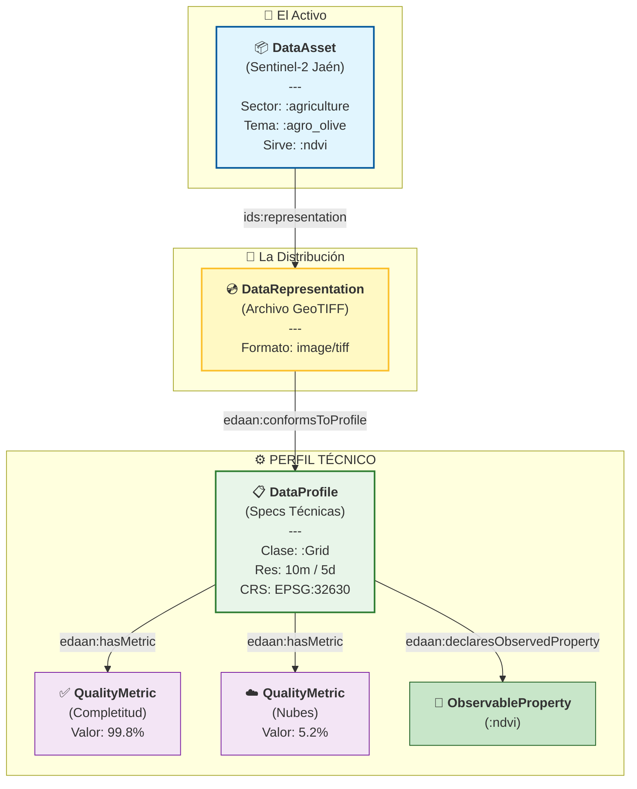

# 🫒 Demostración de Integración EDAAn: Monitorización de Olivar

Este documento demuestra cómo utilizar **EDAAnOWL v0.4.1** para anotar datos en el contexto de **EDAAn (Espacios de Datos Agroalimentarios en Andalucía)**.

Está diseñado para explicar la ontología al equipo y servir de guía para el desarrollo del **Script de Anotación**.

---

## 1. El Escenario: Optimización de Riego en Jaén

Tenemos un conjunto de datos de **Imágenes Satelitales Sentinel-2** enfocado en olivares de Jaén.
- **Objetivo**: Hacer que estos datos sean descubribles por una "App de Optimización de Riego".
- **Desafío**: La app no solo necesita saber *qué* son los datos (Olivar, NDVI), sino *cuán buenos* son (Cobertura de nubes, Completitud) y *cómo leerlos* (GeoTIFF, Resolución).

---

## 2. El Modelo Semántico (Diagrama)

Este diagrama explica cómo estructuramos los metadatos. **Concepto Clave**: Separamos el "Activo Abstracto" (Buscable) del "Archivo Concreto" (Descargable) y del "Perfil Técnico" (Validable).



### 🧠 Puntos Clave para el Equipo:
1.  **Capa de Descubrimiento**: Los usuarios buscan "Olivar" y "NDVI" (`DataAsset`).
2.  **Capa de Validación**: Usan el `DataProfile` para verificar requisitos técnicos.
3.  **Calidad y Semántica**: El Perfil no solo dice "es un GeoTIFF", sino **qué variable contiene** (`declaresObservedProperty`) y **su calidad** (`hasMetric`).

---

## 3. La Anotación (Código Turtle)

Esta es la salida RDF real que nuestro **Script de Anotación** necesitará generar.

```turtle
@prefix : <https://w3id.org/EDAAnOWL/> .
@prefix ids: <https://w3id.org/idsa/core/> .
@prefix dcat: <http://www.w3.org/ns/dcat#> .
@prefix dct: <http://purl.org/dc/terms/> .
@prefix xsd: <http://www.w3.org/2001/XMLSchema#> .
@prefix prov: <http://www.w3.org/ns/prov#> .

# 1️⃣ EL ACTIVO (¿Qué es?)
:SentinelOliveJaen2024 a :SpatialTemporalAsset ;
    dct:title "Monitorización de Olivares Sentinel-2 Jaén"@es ;
    
    # Etiquetas de Descubrimiento
    :hasDomainSector :agriculture ;
    :topic :agro_olive ;
    :servesObservableProperty :ndvi ; # 📢 "Ofrezco datos de NDVI"
    
    ids:representation :SentinelOliveJaen2024_GeoTIFF .

# 2️⃣ LA DISTRIBUCIÓN (¿Cómo lo obtengo?)
:SentinelOliveJaen2024_GeoTIFF a :DataRepresentation ;
    dct:format "image/tiff" ;
    ids:byteSize "45000000"^^xsd:integer ;
    :conformsToProfile :Olive_S2_L2A_Profile .

# 3️⃣ EL PERFIL (¿Cumple los requisitos técnicos?)
:Olive_S2_L2A_Profile a :DataProfile ;
    dct:title "Perfil Técnico Sentinel-2 L2A"@es ;
    
    # 🔗 Enlace Semántico-Estructural
    # Confirma que este perfil estructura la variable NDVI
    :declaresObservedProperty :ndvi ; 

    # Estructura y Resolución
    :declaresDataClass <https://w3id.org/BIGOWLData/Grid> ;
    :hasCRS <http://www.opengis.net/def/crs/EPSG/0/32630> ;
    dcat:spatialResolutionInMeters "10.0"^^xsd:decimal ;
    dcat:temporalResolution "P5D"^^xsd:duration ;
    
    # Métricas de Calidad
    :hasMetric [
        a :QualityMetric ;
        :metricName "cloud_coverage" ;
        :metricValue "5.2"^^xsd:decimal
    ] .
```

---

## 4. Guía para el Script de Anotación

Cuando escribamos el script en Python para automatizar esto, mapearemos los metadatos fuente a estos campos:

| Metadato Fuente (ej. Tags GeoTIFF) | Propiedad Ontología EDAAn | Clase Destino |
|------------------------------------|---------------------------|---------------|
| `TIFFTAG_IMAGEWIDTH`, `IMAGELENGTH` | *(Define implícitamente área/forma)* | `:SpatialTemporalAsset` |
| Código `PROJ:EPSG` (ej. 32630) | `:hasCRS` | `:DataProfile` |
| `GSD` (Ground Sample Distance) | `dcat:spatialResolutionInMeters` | `:DataProfile` |
| `CLOUDY_PIXEL_PERCENTAGE` | `:metricValue` (métrica cloud) | `:QualityMetric` |
| Bandas disponibles (VIS, NIR) | `:declaresObservedProperty` (:ndvi) | `:DataProfile` |

---

## 5. Caso de Uso: Matchmaking con SmartDataApp

Una vez anotado, ¿cómo se consume? Aquí se muestra cómo una **App de Análisis** encuentra este dataset.

### Escenario
El servicio **"EcoIrrigation Optimizer"** busca datos para calcular recomendaciones de riego.

### Requisitos de la App (La Demanda)
```turtle
:EcoIrrigationApp a :PredictionApp ;
    dct:title "Optimizador de Riego"@es ;
    
    # 1. ¿De qué tema?
    :hasDomainSector :agriculture ;
    
    # 2. ¿Qué variables necesita como input?
    :requiresObservableProperty :ndvi ; # 🔍 Busca datasets que sirvan NDVI
    
    # 3. ¿Con qué estructura técnica?
    :requiresProfile :Olive_S2_L2A_Profile . # 🔍 Busca datasets con esta estructura (10m, UTM30N...)
```

### El "Match" (La Magia de la Ontología)
El sistema conecta la oferta y la demanda porque:
1.  **Semántica**: Dataset `:servesObservableProperty :ndvi` == App `:requiresObservableProperty :ndvi`.
2.  **Técnica**: Dataset (Distribución) `:conformsToProfile :P` == App `:requiresProfile :P`.
3.  **Calidad**: La App puede filtrar adicionalmente: *"Solo dame datos donde `cloud_coverage` < 10%"* leyendo las métricas del perfil.

---

## 6. Uso de Vocabularios Controlados (AGROVOC)

Para garantizar que "Olivar" signifique lo mismo para todos (interoperabilidad global), enlazamos nuestros conceptos locales con **FAO AGROVOC** usando `skos:exactMatch`.

**¿Por qué?**
Si un usuario busca "Olea europaea" (científico) o "Olive" (inglés), el sistema sabrá que es lo mismo que nuestro concept `:agro_olive`.

### Ejemplo de Definición de Concepto
Así es como definimos `:agro_olive` en nuestra ontología (`agro-vocab.ttl`), y como tu script podría enriquecer los metadatos si fuera necesario:

```turtle
@prefix skos: <http://www.w3.org/2004/02/skos/core#> .
@prefix agrovoc: <http://aims.fao.org/aos/agrovoc/> .

:agro_olive a skos:Concept ;
    skos:prefLabel "Olivo"@es, "Olive"@en ;
    
    # 🌍 Enlace al estándar global (AGROVOC c_12926 = Olive)
    skos:exactMatch agrovoc:c_12926 . 
```

**Nota para el Script**:
No necesitas definir esto cada vez. Simplemente usa el URI `:agro_olive` en tu dataset, y la ontología ya se encarga del enlace con AGROVOC.
