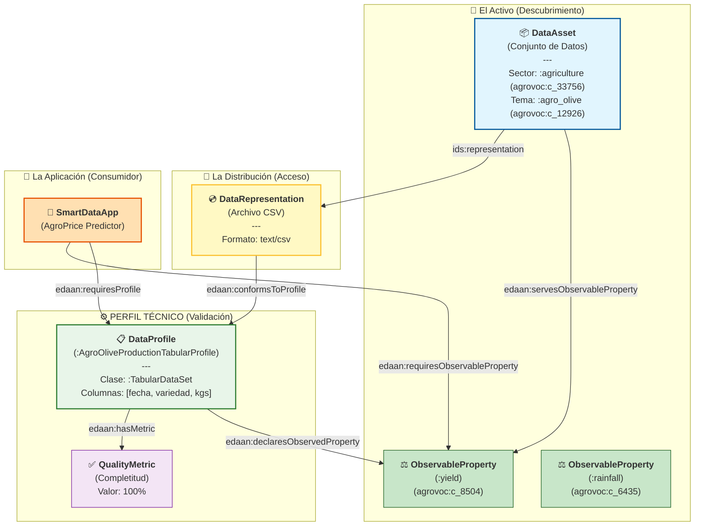

# 🫒 Demostración de Integración EDAAn: Datos de Producción de Olivar

Este documento demuestra cómo utilizar **EDAAnOWL v0.4.1** para anotar datos en el contexto de **EDAAn (Espacios de Datos Agroalimentarios en Andalucía)**.

Está diseñado para explicar la ontología al equipo y servir de guía para el desarrollo del **Script de Anotación**.

---

## 1. El Escenario: Histórico de Producción en Jaén

Tenemos un archivo **CSV** simple que contiene los datos de producción de aceituna de varias cooperativas en Jaén durante la campaña 2024.
- **Objetivo**: Hacer que estos datos sean descubribles para una "App de Predicción de Precios".
- **Desafío**: La app necesita saber que el CSV contiene datos de *Rendimiento (Yield)* de *Olivar*, y que cumple con una estructura técnica específica (Perfil) que la app sabe procesar.

---

## 2. El Modelo Semántico (Diagrama)

Este diagrama explica cómo estructuramos los metadatos. **Concepto Clave**: Un **Data Profile (Perfil de Datos)** es una especificación reutilizable ("molde") al que distintos datasets pueden conformarse.



### 🧠 Puntos Clave para el Equipo:
1.  **Reutilización**: `:AgroOliveProductionTabularProfile` es un concepto genérico. Cualquier CSV de aceituna con columnas básicas `[fecha, variedad, kgs]` puede usar este perfil.
2.  **Relaciones Explícitas**:
    *   `servesObservableProperty`: El activo contiene información sobre Yield.
    *   `declaresObservedProperty`: El perfil garantiza que la estructura de datos soporta la variable Yield.
3.  **¿Aceituna o Uva?**: La distinción semántica ("¿De qué trata esto?") la da el `DataAsset` con la propiedad `:topic` (ej. `:agro_olive`). El Perfil asegura que la *estructura* es válida para ese tema.
    *   Si el activo dice `:topic :agro_olive` -> Busco un perfil de aceituna.
    *   Si el activo dice `:topic :agro_wine` -> Busco un perfil de viñedo.

---

## 3. Ejemplo: Perfiles Reutilizables y Estandarización

Aquí demostramos cómo creamos perfiles semánticamente idénticos para diferentes sectores (Olivar vs. Viñedo), siguiendo las sugerencias de nombrado más descriptivas.

### A) Perfil de Olivar (:AgroOliveProductionTabularProfile)
Específico para campañas de aceituna.

```turtle
:AgroOliveProductionTabularProfile a :DataProfile ;
    dct:title "Perfil Tabular de Producción de Aceituna"@es ;
    
    # Variable Principal
    :declaresObservedProperty :yield ; # (kg aceituna)
    
    # Estructura
    :declaresDataClass <https://w3id.org/BIGOWLData/TabularDataSet> ;
    rdfs:comment "Columnas esperadas: [fecha, variedad, kgs_aceituna]" .
```

### B) Perfil de Viñedo (:AgroWineProductionTabularProfile)
Similar al anterior, pero adaptado a la recolección de uva.

```turtle
:AgroWineProductionTabularProfile a :DataProfile ;
    dct:title "Perfil Tabular de Producción de Viñedo"@es ;
    
    # Variable Principal (también es rendimiento, pero de uva)
    :declaresObservedProperty :yield ; 
    
    :declaresDataClass <https://w3id.org/BIGOWLData/TabularDataSet> ;
    rdfs:comment "Columnas esperadas: [fecha, variedad_uva, kgs_uva, grado_azucar]" .
```

> **Nota**: Al usar nombres estandarizados (`Agro[Sector]ProductionTabularProfile`), facilitamos que los desarrolladores intuyan qué perfil buscar.

---

## 4. La Anotación Completa (RDF)

Aquí vemos cómo el archivo real "Producción Jaén 2024" usa el perfil de Olivar.

```turtle
@prefix : <https://w3id.org/EDAAnOWL/> .
@prefix ids: <https://w3id.org/idsa/core/> .
@prefix dcat: <http://www.w3.org/ns/dcat#> .
@prefix dct: <http://purl.org/dc/terms/> .
@prefix xsd: <http://www.w3.org/2001/XMLSchema#> .
@prefix agrovoc: <http://aims.fao.org/aos/agrovoc/> .

# 1️⃣ EL ACTIVO (DataAsset)
:OliveYield2024_Jaen a :DataAsset ;
    dct:title "Producción Aceituna Jaén 2024"@es ;
    
    # Uso de Conceptos AGROVOC para interoperabilidad semántica
    :hasDomainSector :agriculture ;      # Mapped to agrovoc:c_33756 (Agriculture)
    :topic :agro_olive ;                 # Mapped to agrovoc:c_12926 (Olive trees)
    
    # Propiedad Observable
    :servesObservableProperty :yield ;   # Mapped to agrovoc:c_8504 (Yields)
    
    ids:representation :OliveYield2024_CSV .

# 2️⃣ LA DISTRIBUCIÓN (DataRepresentation)
:OliveYield2024_CSV a :DataRepresentation ;
    dct:format "text/csv" ;
    
    # PERFIL TÉCNICO
    :conformsToProfile :AgroOliveProductionTabularProfile ; 
    
    # Métricas específicas de ESTA distribución
    :hasMetric [
        a :QualityMetric ;
        :metricName "completeness" ;
        :metricValue "1.0"^^xsd:decimal 
    ] .
```

---

## 5. Caso de Uso: Matchmaking Inteligente

### Escenario
El servicio **"AgroPrice Predictor"** busca datos para entrenar.

### Requisitos de la App
La app no busca "el archivo de Jaén". Busca **"algo que tenga Yield y cumpla el perfil de Producción"**.

```turtle
:AgroPricePredictor a :SmartDataApp ;
    :hasDomainSector :agriculture ;
    
    # Quiero saber el Rendimiento
    :requiresObservableProperty :yield ; 
    
    # Y necesito que los datos vengan con la estructura que sé leer (Perfil A)
    :requiresProfile :AgroOliveProductionTabularProfile .
```

### Resolución
1. El sistema encuentra `:OliveYield2024_Jaen`.
2. Ve que sirve `:yield`. (**Match Semántico** ✅)
3. Ve que su distribución `:OliveYield2024_CSV` se ajusta a `:AgroOliveProductionTabularProfile`. (**Match Técnico** ✅)
4. La App puede consumir el CSV automáticamente porque sabe que tendrá las columnas `[fecha, variedad, kgs]`.

---

## 6. Uso de Vocabularios Controlados (AGROVOC)

Para garantizar la interoperabilidad, usamos `agro-vocab.ttl`.

```turtle
@prefix skos: <http://www.w3.org/2004/02/skos/core#> .
@prefix agrovoc: <http://aims.fao.org/aos/agrovoc/> .

:agro_olive a skos:Concept ;
    skos:prefLabel "Olivo"@es, "Olive"@en ;
    skos:exactMatch agrovoc:c_12926 . 
```

**Nota**: Al etiquetar tu CSV con `:topic :agro_olive`, automáticamente eres compatible con cualquier sistema que entienda AGROVOC, sin cambiar tu CSV.
