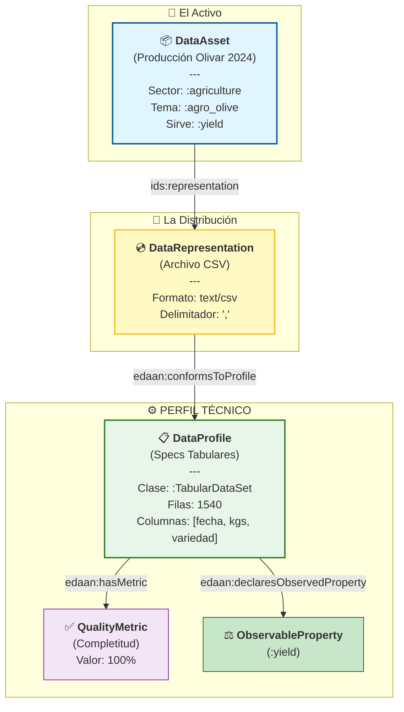

# 🫒 Demostración de Integración EDAAn: Datos de Producción de Olivar

Este documento demuestra cómo utilizar **EDAAnOWL v0.4.1** para anotar datos en el contexto de **EDAAn (Espacios de Datos Agroalimentarios en Andalucía)**.

Está diseñado para explicar la ontología al equipo y servir de guía para el desarrollo del **Script de Anotación**.

---

## 1. El Escenario: Histórico de Producción en Jaén

Tenemos un archivo **CSV** simple que contiene los datos de producción de aceituna de varias cooperativas en Jaén durante la campaña 2024.
- **Objetivo**: Hacer que estos datos sean descubribles para una "App de Predicción de Precios".
- **Desafío**: La app necesita saber que el CSV contiene datos de *Rendimiento (Yield)* de *Olivar*, que es un archivo *Tabular*, y que los datos están completos (sin filas vacías).

---

## 2. El Modelo Semántico (Diagrama)

Este diagrama explica cómo estructuramos los metadatos. **Concepto Clave**: Separamos el "Activo Abstracto" (Buscable) del "Archivo Concreto" (Descargable) y del "Perfil Técnico" (Validable).



### 🧠 Puntos Clave para el Equipo:
1.  **Capa de Descubrimiento**: Los usuarios buscan "Olivar" y "Rendimiento" (`:yield`).
2.  **Capa de Validación**: Usan el `DataProfile` para verificar que es una tabla y no una imagen.
3.  **Calidad y Semántica**: El Perfil declara explícitamente que la tabla contiene la variable "Yield" (`:yield`) y que no faltan datos.

---

## 3. La Anotación (Código Turtle)

Esta es la salida RDF real que nuestro **Script de Anotación** necesitará generar para un CSV.

```turtle
@prefix : <https://w3id.org/EDAAnOWL/> .
@prefix ids: <https://w3id.org/idsa/core/> .
@prefix dcat: <http://www.w3.org/ns/dcat#> .
@prefix dct: <http://purl.org/dc/terms/> .
@prefix xsd: <http://www.w3.org/2001/XMLSchema#> .

# 1️⃣ EL ACTIVO (¿Qué es?)
:OliveYield2024_Jaen a :DataAsset ;  # Activo Genérico
    dct:title "Producción Aceituna Jaén 2024"@es ;
    
    # Etiquetas de Descubrimiento
    :hasDomainSector :agriculture ;
    :topic :agro_olive ;
    :servesObservableProperty :yield ; # 📢 "Ofrezco datos de Rendimiento (kg/ha)"
    
    ids:representation :OliveYield2024_CSV .

# 2️⃣ LA DISTRIBUCIÓN (¿Cómo lo obtengo?)
:OliveYield2024_CSV a :DataRepresentation ;
    dct:format "text/csv" ;
    ids:byteSize "102400"^^xsd:integer ; # 100KB
    :conformsToProfile :Tabular_Yield_Profile .

# 3️⃣ EL PERFIL (¿Cumple los requisitos técnicos?)
:Tabular_Yield_Profile a :DataProfile ;
    dct:title "Perfil Tabular estándar para Producción"@es ;
    
    # 🔗 Enlace Semántico-Estructural
    # Confirma que este perfil estructura la variable Yield
    :declaresObservedProperty :yield ; 

    # Estructura Tabular
    :declaresDataClass <https://w3id.org/BIGOWLData/TabularDataSet> ;
    
    # Métricas de Calidad
    :hasMetric [
        a :QualityMetric ;
        :metricName "completeness" ;
        :metricValue "1.0"^^xsd:decimal ; # 100% completo
        :metricUnit "ratio"
    ] .
```

---

## 4. Guía para el Script de Anotación

Para ficheros CSV, el script leerá las cabeceras o metadatos asociados:

| Metadato Fuente (ej. análisis de pandas) | Propiedad Ontología EDAAn | Clase Destino |
|------------------------------------------|---------------------------|---------------|
| Extensión `.csv` | `dct:format`: "text/csv" | `:DataRepresentation` |
| ¿Contiene columna 'kgs', 'yield'? | `:servesObservableProperty` (:yield) | `:DataAsset` |
| `pd.isna(df).sum()` (Nulos) | `:metricValue` (métrica completeness) | `:QualityMetric` |
| Nombre fichero / Usuario | `dct:title` | `:DataAsset` |

---

## 5. Caso de Uso: Matchmaking

### Escenario
El servicio **"AgroPrice Predictor"** busca datos históricos para entrenar su modelo.

### Requisitos de la App
```turtle
:AgroPricePredictor a :PredictionApp ;
    # 1. ¿De qué tema?
    :hasDomainSector :agriculture ;
    
    # 2. ¿Qué variables necesita?
    :requiresObservableProperty :yield ; 
    
    # 3. ¿Qué formato? (Solo sabe leer Tablas, no imágenes)
    :requiresProfile [ a :DataProfile ; 
        :declaresDataClass <https://w3id.org/BIGOWLData/TabularDataSet> 
    ] .
```

### El "Match"
El sistema descarta los satélites (GeoTIFF) y conecta nuestra tabla porque ambos comparten `:yield` y la clase `:TabularDataSet`.

---

## 6. Uso de Vocabularios Controlados (AGROVOC)

Para garantizar la interoperabilidad, usamos `agro-vocab.ttl`.

```turtle
@prefix skos: <http://www.w3.org/2004/02/skos/core#> .
@prefix agrovoc: <http://aims.fao.org/aos/agrovoc/> .

:agro_olive a skos:Concept ;
    skos:prefLabel "Olivo"@es, "Olive"@en ;
    skos:exactMatch agrovoc:c_12926 . 
```

**Nota**: Al etiquetar tu CSV con `:topic :agro_olive`, automáticamente eres compatible con cualquier sistema que entienda AGROVOC, sin cambiar tu CSV.
