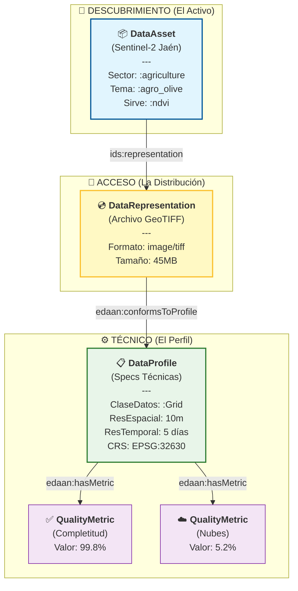

# 🫒 Demostración de Integración EDAAn: Monitorización de Olivar

Este documento demuestra cómo utilizar **EDAAnOWL v0.4.1** para anotar datos en el contexto de **EDAAn (Espacios de Datos Agroalimentarios en Andalucía)**.

Está diseñado para explicar la ontología al equipo y servir de guía para el desarrollo del **Script de Anotación**.

---

## 1. El Escenario: Optimización de Riego en Jaén

Tenemos un conjunto de datos de **Imágenes Satelitales Sentinel-2** enfocado en olivares de Jaén.
- **Objetivo**: Hacer que estos datos sean descubribles por una "App de Optimización de Riego".
- **Desafío**: La app no solo necesita saber *qué* son los datos (Olivar, NDVI), sino *cuán buenos* son (Cobertura de nubes, Completitud) y *cómo leerlos* (GeoTIFF, Resolución).

---

## 2. El Modelo Semántico (Diagrama)

Este diagrama explica cómo estructuramos los metadatos. **Concepto Clave**: Separamos el "Activo Abstracto" (Buscable) del "Archivo Concreto" (Descargable) y del "Perfil Técnico" (Validable).



### 🧠 Puntos Clave para el Equipo:
1.  **Capa de Descubrimiento**: Los usuarios buscan "Olivar" y "NDVI" (definido en `DataAsset`).
2.  **Capa de Validación**: Usan el `DataProfile` para verificar si el dato encaja con la app (ej. "Necesito resolución de 10m").
3.  **Calidad Primero**: El `Profile` lista explícitamente las métricas de calidad (`hasMetric`), permitiendo filtrado automático (ej. "Rechazar si Nubes > 20%").

---

## 3. La Anotación (Código Turtle)

Esta es la salida RDF real que nuestro **Script de Anotación** necesitará generar.

```turtle
@prefix : <https://w3id.org/EDAAnOWL/> .
@prefix ids: <https://w3id.org/idsa/core/> .
@prefix dcat: <http://www.w3.org/ns/dcat#> .
@prefix dct: <http://purl.org/dc/terms/> .
@prefix xsd: <http://www.w3.org/2001/XMLSchema#> .
@prefix prov: <http://www.w3.org/ns/prov#> .

# 1️⃣ EL ACTIVO (¿Qué es?)
:SentinelOliveJaen2024 a :SpatialTemporalAsset ;
    dct:title "Monitorización de Olivares Sentinel-2 Jaén"@es ;
    dct:description "Datos multiespectrales para análisis de rendimiento en olivar."@es ;
    
    # Etiquetas de Descubrimiento (Vocabularios Controlados)
    :hasDomainSector :agriculture ;    # Del sector-scheme
    :topic :agro_olive ;              # Del agro-vocab
    :servesObservableProperty :ndvi ; # De observed-properties
    
    # Enlace al archivo físico/distribución
    ids:representation :SentinelOliveJaen2024_GeoTIFF .

# 2️⃣ LA DISTRIBUCIÓN (¿Cómo lo obtengo?)
:SentinelOliveJaen2024_GeoTIFF a :DataRepresentation ;
    dct:format "image/tiff" ;
    ids:byteSize "45000000"^^xsd:integer ;
    
    # Enlace al perfil técnico
    :conformsToProfile :Olive_S2_L2A_Profile .

# 3️⃣ EL PERFIL (¿Es suficientemente bueno?)
:Olive_S2_L2A_Profile a :DataProfile ;
    dct:title "Perfil Técnico Sentinel-2 L2A"@es ;
    
    # Estructura y Resolución
    :declaresDataClass <https://w3id.org/BIGOWLData/Grid> ;
    :hasCRS <http://www.opengis.net/def/crs/EPSG/0/32630> ; # UTM Zona 30N
    dcat:spatialResolutionInMeters "10.0"^^xsd:decimal ;
    dcat:temporalResolution "P5D"^^xsd:duration ; # Cada 5 días
    
    # Métricas de Calidad (El "Contrato")
    :hasMetric [
        a :QualityMetric ;
        :metricName "cloud_coverage" ;
        :metricValue "5.2"^^xsd:decimal ;
        :metricUnit "percentage"
    ] ;
    :hasMetric [
        a :QualityMetric ;
        :metricName "completeness" ;
        :metricValue "0.998"^^xsd:decimal ;
        :metricUnit "ratio"
    ] .
```

---

## 4. Guía para el Script de Anotación

Cuando escribamos el script en Python para automatizar esto, mapearemos los metadatos fuente a estos campos:

| Metadato Fuente (ej. Tags GeoTIFF) | Propiedad Ontología EDAAn | Clase Destino |
|------------------------------------|---------------------------|---------------|
| `TIFFTAG_IMAGEWIDTH`, `IMAGELENGTH` | *(Define implícitamente área/forma)* | `:SpatialTemporalAsset` |
| Código `PROJ:EPSG` (ej. 32630) | `:hasCRS` | `:DataProfile` |
| `GSD` (Ground Sample Distance) | `dcat:spatialResolutionInMeters` | `:DataProfile` |
| `CLOUDY_PIXEL_PERCENTAGE` | `:metricValue` (métrica cloud) | `:QualityMetric` |
| Tamaño de archivo (os.stat) | `ids:byteSize` | `:DataRepresentation` |

**Estrategia**:
1.  **Extraer**: Leer tags de cabecera de las imágenes.
2.  **Mapear**: Convertir tags a propiedades RDF (como se muestra arriba).
3.  **Serializar**: Generar el archivo `.ttl` usando `rdflib`.
