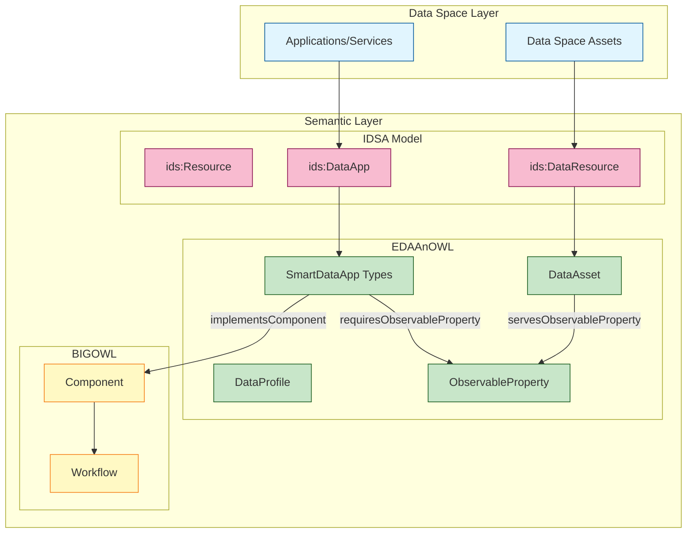

# EDAAnOWL — (v0.2.0)

[](https://github.com/KhaosResearch/EDAAnOWL/actions/workflows/release.yml)

[](https://khaosresearch.github.io/EDAAnOWL/)
[](LICENSE)
[](https://github.com/KhaosResearch/EDAAnOWL/releases)

A pilot ontology for the semantic exploitation of data assets in the Agri-food (EDAA) context, aligned with the IDSA Information Model and the BIGOWL ontology.

> Latest stable: see `src/0.2.0/` (ontology, shapes, examples, vocabularies) and the rendered docs under GitHub Pages.

The purpose of `EDAAnOWL` is to serve as an annotation ontology that enriches the description of Data Space assets. It allows for modeling the functional profile (inputs, outputs, parameters) of `ids:DataApp` and `ids:DataResource`, facilitating their semantic discovery, composition into complex services, and compatibility validation.

## � Architecture Overview



## 🖼 Architecture diagram


Figure: High-level architecture showing how EDAAnOWL maps IDSA concepts (DataApp/DataResource) to BIGOWL components and publishes artifacts via DCAT, linking policies (ODRL/DPV). The image is stored in `images/` and can be reused in versioned READMEs.

## 🚀 Features

- **Main Ontology**: A semantic "bridge" linking `ids:DataApp` to `bigwf:Component` (from BIGOWL).
- **Profile Model**: A `:DataProfile` class to describe the data "signatures" (inputs/outputs) of assets.
- **Modular Vocabularies**: Separate, resolvable SKOS vocabularies for domains, observed properties, etc., versioned alongside the main ontology.
- **Persistent Identifiers**: All ontology and vocabulary modules are resolvable via `https://w3id.org/EDAAnOWL/` for robust content negotiation.
- **Automated Documentation & CI/CD**: A GitHub Actions workflow (`release.yml`) that, upon creating a new release:
  - Generates a dynamic `catalog-v0.xml` to resolve all imports.
  - Builds comprehensive HTML documentation with **Widoco**.
  - Post-processes the HTML (`sed`) to ensure all vocabulary links are correctly versioned.
  - Publishes all artifacts (docs, vocabs, RDF serializations) to the `gh-pages` branch.
- **Versioning**: Supports a `latest` development version and immutable, versioned snapshots (e.g., `/0.0.1/`).
  

---

## 📘 Background: IDSA and BIGOWL (what they are and why we align)

### IDSA Information Model (what/why/how)

- **What it is**: The International Data Spaces Association (IDSA) Information Model defines a common vocabulary for resources (data and apps), their representations, endpoints, usage contracts, participants, connectors, and security profiles. It provides a canonical taxonomy for `ids:Resource` and content/context views to describe how resources are exposed and governed.
- **How it works**: Key concepts include:
  - `ids:Resource` → specialized into `ids:DataResource` and `ids:DataApp`/`ids:SmartDataApp`.
  - `ids:Representation` capturing format/media type/language, linked from resources by `ids:representation` or `ids:defaultRepresentation`.
  - Usage control with contracts and rules (ODRL-based), endpoints for access, and participant/connector/security profiles.
- **Why we reuse it**: We want assets and apps to be discoverable and governable across Data Spaces without reinventing core notions (resource taxonomy, representation, policies, endpoints). Aligning with IDSA ensures compatibility with IDS-based tooling and documentation.
- References:
  - IDSA IM docs: `https://international-data-spaces-association.github.io/InformationModel/docs/index.html#Resource`
  - Figures (examples): Resource taxonomy (Fig. 3.15), Data App content view (Fig. 3.32), Data App taxonomy (Fig. 3.34).

### BIGOWL (what/why/how)

- **What it is**: A family of ontologies for analytical workflows, algorithms, problems, data, and components. It formalizes workflow elements (e.g., `bigwf:Component`), data types (`bigdat:Data`), and their relations.
- **How it works**: Workflows are composed of components with well-defined inputs/outputs. These can be linked to algorithms/problems, enabling reproducible compositions and reasoning about compatibility.
- **Why we reuse it**: We need to express the computational side (pipelines, components, inputs/outputs) and connect IDSA “apps” to executable workflow elements. BIGOWL gives us a neutral, modular way to do so, avoiding bespoke, ad-hoc workflow modeling.

---

## 🧭 Design Rationale: Why EDAAnOWL extends and aligns the way it does

EDAanOWL provides the “connective tissue” between IDSA’s resource/contract governance and BIGOWL’s workflow semantics:

- **Classes (why we created/extended them)**

  - `:DataAsset ⊑ ids:DataResource`: We specialize IDSA’s data resource to attach domain semantics (e.g., observable variables) needed for matchmaking and discovery.
  - `ids:SmartDataApp` specializations (`:PredictionApp`, `:AnalyzerApp`, `:VisualizationApp`): We align with IDSA’s app branch and provide a practical taxonomy reflecting functionality (prediction/analysis/visualization) inspired by IDSA’s Data App taxonomy.
  - `:DataProfile`: Encapsulates structural/semantic “signatures” of data (class, CRS, resolutions, observed properties). This lives alongside IDSA `ids:Representation` (format/media/language), not replacing it—complementary roles.
  - `:ObservableProperty ⊑ sosa:ObservableProperty`: We reuse SOSA/SSN for domain variables (e.g., NDVI, temperature), enabling semantic I/O specifications for apps and semantic descriptions for assets.

- **Object properties (motivations)**

  - `:conformsToProfile (ids:Resource → :DataProfile)`: A resource states it conforms to a profile (structural/semantic signature). Motivates profile-based compatibility checks.
  - `:requiresProfile` / `:producesProfile (ids:DataApp ↔ :DataProfile)`: Apps specify expected/produced data signatures to enable structural compatibility.
  - `:requiresObservableProperty` / `:producesObservableProperty (ids:SmartDataApp ↔ :ObservableProperty)`: Apps declare semantic I/O needs—enables simple, meaningful matchmaking (semantic compatibility).
  - `:servesObservableProperty (:DataAsset ↔ :ObservableProperty)`: Assets declare the variables they provide—completing the matchmaking triangle.
  - `:implementsComponent (ids:DataApp ↔ bigwf:Component)`: Bridges IDSA apps to BIGOWL components, grounding apps in executable workflow units.
  - `:realizesWorkflow (ids:DataApp ↔ opmw:WorkflowTemplate)`: Links apps to abstract workflows (OPMW) for documentation and reasoning.
  - `:hasDomainSector (⊑ dcat:theme)`: DCAT-aligned domain tagging using SKOS schemes, ensuring interoperable cataloguing and filtering across domains.

- **Data properties (motivations)**

  - `:profileCRS` and `:profileCRSRef`: Explicit CRS as string and IRI; we recommend the IRI form (`xsd:anyURI`) for unambiguous validation.
  - `:profileSpatialResolution`, `:profileTemporalResolution`: Required to capture EO and time-series constraints for practical matchmaking.
  - `:supportContact`: Operational contact—crucial in Data Spaces to support consumers.
  - Metrics (`:Metric` and subtypes with `:metricName`/`:metricValue`/`:metricUnit`/`:computedAt`): Allows publishing quality/performance indicators relevant to governance and selection.

- **Why both Profile-based and Direct Semantic models?**

  - Real-world data/app compatibility has two complementary facets:
    - Structural: “Does my dataset’s structure/CRS/resolution match the app’s expectations?” → `:DataProfile`.
    - Semantic: “Do I have NDVI/temperature that this app needs?” → `:ObservableProperty`.
  - Keeping both enables robust, explainable matchmaking and aligns with IDSA’s content view (representations) without conflating structure with format/serialization.

- **Why align with IDSA Representation instead of embedding formats in profiles?**

  - IDSA prescribes `ids:Representation` for format/media/language; we follow that and keep `:DataProfile` for data semantics/shape. This mirrors IDSA’s own separation of “content” vs. “context” and avoids duplication.

- **Why SKOS/DCAT/ODRL/PROV/LOCN/GeoSPARQL?**
  - We adopt standards recommended by IDSA and the Linked Data community: SKOS for taxonomies, DCAT for cataloguing, ODRL for policies/usage control, PROV-O for provenance, LOCN/GeoSPARQL for geospatial coverage. This maximizes interoperability and reduces custom modeling.

---

## 📁 Repository Structure & Branching Model

This repository uses a `dev` -> `main` -> `gh-pages` git flow.

- **`main` branch**:

  - **Purpose**: This branch represents the most recent _stable, released_ version of the ontology.
  - **Do NOT commit directly here.** All changes must come from the `dev` branch via a Pull Request.
  - Creating a "Release" from this branch triggers the `gh-pages` deployment.
  - **Structure**:
    - `/src/`
      - `0.0.1/` (Ontology and vocabs for v0.0.1)
      - `0.0.2/` (Ontology and vocabs for v0.0.2)
    - `/.github/workflows/` (The CI/CD workflow)

- **`dev` branch**:

  - **Purpose**: This is the main **development branch**. All new features, fixes, and preparations for the _next_ version happen here.
  - All Pull Requests should be targeted at `dev`.
  - **Structure**:
    - Same as `main`, but may contain the _next_ unreleased version folder (e.g., `src/0.0.3/`) while it is in progress.

- **`gh-pages` branch**:

  - **Purpose**: **AUTO-GENERATED. DO NOT EDIT MANUALLY.**
  - This branch contains the static output of the `release.yml` workflow.
  - It hosts the public-facing documentation and RDF files served by GitHub Pages.
  - **Structure**:
    - `/latest/` (A mirror of the most recent version)
    - `/0.0.1/` (A snapshot of the v0.0.1 documentation and files)
    - `/0.0.2/` (A snapshot of the v0.0.2 documentation and files)
    - `.nojekyll` (Disables Jekyll on GitHub Pages)

- **Feature Branches (e.g., `feat/my-fix`)**:
  - **Purpose**: Temporary branches for new work. They should be based on `dev` and merged back into `dev` via a Pull Request.

## 🧪 Local Validation (Docker-based)

This repository includes a Docker-based local validation environment to check the ontology and its vocabularies _before_ creating a new release.

The validation pipeline performs three main checks:

1. **RDF Syntax Validation**

   - Script: `scripts/check_rdf.py`
   - Runs inside a Docker container with Python and `rdflib`.
   - It automatically detects the **latest version folder** under `src/` (e.g. `src/0.0.1/`) and parses all `*.ttl` files in:
     - `src/<version>/`
     - `src/<version>/vocabularies/`
     - `src/<version>/examples/`
     - `src/<version>/shapes/`
   - If any file is not well-formed RDF, the script fails with a non-zero exit code and prints a summary.

2. **SHACL Validation (pySHACL)**

   - Tool: [`pyshacl`](https://github.com/RDFLib/pySHACL) (installed in the Docker image).
   - Validates:
     - Main ontology: `src/<version>/EDAAnOWL.ttl`
     - Against shapes: `src/<version>/shapes/edaan-shapes.ttl`
     - With test data: `src/<version>/examples/test-consistency.ttl`
   - The validation runs with:
     - RDFS inference (`-i rdfs`)
     - Meta-SHACL checks (`-m`)
   - The process prints a SHACL validation report and fails if `Conforms: False`.

3. **OWL Consistency Check (ROBOT + ELK)**
   - Tool: [`ROBOT`](http://robot.obolibrary.org/) with ELK reasoner
   - Validates:
     - Main ontology: `src/<version>/EDAAnOWL.ttl`
     - Test instances: `src/<version>/examples/test-consistency.ttl`
   - Performs:
     - Consistency checking
     - Classification
     - Instance realization
   - If reasoning fails, the validation script reports an error.

### Docker Image

All local validations run in the same Docker image, defined by the root-level `Dockerfile`:

- Base image: `eclipse-temurin:17-jdk-jammy` (JDK 17)
- Installs:
  - `python3`, `python3-pip`
  - Python packages: `rdflib`, `pyshacl`
  - `wget` to download `robot.jar`
- Downloads ROBOT to:
  - `/opt/robot/robot.jar`
- Sets the default working directory to:
  - `/app`, where the repository is mounted at runtime (`-v <repo>:/app`).

### Scripts & Usage

Two convenience scripts are provided to run the full local validation pipeline:

- **Windows**: `scripts/local-validate.bat`
- **Linux/macOS**: `scripts/local-validate.sh`

Both scripts:

1. Build (or rebuild) the Docker image:

   ```bash
   docker build -t edaanowl-validator -f Dockerfile .
   ```

2. Detect the latest version under src/ (e.g. src/0.0.1/).

3. Run:

- `scripts/check_rdf.py` (RDF syntax validation)
- `pyshacl` (SHACL validation)
- `ROBOT reason` (OWL consistency check)

If any step fails, the script prints an error message and exits with a non-zero code.

### How to run

From the repository root:

- On Windows (PowerShell or CMD):

  ```bash
  .\scripts\local-validate.bat
  ```

- On Linux/macOS:

  ```bash
  chmod +x scripts/local-validate.sh
  ./scripts/local-validate.sh
  ```

> [!NOTE]
> These scripts are intended to be used locally by developers before creating a new release, and can also be integrated into CI pipelines if desired.

## 🔗 Resolvability (PID)

This repository manages the _source code_. The Persistent Identifiers (PIDs) (e.g., `https://w3id.org/EDAAnOWL/...`) are resolved by the `.htaccess` file located in the [w3id.org repository](https://github.com/perma-id/w3id.org/tree/master/EDAAnOWL).

That `.htaccess` file points all requests to the documentation and files automatically built and published by our CI/CD workflow to the `gh-pages` branch, which is hosted at:

**`https://khaosresearch.github.io/EDAAnOWL/`**
