# 📖 EDAAnOWL Use Cases

This document illustrates practical use cases of the EDAAnOWL ontology through diagrams and RDF examples, using **exactly** the concepts defined in ontology v0.3.2.

---

## 🎯 Use Case 1: Semantic Matchmaking for Olive Yield Prediction

### Scenario

An agricultural researcher in the olive sector has a **yield prediction application** that requires specific input data. The system must automatically find **compatible datasets** in the Data Space catalog.

### Actors

- **Prediction App**: `agri:OliveYieldPredictor` (:PredictionApp)
- **Sentinel-2 Dataset**: `data:SentinelOliveJaen2024` (:SpatialTemporalAsset)
- **Data Profile**: `profile:OliveAgriProfile` (:DataProfile)
- **Observable Properties**: `:ndvi`, `:temperature`, `:precipitation` (skos:Concept from vocabulary)
- **Sector**: `:agriculture` (skos:Concept)
- **Crop**: `:agro_olive` (skos:Concept from agro-vocab)

### Matchmaking Flow Diagram

```mermaid
graph LR
    subgraph "DEMAND (App)"
        App["🤖 OliveYieldPredictor<br/>(PredictionApp)"]
        AppSector["Sector:<br/>:agriculture"]
        AppTopic["Topic:<br/>:agro_olive"]
        AppReq1["Requires:<br/>:ndvi"]
        AppReq2["Requires:<br/>:temperature"]
        AppReq3["Requires:<br/>:precipitation"]
        AppProfile["Requires Profile:<br/>OliveAgriProfile"]
        AppProduce["Produces:<br/>:yield"]
    end

    subgraph "SUPPLY (Dataset)"
        Data["📊 SentinelOliveJaen2024<br/>(SpatialTemporalAsset)"]
        DataSector["Sector:<br/>:agriculture"]
        DataTopic["Topic:<br/>:agro_olive"]
        DataServ1["Serves:<br/>:ndvi"]
        DataServ2["Serves:<br/>:temperature"]
        DataServ3["Serves:<br/>:precipitation"]
        DataProfile["Conforms to:<br/>OliveAgriProfile"]
    end

    subgraph "SHARED SEMANTICS"
        Sector["🏭 :agriculture<br/>(skos:Concept)"]
        Topic["🪔 :agro_olive<br/>(skos:Concept)"]
        NDVI["🌿 :ndvi<br/>(skos:Concept)"]
        Temp["🌡️ :temperature<br/>(skos:Concept)"]
        Precip["🌧️ :precipitation<br/>(skos:Concept)"]
        Yield["📈 :yield<br/>(skos:Concept)"]
        Profile["📋 OliveAgriProfile<br/>(DataProfile)<br/>Contains: Metrics, CRS,<br/>Resolutions"]
        Metric["📊 QualityMetric<br/>completeness: 0.98"]
    end

    App --> AppSector
    App --> AppTopic
    App --> AppReq1
    App --> AppReq2
    App --> AppReq3
    App --> AppProfile
    App --> AppProduce
    
    AppSector -.->|"hasDomainSector"| Sector
    AppTopic -.->|"topic"| Topic
    AppReq1 -.->|"requiresObservableProperty"| NDVI
    AppReq2 -.->|"requiresObservableProperty"| Temp
    AppReq3 -.->|"requiresObservableProperty"| Precip
    AppProfile -.->|"requiresProfile"| Profile
    AppProduce -.->|"producesObservableProperty"| Yield

    Data --> DataSector
    Data --> DataTopic
    Data --> DataServ1
    Data --> DataServ2
    Data --> DataServ3
    Data --> DataProfile
    
    DataSector -.->|"hasDomainSector"| Sector
    DataTopic -.->|"topic"| Topic
    DataServ1 -.->|"servesObservableProperty"| NDVI
    DataServ2 -.->|"servesObservableProperty"| Temp
    DataServ3 -.->|"servesObservableProperty"| Precip
    DataProfile -.->|"conformsToProfile"| Profile

    Profile -->|"hasMetric"| Metric

    style App fill:#ffcccc,stroke:#cc0000,stroke-width:3px
    style Data fill:#ccffcc,stroke:#00cc00,stroke-width:3px
    style Sector fill:#e1f5fe,stroke:#01579b,stroke-width:2px
    style Topic fill:#fff9c4,stroke:#f57f17,stroke-width:2px
    style NDVI fill:#c8e6c9,stroke:#1b5e20,stroke-width:2px
    style Temp fill:#c8e6c9,stroke:#1b5e20,stroke-width:2px
    style Precip fill:#c8e6c9,stroke:#1b5e20,stroke-width:2px
    style Yield fill:#c8e6c9,stroke:#1b5e20,stroke-width:2px
    style Profile fill:#f8bbd0,stroke:#880e4f,stroke-width:3px
    style Metric fill:#dcedc8,stroke:#558b2f,stroke-width:2px
```



### ✅ Matchmaking Result

The system determines that `SentinelOliveJaen2024` is **compatible** with `OliveYieldPredictor` because:

1. **Sector Compatibility**: Both belong to the `:agriculture` sector
2. **Thematic Compatibility**: Both are related to `:agro_olive`
3. **Semantic Compatibility**: The dataset *serves* all observable properties that the app *requires* (`:ndvi`, `:temperature`, `:precipitation`)
4. **Structural Compatibility**: Both share the same `:DataProfile`

### RDF Example (Turtle)

```turtle
@prefix edaan: <https://w3id.org/EDAAnOWL/> .
@prefix ids: <https://w3id.org/idsa/core/> .
@prefix dct: <http://purl.org/dc/terms/> .
@prefix bigdat: <https://w3id.org/BIGOWLData/> .
@prefix dcat: <http://www.w3.org/ns/dcat#> .
@prefix skos: <http://www.w3.org/2004/02/skos/core#> .
@prefix locn: <http://www.w3.org/ns/locn#> .
@prefix time: <http://www.w3.org/2006/time#> .
@prefix gsp: <http://www.opengis.net/ont/geosparql#> .
@prefix xsd: <http://www.w3.org/2001/XMLSchema#> .

# ========== THE APPLICATION (DEMAND) ==========
agri:OliveYieldPredictor a edaan:PredictionApp ;
    dct:title "Olive Yield Predictor"@en ;
    dct:description "Predicts olive yield based on vegetation indices and meteorological data"@en ;
    
    # Sector and topic (using real SKOS concepts)
    edaan:hasDomainSector edaan:agriculture ;  # skos:Concept from sector-scheme
    edaan:topic edaan:agro_olive ;             # skos:Concept from agro-vocab
    
    # Semantic requirements (what variables it needs) - all are skos:Concept
    edaan:requiresObservableProperty edaan:ndvi,          # from observed-properties
                                     edaan:temperature,   # from observed-properties
                                     edaan:precipitation ; # from observed-properties
    
    # What it produces
    edaan:producesObservableProperty edaan:yield ;  # skos:Concept from observed-properties
    
    # Structural requirements (what format/structure it needs)
    edaan:requiresProfile profile:OliveAgriProfile .

# ========== THE DATASET (SUPPLY) ==========
data:SentinelOliveJaen2024 a edaan:SpatialTemporalAsset ;
    dct:title "Sentinel-2 Data for Olive Groves in Jaén 2024"@en ;
    dct:description "Time series of Sentinel-2 images with vegetation indices and meteorological data for olive groves"@en ;
    dct:created "2024-01-15T00:00:00Z"^^xsd:dateTime ;
    
    # Sector and topic
    edaan:hasDomainSector edaan:agriculture ;
    edaan:topic edaan:agro_olive ;
    
    # What variables it provides (skos:Concept)
    edaan:servesObservableProperty edaan:ndvi,
                                   edaan:temperature,
                                   edaan:precipitation ;
    
    # What profile it conforms to
    edaan:conformsToProfile profile:OliveAgriProfile ;
    
    # Spatial coverage (Jaén, Spain)
    edaan:hasSpatialCoverage [
        a locn:Geometry ;
        locn:geometry "POLYGON((-3.8 37.7, -3.8 38.0, -3.5 38.0, -3.5 37.7, -3.8 37.7))"^^gsp:wktLiteral
    ] ;
    
    # Temporal coverage (year 2024)
    edaan:hasTemporalCoverage [
        a time:Interval ;
        time:hasBeginning [ time:inXSDDate "2024-01-01"^^xsd:date ] ;
        time:hasEnd [ time:inXSDDate "2024-12-31"^^xsd:date ]
    ] .

# ========== THE SHARED PROFILE ==========
profile:OliveAgriProfile a edaan:DataProfile ;
    dct:title "Agricultural Data Profile for Olive"@en ;
    
    # Data type (BIGOWL Data class)
    edaan:declaresDataClass bigdat:TabularDataSet ;
    
    # Declared observed properties (skos:Concept)
    edaan:declaresObservedProperty edaan:ndvi,
                                   edaan:temperature,
                                   edaan:precipitation ;
    
    # Coordinate reference system
    edaan:hasCRS <http://www.opengis.net/def/crs/EPSG/0/4326> ;
    
    # Resolutions
    dcat:spatialResolutionInMeters 10.0 ;
    dcat:temporalResolution "P1D"^^xsd:duration ;  # Daily
    
    # Quality metrics (mandatory according to SHACL)
    edaan:hasMetric [
        a edaan:QualityMetric ;
        edaan:metricName "completeness" ;
        edaan:metricValue 0.98 ;  # rdfs:Literal
        edaan:metricUnit "ratio" ;
        edaan:computedAt "2024-11-20T10:00:00Z"^^xsd:dateTime
    ] .
```

### 🔗 Connection with AGROVOC

EDAAnOWL concepts can be linked to AGROVOC for greater interoperability:

```turtle
# Linking local concepts with AGROVOC
edaan:agro_olive skos:exactMatch <http://aims.fao.org/aos/agrovoc/c_5277> .  # Olive
edaan:yield skos:exactMatch <http://aims.fao.org/aos/agrovoc/c_8488> .       # Yield
edaan:ndvi skos:relatedMatch <http://aims.fao.org/aos/agrovoc/c_37221> .     # Vegetation index
```

---

## 🔄 Use Case 1b: DataApp as Supply (App Offering)

### Scenario

A data scientist publishes a **DataApp** in the Data Space catalog, making it available for others to use. Users can discover and consume this app if they provide the required input data.

### Key Insight

**A DataApp can be both DEMAND and SUPPLY:**
- **As DEMAND**: The app *requires* input data (datasets) → matchmaking finds compatible datasets
- **As SUPPLY**: The app is *offered* to users → matchmaking finds users/datasets that can provide the required inputs

### Example: Publishing an App

```turtle
# ========== PUBLISHED APP (SUPPLY) ==========
apps:PublishedNDVICalculator a edaan:AnalyzerApp ;
    dct:title "NDVI Calculator Service"@en ;
    dct:description "Available service that calculates NDVI from multispectral imagery"@en ;
    dct:publisher <https://example.org/providers/AgriTech> ;
    
    # What it requires (DEMAND side)
    edaan:requiresObservableProperty edaan:reflectance_red, edaan:reflectance_nir ;
    edaan:requiresProfile profile:MultispectralImageProfile ;
    
    # What it produces (SUPPLY side)
    edaan:producesObservableProperty edaan:ndvi ;
    edaan:producesProfile profile:NDVIOutputProfile ;
    
    # Sector
    edaan:hasDomainSector edaan:agriculture ;
    
    # Access endpoint (IDSA)
    ids:resourceEndpoint [
        a ids:ResourceEndpoint ;
        dct:description "REST API endpoint for NDVI calculation"@en
    ] ;
    
    # Usage policy (ODRL)
    ids:contractOffer [
        a odrl:Policy, ids:ContractOffer ;
        odrl:permission [
            a odrl:Permission ;
            odrl:action odrl:use
        ]
    ] .
```

**Matchmaking scenarios:**
1. **User has data** → System finds this app as compatible service
2. **User needs NDVI** → System finds this app as provider of `:ndvi`

---

## 🔗 Use Case 2: Traceability and Provenance (Data Lineage)

### Scenario

An **analysis application** processes input data and generates a **new derived dataset**. It is crucial to record provenance for auditing, reproducibility, and trust.

### Actors

- **Analysis App**: `analytics:NDVIAnalyzer` (:AnalyzerApp)
- **Original Dataset**: `data:SentinelRaw2024` (:DataAsset)
- **Derived Dataset**: `data:NDVITimeSeries2024` (:DataAsset)
- **Workflow**: `workflow:VegetationAnalysis` (opmw:WorkflowTemplate)
- **Component**: `component:NDVICalculator` (bigwf:Component)

### Provenance Flow Diagram

```mermaid
graph TB
    subgraph "INPUT"
        Input["📥 SentinelRaw2024<br/>(DataAsset)<br/>Raw Sentinel-2 images<br/>Serves: reflectance"]
        InputProfile["📋 RawSentinelProfile<br/>(DataProfile)<br/>Contains: Metrics"]
    end

    subgraph "PROCESSING"
        App["⚙️ NDVIAnalyzer<br/>(AnalyzerApp)<br/>Calculates NDVI"]
        Workflow["📋 VegetationAnalysis<br/>(WorkflowTemplate)"]
        Component["🔧 NDVICalculator<br/>(Component)"]
    end

    subgraph "OUTPUT"
        Output["📤 NDVITimeSeries2024<br/>(DataAsset)<br/>NDVI time series<br/>Serves: :ndvi"]
        OutputProfile["📊 NDVITimeSeriesProfile<br/>(DataProfile)<br/>Contains: Metrics"]
        OutputMetric["✅ QualityMetric<br/>completeness: 1.0"]
    end

    Input -->|"conformsToProfile"| InputProfile
    Input -->|"input to"| App
    App -->|"generates"| Output
    Output -.->|"prov:wasGeneratedBy"| App
    Output -.->|"prov:wasDerivedFrom"| Input
    Output -->|"conformsToProfile"| OutputProfile
    OutputProfile -->|"hasMetric"| OutputMetric
    
    App -->|"realizesWorkflow"| Workflow
    App -->|"implementsComponent"| Component

    style Input fill:#e1f5fe,stroke:#01579b,stroke-width:2px
    style InputProfile fill:#f8bbd0,stroke:#880e4f,stroke-width:2px
    style App fill:#fff9c4,stroke:#f57f17,stroke-width:3px
    style Output fill:#c8e6c9,stroke:#1b5e20,stroke-width:3px
    style OutputProfile fill:#f8bbd0,stroke:#880e4f,stroke-width:3px
    style OutputMetric fill:#dcedc8,stroke:#558b2f,stroke-width:2px
```



### 🔍 Lineage Query (SPARQL)

A user can trace the origin of the derived dataset:

```sparql
PREFIX edaan: <https://w3id.org/EDAAnOWL/>
PREFIX prov: <http://www.w3.org/ns/prov#>
PREFIX dct: <http://purl.org/dc/terms/>

SELECT ?dataset ?title ?app ?appTitle ?inputDataset ?inputTitle
WHERE {
    # The derived dataset
    ?dataset a edaan:DataAsset ;
             dct:title ?title ;
             prov:wasGeneratedBy ?app .
    
    # The app that generated it
    ?app a edaan:AnalyzerApp ;
         dct:title ?appTitle .
    
    # The original input dataset (optional)
    OPTIONAL {
        ?dataset prov:wasDerivedFrom ?inputDataset .
        ?inputDataset a edaan:DataAsset ;
                      dct:title ?inputTitle .
    }
}
```

### RDF Example (Turtle)

```turtle
@prefix edaan: <https://w3id.org/EDAAnOWL/> .
@prefix prov: <http://www.w3.org/ns/prov#> .
@prefix dct: <http://purl.org/dc/terms/> .
@prefix opmw: <http://www.opmw.org/ontology/> .
@prefix bigwf: <https://w3id.org/BIGOWLWorkflows/> .
@prefix bigdat: <https://w3id.org/BIGOWLData/> .
@prefix ids: <https://w3id.org/idsa/core/> .
@prefix dcat: <http://www.w3.org/ns/dcat#> .
@prefix xsd: <http://www.w3.org/2001/XMLSchema#> .

# ========== ORIGINAL DATASET (INPUT) ==========
data:SentinelRaw2024 a edaan:DataAsset ;
    dct:title "Raw Sentinel-2 Images 2024"@en ;
    dct:description "Unprocessed surface reflectance data"@en ;
    dct:created "2024-01-15T00:00:00Z"^^xsd:dateTime ;
    edaan:hasDomainSector edaan:agriculture ;
    edaan:conformsToProfile profile:RawSentinelProfile .

# ========== THE ANALYSIS APPLICATION ==========
analytics:NDVIAnalyzer a edaan:AnalyzerApp ;
    dct:title "NDVI Analyzer"@en ;
    dct:description "Calculates NDVI vegetation indices from spectral bands"@en ;
    
    # Sector
    edaan:hasDomainSector edaan:agriculture ;
    
    # What it produces (skos:Concept)
    edaan:producesProfile profile:NDVITimeSeriesProfile ;
    edaan:producesObservableProperty edaan:ndvi ;  # skos:Concept
    
    # Linking with BIGOWL and OPMW
    edaan:implementsComponent component:NDVICalculator ;
    edaan:realizesWorkflow workflow:VegetationAnalysis .

# ========== DERIVED DATASET (OUTPUT) ==========
data:NDVITimeSeries2024 a edaan:DataAsset ;
    dct:title "NDVI Time Series 2024"@en ;
    dct:description "Daily NDVI values calculated from Sentinel-2"@en ;
    dct:created "2024-11-24T09:30:00Z"^^xsd:dateTime ;
    
    # PROVENANCE: Who generated it and where it comes from
    prov:wasGeneratedBy analytics:NDVIAnalyzer ;
    prov:wasDerivedFrom data:SentinelRaw2024 ;
    
    # Sector
    edaan:hasDomainSector edaan:agriculture ;
    
    # What it provides (skos:Concept)
    edaan:servesObservableProperty edaan:ndvi ;
    edaan:conformsToProfile profile:NDVITimeSeriesProfile .

# ========== DERIVED DATASET PROFILE ==========
profile:NDVITimeSeriesProfile a edaan:DataProfile ;
    dct:title "NDVI Time Series Profile"@en ;
    edaan:declaresDataClass bigdat:TabularDataSet ;
    edaan:declaresObservedProperty edaan:ndvi ;  # skos:Concept
    dcat:temporalResolution "P1D"^^xsd:duration ;
    
    # Processing quality metrics (mandatory)
    edaan:hasMetric [
        a edaan:QualityMetric ;
        edaan:metricName "completeness" ;
        edaan:metricValue 1.0 ;  # rdfs:Literal (can be decimal, boolean, string)
        edaan:metricUnit "ratio" ;
        edaan:appliesToFeature "ndvi_value" ;
        edaan:computedAt "2024-11-24T09:30:00Z"^^xsd:dateTime
    ] ;
    edaan:hasMetric [
        a edaan:PerformanceMetric ;
        edaan:metricName "processing_time" ;
        edaan:metricValue 90 ;
        edaan:metricUnit "minutes" ;
        edaan:computedAt "2024-11-24T09:30:00Z"^^xsd:dateTime
    ] .

# ========== WORKFLOW AND COMPONENT (BIGOWL/OPMW) ==========
workflow:VegetationAnalysis a opmw:WorkflowTemplate ;
    dct:title "Vegetation Analysis"@en ;
    dct:description "Pipeline to calculate vegetation indices from satellite imagery"@en .

component:NDVICalculator a bigwf:Component ;
    dct:title "NDVI Calculator"@en ;
    edaan:consumesResource [ a ids:Representation ; dct:format "GeoTIFF" ] ;
    edaan:producesResource [ a ids:Representation ; dct:format "CSV" ] .
```

---

## 📊 Benefits Summary

### Use Case 1: Semantic Matchmaking
- ✅ **Automatic discovery** using controlled SKOS vocabularies
- ✅ **Sector validation** (`:agriculture`) and topic (`:agro_olive`)
- ✅ **Semantic validation** with observable properties (`:ndvi`, `:temperature`, `:precipitation`)
- ✅ **Structural validation** with `:DataProfile`
- ✅ **Interoperability** with AGROVOC via `skos:exactMatch`
- ✅ **Bidirectional matchmaking**: Apps can be both demand (need data) and supply (offer services)

### Use Case 2: Provenance and Traceability
- ✅ **Complete traceability** with `prov:wasGeneratedBy` and `prov:wasDerivedFrom`
- ✅ **Quality metrics** (`:QualityMetric`) aligned with DQV
- ✅ **Performance metrics** (`:PerformanceMetric`)
- ✅ **Reproducibility** via linking to workflows (OPMW) and components (BIGOWL)
- ✅ **SPARQL queries** for lineage auditing
- ✅ **Profile-based quality tracking**: Each dataset has a profile with metrics

---

## ❓ FAQ: Common Questions

### Metric vs ObservableProperty: What's the difference?

These are **completely different concepts** with distinct purposes:

| Aspect | **Metric** | **ObservableProperty** |
|--------|------------|------------------------|
| **Purpose** | Describes data quality/characteristics | Describes the phenomenon being measured |
| **Examples** | `completeness`, `recordCount`, `accuracy` | `:ndvi`, `:temperature`, `:yield` |
| **Associated with** | `DataProfile` via `hasMetric` | `DataAsset` via `servesObservableProperty` |
| **Has a value?** | Yes (`metricValue: 0.98`) | No (it's a SKOS concept) |
| **Question it answers** | "How good is the data?" | "What does the data measure?" |

**Example:**
```turtle
# The dataset SERVES the "NDVI" property (what it measures)
ex:MyDataset :servesObservableProperty :ndvi .

# The profile HAS A METRIC for completeness (how complete it is)
ex:MyProfile :hasMetric [
    a :QualityMetric ;
    :metricName "completeness" ;
    :metricValue 0.98  # 98% of NDVI values are complete
] .
```

### Does EDAAnOWL store the actual data values?

**No.** EDAAnOWL is a **metadata ontology**:

- ✅ Describes WHAT variables a dataset contains
- ✅ Describes HOW the data is structured
- ✅ Enables matchmaking between datasets and apps
- ❌ Does NOT store individual data values (0.72, 18.5°C, etc.)

The actual data stays in its native format (CSV, database, etc.). If you need to store individual observations as RDF, use **SOSA/SSN** ontology alongside EDAAnOWL.

---

## 🔗 References

- **Complete ontology**: `src/0.3.2/EDAAnOWL.ttl`
- **SKOS vocabularies**:
  - `src/0.3.2/vocabularies/observed-properties.ttl` (`:ndvi`, `:temperature`, `:precipitation`, `:yield`)
  - `src/0.3.2/vocabularies/sector-scheme.ttl` (`:agriculture`, `:energy`, `:health`, etc.)
  - `src/0.3.2/vocabularies/agro-vocab.ttl` (`:agro_olive`, `:agro_wheat`, `:agro_maize`, etc.)
  - `src/0.3.2/vocabularies/metric-types.ttl` (`:mt_completeness`, `:mt_recordCount`, etc.)
- **Practical demos**:
  - `demo/olive-grove/` - CSV transformation with complete matchmaking example (compatible with Use Case 1)
  - `demo/catalog/` - DCAT catalog transformation
- **Additional examples**: `src/0.3.2/examples/test-consistency.ttl`
- **SHACL validation**: `src/0.3.2/shapes/edaan-shapes.ttl`
- **AGROVOC**: https://agrovoc.fao.org/
