# 📖 EDAAnOWL Use Cases & Examples

This document consolidates all practical use cases, examples, and demonstrations of EDAAnOWL, showing how the ontology enables semantic matchmaking, provenance tracking, and cross-domain interoperability.

> [!IMPORTANT]
> **v0.4.0+ Change**: `:conformsToProfile` is now applied to `dcat:Distribution` (e.g., `:DataRepresentation`), not directly on the Resource.

---

## Table of Contents

1. [Use Case 1: Semantic Matchmaking (Olive Yield)](#-use-case-1-semantic-matchmaking-for-olive-yield-prediction)
2. [Use Case 1b: DataApp as Supply](#-use-case-1b-dataapp-as-supply-app-offering)
3. [Use Case 2: Provenance & Traceability](#-use-case-2-traceability-and-provenance-data-lineage)
4. [Use Case 3: Cross-Domain Interoperability (Agri ↔ Energy)](#-use-case-3-cross-domain-interoperability-agri--energy)
5. [Advanced: Weighted Matching](#-advanced-weighted-matching-with-metrics)
6. [DataProfile Reuse & Identity](#-dataprofile-reuse--identity)
7. [Matchmaking Property Reference](#-matchmaking-property-reference)
8. [Multi-Dimensional Compatibility](#-multi-dimensional-compatibility)
9. [Vocabulary Strategies](#-vocabulary-strategies-local-proxies-vs-direct-linking)
10. [FAQ](#-faq-common-questions)

---

## 🎯 Use Case 1: Semantic Matchmaking for Olive Yield Prediction

### Scenario

An agricultural researcher has a **yield prediction application** that requires specific input data. The system must automatically find **compatible datasets** in the Data Space catalog.

### Actors

- **Prediction App**: `agri:OliveYieldPredictor` (`:PredictionApp`)
- **Sentinel-2 Dataset**: `data:SentinelOliveJaen2024` (`:SpatialTemporalAsset`)
- **Data Profile**: `profile:OliveAgriProfile` (`:DataProfile`)
- **Observable Properties**: `:ndvi`, `:temperature`, `:precipitation`
- **Sector**: `:agriculture`
- **Crop**: `:agro_olive`

### Matchmaking Flow Diagram

```mermaid
graph LR
    subgraph "DEMAND (App)"
        App["🤖 OliveYieldPredictor<br/>(PredictionApp)"]
        AppSector["Sector:<br/>:agriculture"]
        AppReq1["Requires:<br/>:ndvi"]
        AppReq2["Requires:<br/>:temperature"]
        AppReq3["Requires:<br/>:precipitation"]
        AppProfile["Requires Profile:<br/>OliveAgriProfile"]
        AppProduce["Produces:<br/>:yield"]
    end

    subgraph "SUPPLY (Dataset)"
        Data["📊 SentinelOliveJaen2024<br/>(SpatialTemporalAsset)"]
        DataServ1["Serves:<br/>:ndvi"]
        DataServ2["Serves:<br/>:temperature"]
        DataServ3["Serves:<br/>:precipitation"]
        DataProfile["Conforms to:<br/>OliveAgriProfile"]
    end

    subgraph "SHARED SEMANTICS"
        NDVI["🌿 :ndvi"]
        Temp["🌡️ :temperature"]
        Precip["🌧️ :precipitation"]
        Profile["📋 OliveAgriProfile<br/>(DataProfile)"]
    end

    App --> AppReq1 & AppReq2 & AppReq3 & AppProfile
    Data --> DataServ1 & DataServ2 & DataServ3 & DataProfile
    
    AppReq1 -.-> NDVI
    DataServ1 -.-> NDVI
    AppProfile -.-> Profile
    DataProfile -.-> Profile
```



### ✅ Matchmaking Result

The system determines compatibility because:

1. **Sector Compatibility**: Both belong to `:agriculture`
2. **Semantic Compatibility**: Dataset *serves* all properties the app *requires*
3. **Structural Compatibility**: Both share the same `:DataProfile`

### RDF Example

```turtle
@prefix edaan: <https://w3id.org/EDAAnOWL/> .
@prefix ids: <https://w3id.org/idsa/core/> .
@prefix dct: <http://purl.org/dc/terms/> .

# THE APPLICATION (DEMAND)
agri:OliveYieldPredictor a edaan:PredictionApp ;
    edaan:hasDomainSector edaan:agriculture ;
    edaan:requiresObservableProperty edaan:ndvi, edaan:temperature, edaan:precipitation ;
    edaan:requiresProfile profile:OliveAgriProfile .

# THE DATASET (SUPPLY)
data:SentinelOliveJaen2024 a edaan:SpatialTemporalAsset ;
    dct:title "Sentinel-2 Data for Olive Groves in Jaén 2024"@en ;
    edaan:hasDomainSector edaan:agriculture ;
    edaan:servesObservableProperty edaan:ndvi, edaan:temperature, edaan:precipitation ;
    ids:representation data:SentinelOliveJaen2024_Repr .

data:SentinelOliveJaen2024_Repr a edaan:DataRepresentation ;
    edaan:conformsToProfile profile:OliveAgriProfile .
```

---

## 🔄 Use Case 1b: DataApp as Supply (App Offering)

A `DataApp` can be both **DEMAND** (requires input) and **SUPPLY** (offers a service):

```turtle
apps:PublishedNDVICalculator a edaan:AnalyzerApp ;
    dct:title "NDVI Calculator Service"@en ;
    # What it requires (DEMAND)
    edaan:requiresObservableProperty edaan:reflectance_red, edaan:reflectance_nir ;
    # What it produces (SUPPLY)
    edaan:producesObservableProperty edaan:ndvi .
```

---

## 🔗 Use Case 2: Traceability and Provenance (Data Lineage)

### Scenario

An analysis application processes input data and generates a **derived dataset**. Provenance must be recorded for auditing and reproducibility.

### Provenance Flow

```mermaid
graph TB
    Input["📥 SentinelRaw2024<br/>(DataAsset)"]
    App["⚙️ NDVIAnalyzer<br/>(AnalyzerApp)"]
    Output["📤 NDVITimeSeries2024<br/>(DataAsset)"]

    Input -->|"input"| App
    App -->|"generates"| Output
    Output -.->|"prov:wasGeneratedBy"| App
    Output -.->|"prov:wasDerivedFrom"| Input
```



### RDF Example

```turtle
data:NDVITimeSeries2024 a edaan:DataAsset ;
    prov:wasGeneratedBy analytics:NDVIAnalyzer ;
    prov:wasDerivedFrom data:SentinelRaw2024 ;
    edaan:servesObservableProperty edaan:ndvi .
```

---

## 🚜⚡ Use Case 3: Cross-Domain Interoperability (Agri ↔ Energy)

### Scenario: "From Olive Grove to Kilowatt"

- **Agricultural Data Space**: Olive cooperatives generating biomass residue.
- **Energy Data Space**: A biomass power plant seeking fuel supply.

The power plant does not search for "olive pits". It searches for **"Biomass"** (`agrovoc:c_926`).

### The Semantic Bridge

Both domains share the universal concept `:biomass` via SKOS mappings:

```mermaid
graph LR
    subgraph "🌾 Agricultural Space"
        Asset["📦 Olive Residues 2025<br/>(DataAsset)<br/>Sector: :agriculture"]
        Asset -->|"serves"| BiomassAgri[":biomass"]
    end

    subgraph "⚡ Energy Space"
        EnergyApp["🏭 Supply Optimizer<br/>(SmartDataApp)<br/>Sector: :energy"]
        EnergyApp -->|"requires"| BiomassEnergy[":biomass"]
    end

    subgraph "🌐 Shared Semantics"
        Concept["🟢 skos:Concept :biomass<br/>(agrovoc:c_926)"]
    end

    BiomassAgri -.-> Concept
    BiomassEnergy -.-> Concept
```



### RDF Example (Direct Standard Linking)

```turtle
@prefix agrovoc: <http://aims.fao.org/aos/agrovoc/> .

:OliveResidues_2025 a :DataAsset ;
    :hasDomainSector <http://data.europa.eu/ux2/nace2/0161> ;  # NACE code
    :topic agrovoc:c_12926 ;                                    # Olive
    :servesObservableProperty agrovoc:c_926 .                   # Biomass

:BiomassPlantOptimizer a :SmartDataApp ;
    :hasDomainSector :energy ;
    :requiresObservableProperty agrovoc:c_926 .                 # Biomass
```

---

## 📊 Advanced: Weighted Matching with Metrics

EDAAnOWL supports **non-binary compatibility** through the `:DataProfile` → `:hasMetric` mechanism.

### The Mechanism

Each `DataProfile` can contain multiple `:Metric` instances (e.g., `mt_completeness`, `mt_uniqueness`) with quantitative values. This enables systems to compute a **compatibility score** rather than a simple match/no-match.

### Example: Quality-Based SPARQL Query

```sparql
PREFIX edaan: <https://w3id.org/EDAAnOWL/>
PREFIX ids: <https://w3id.org/idsa/core/>

SELECT ?asset ?completeness
       (IF(?completeness >= 0.90, 1.0, ?completeness / 0.90) AS ?compatibilityScore)
WHERE {
    ?asset a edaan:DataAsset ;
           ids:representation ?repr .
    ?repr edaan:conformsToProfile ?profile .
    ?profile edaan:hasMetric ?metric .
    ?metric edaan:metricType edaan:mt_completeness ;
            edaan:metricValue ?completeness .
}
ORDER BY DESC(?compatibilityScore)
```

| Asset                   | Completeness | Compatibility Score |
|-------------------------|--------------|---------------------|
| `:OliveResidues_2025`   | 0.85         | 94.4%               |
| `:WheatResidues_2025`   | 0.72         | 80.0%               |

### Future Extension

The ontology could be extended with a `:CompatibilityAssessment` class containing a `:compatibilityScore` property to formally model this scoring mechanism.

---

## 🔄 DataProfile Reuse & Identity

### What Makes a DataProfile Reusable?

A `DataProfile` is a **reusable template** that describes the structure and characteristics of data, independent of any specific dataset. It contains:

- **`declaresDataClass`**: Type of data (e.g., `bigdat:TabularDataSet`, `:georaster`)
- **`declaresObservedProperty`**: Semantic variables (e.g., `:ndvi`, `:temperature`, `:humidity`)
- **`hasCRS`**: Coordinate Reference System (e.g., EPSG:4326)
- **`dcat:temporalResolution` / `dcat:spatialResolutionInMeters`**: Resolution constraints
- **`hasMetric`**: Quality thresholds (e.g., minimum completeness)

### How Reuse Works


### RDF Example: Profile Reuse

```turtle
# Shared Profile (defined once)
profile:WeatherStationCSV a :DataProfile ;
    :declaresDataClass :tabular ;
    :declaresObservedProperty :temperature, :humidity, :precipitation ;
    dcat:temporalResolution "PT1H"^^xsd:duration ;
    :hasMetric [
        a :Metric, :QualityMetric ;
        :metricType :mt_completeness ;
        :metricValue "0.90"^^xsd:decimal
    ] .

# User A uploads 2024 data
data:WeatherStation_2024 a :DataAsset ;
    dct:title "Weather Station Data 2024"@en ;
    :servesObservableProperty :temperature, :humidity, :precipitation ;
    ids:representation data:WeatherStation_2024_CSV .

data:WeatherStation_2024_CSV a :DataRepresentation ;
    dct:format "text/csv" ;
    :conformsToProfile profile:WeatherStationCSV .  # ← Reuses shared profile

# User B uploads 2025 data (same structure)
data:WeatherStation_2025 a :DataAsset ;
    dct:title "Weather Station Data 2025"@en ;
    :servesObservableProperty :temperature, :humidity, :precipitation ;
    ids:representation data:WeatherStation_2025_CSV .

data:WeatherStation_2025_CSV a :DataRepresentation ;
    dct:format "text/csv" ;
    :conformsToProfile profile:WeatherStationCSV .  # ← Same profile!
```

### Profile Generation Lifecycle

When a user uploads a DataAsset, the catalog system (not the ontology itself) follows a decision process:

```mermaid
flowchart TD
    Upload["📤 User uploads DataAsset"]
    Analyze["🔍 System analyzes data structure:<br/>• Data type (CSV, GeoTIFF...)<br/>• Columns/properties<br/>• CRS, resolution"]
    Search["🔎 Query: Does a matching<br/>DataProfile exist?"]
    
    Match{"Profile<br/>found?"}
    
    Reuse["✅ Reuse existing Profile<br/>Distribution conformsToProfile → ProfileX"]
    Create["🆕 Create new DataProfile<br/>with detected characteristics"]
    Enrich["📊 Compute quality metrics<br/>(completeness, recordCount...)"]
    Link["🔗 Link Distribution to Profile"]
    Done["✔️ Asset registered in catalog"]
    
    Upload --> Analyze
    Analyze --> Search
    Search --> Match
    Match -->|Yes| Reuse
    Match -->|No| Create
    Create --> Enrich
    Reuse --> Enrich
    Enrich --> Link
    Link --> Done
```



**SPARQL to find matching profiles:**

```sparql
PREFIX edaan: <https://w3id.org/EDAAnOWL/>

SELECT ?existingProfile
WHERE {
    ?existingProfile a edaan:DataProfile ;
        edaan:declaresDataClass ?dataClass ;
        edaan:declaresObservedProperty ?prop1, ?prop2, ?prop3 .
    
    # Match criteria: same data class and same properties
    FILTER(?dataClass = edaan:tabular)
    FILTER(?prop1 = edaan:temperature)
    FILTER(?prop2 = edaan:humidity)
    FILTER(?prop3 = edaan:precipitation)
}
LIMIT 1
```

> [!TIP]
> **Implementation Note**: The ontology provides the vocabulary; the **catalog/ingestion system** implements the profile matching logic. A typical implementation might use SHACL shapes or SPARQL ASK queries to determine if an existing profile is compatible.

---

## 🔗 Matchmaking Property Reference

EDAAnOWL provides **two complementary matchmaking models**:

### Model Comparison

| Aspect | **Profile-Based** | **Direct Semantic** |
|--------|-------------------|---------------------|
| **Focus** | Structural compatibility | Semantic/business compatibility |
| **Question** | "Does my data structure match?" | "Does my data contain what the app needs?" |
| **Best for** | Complex validation, format requirements | Quick discovery, semantic search |

### Property Reference Table

| Property | Domain | Range | Purpose |
|----------|--------|-------|---------|
| **Supply Side (DataAsset)** ||||
| `servesObservableProperty` | `:DataAsset` | `:ObservableProperty` | Business promise: "This dataset contains X" |
| `ids:representation` | `ids:Resource` | `dcat:Distribution` | Link to physical representation |
| `conformsToProfile` | `dcat:Distribution` | `:DataProfile` | Structural specification |
| **Demand Side (DataApp)** ||||
| `requiresObservableProperty` | `ids:SmartDataApp` | `:ObservableProperty` | Semantic requirement: "I need X" |
| `producesObservableProperty` | `ids:SmartDataApp` | `:ObservableProperty` | Semantic output: "I produce Y" |
| `requiresProfile` | `ids:DataApp` | `:DataProfile` | Structural requirement |
| `producesProfile` | `ids:DataApp` | `:DataProfile` | Structural output specification |
| **Profile Level** ||||
| `declaresObservedProperty` | `:DataProfile` | `:ObservableProperty` | Technical schema: "This profile includes column X" |
| `declaresDataClass` | `:DataProfile` | `bigdat:Data` | Data type classification |
| `hasMetric` | `:DataProfile` | `:Metric` | Quality/performance indicators |

### When to Use Which?


---

## 🎯 Multi-Dimensional Compatibility

### Scenario: "80% Compatible"

A `SmartDataApp` requires:
- ✅ Same DataProfile (structural match)
- ✅ NDVI, Temperature (observable properties)
- ❌ Humidity (missing!)
- ⚠️ Completeness ≥ 90% (metric threshold)

### RDF Example

```turtle
# THE APPLICATION (DEMAND)
apps:CropHealthPredictor a :PredictionApp ;
    dct:title "Crop Health Predictor"@en ;
    :hasDomainSector :agriculture ;
    :requiresProfile profile:CropHealthInput ;
    :requiresObservableProperty :ndvi, :temperature, :humidity .

profile:CropHealthInput a :DataProfile ;
    :declaresDataClass :tabular ;
    :declaresObservedProperty :ndvi, :temperature, :humidity ;
    :hasMetric [
        a :Metric, :QualityMetric ;
        :metricType :mt_completeness ;
        :metricValue "0.90"^^xsd:decimal  # Minimum threshold
    ] .

# THE DATASET (SUPPLY) - Partial match
data:FieldSensors_2024 a :DataAsset ;
    dct:title "Field Sensors 2024"@en ;
    :servesObservableProperty :ndvi, :temperature ;  # ← Missing humidity!
    ids:representation data:FieldSensors_2024_CSV .

data:FieldSensors_2024_CSV a :DataRepresentation ;
    :conformsToProfile profile:FieldSensorProfile .

profile:FieldSensorProfile a :DataProfile ;
    :declaresDataClass :tabular ;
    :declaresObservedProperty :ndvi, :temperature ;  # ← Only 2 of 3 properties
    :hasMetric [
        a :Metric, :QualityMetric ;
        :metricType :mt_completeness ;
        :metricValue "0.85"^^xsd:decimal  # Below 90% threshold
    ] .
```

### Multi-Factor Compatibility Query

```sparql
PREFIX edaan: <https://w3id.org/EDAAnOWL/>
PREFIX ids:   <https://w3id.org/idsa/core/>
PREFIX dct:   <http://purl.org/dc/terms/>

SELECT ?asset ?title
       (COUNT(DISTINCT ?requiredProp) AS ?propsMatched)
       ((xsd:decimal(COUNT(DISTINCT ?requiredProp)) / 3.0) AS ?propScore)
       (?completeness AS ?qualityScore)
       (((xsd:decimal(COUNT(DISTINCT ?requiredProp)) / 3.0) * 0.6 + xsd:decimal(?completeness) * 0.4) AS ?overallScore)
WHERE {
  # Required properties (3)
  VALUES ?requiredProp { edaan:ndvi edaan:temperature edaan:humidity }

  ?asset a edaan:DataAsset ;
         dct:title ?title ;
         ids:representation ?repr .

  ?repr edaan:conformsToProfile ?profile .

  # Count how many required props are served
  OPTIONAL { ?asset edaan:servesObservableProperty ?requiredProp }

  # Completeness metric from the profile
  ?profile edaan:hasMetric ?metric .
  ?metric edaan:metricType edaan:mt_completeness ;
          edaan:metricValue ?completeness .
}
GROUP BY ?asset ?title ?completeness
ORDER BY DESC(?overallScore)
```

### Compatibility Result

| Asset | Props Matched | Prop Score | Quality Score | **Overall (60/40)** |
|-------|---------------|------------|---------------|---------------------|
| `:FieldSensors_2024` | 2/3 | 66.7% | 85% | **74%** |
| `:WeatherStation_2024` | 3/3 | 100% | 92% | **96.8%** |

> [!TIP]
> This multi-factor scoring is computed at **query time**, not stored as RDF. A future extension could introduce a `:CompatibilityAssessment` class to persist these scores.

---

## 🔧 Vocabulary Strategies: Local Proxies vs. Direct Linking

### Option A: Local Proxy + Mapping

Define local terms (e.g., `:biomass`) in project vocabularies and map them via `skos:exactMatch`.

- ✅ **Advantage**: Resilient if external sources change.
- ❌ **Disadvantage**: Requires vocabulary file maintenance.

### Option B: Direct Standard Linking

Use standard URIs directly (e.g., `agrovoc:c_926`).

- ✅ **Advantage**: Simpler, no local files.
- ❌ **Disadvantage**: Depends on external URI stability.

---

## ❓ FAQ: Common Questions

### Metric vs. ObservableProperty: What's the difference?

| Aspect | **Metric** | **ObservableProperty** |
|--------|------------|------------------------|
| **Purpose** | Describes data quality | Describes the phenomenon measured |
| **Examples** | `completeness`, `recordCount` | `:ndvi`, `:temperature`, `:yield` |
| **Question** | "How good is the data?" | "What does the data measure?" |

### Does EDAAnOWL store actual data values?

**No.** EDAAnOWL is a **metadata ontology**:

- ✅ Describes WHAT variables a dataset contains
- ✅ Enables matchmaking between datasets and apps
- ❌ Does NOT store individual observations

### Resource vs. Distribution: When to use which?

| Concept | Class | What it represents | Properties attached here |
|---------|-------|--------------------|-----------------------|
| **Abstract Resource** | `ids:DataResource` / `:DataAsset` | The "idea" of the dataset | `servesObservableProperty`, `topic`, `hasDomainSector` |
| **Concrete Delivery** | `dcat:Distribution` / `:DataRepresentation` | A specific file format/download | `conformsToProfile`, `dct:format`, `instance` |

> [!IMPORTANT]
> In v0.4.0+, `conformsToProfile` moved from Resource to Distribution because the **profile describes the structure** of a specific CSV/GeoTIFF file, not the abstract idea of the data.

### servesObservableProperty vs. declaresObservedProperty?

Both link to `ObservableProperty`, but at **different levels**:

| Property | Domain | Meaning |
|----------|--------|---------|
| `servesObservableProperty` | `:DataAsset` | **Business promise**: "This dataset measures temperature" |
| `declaresObservedProperty` | `:DataProfile` | **Technical schema**: "This profile has a temperature column" |

**When to use both?** When you want:
1. Quick semantic discovery (via `servesObservableProperty`)
2. Detailed structural validation (via the profile's `declaresObservedProperty`)

---

## 🔗 References

- **Ontology**: `src/0.5.0/EDAAnOWL.ttl`
- **Vocabularies**: `src/0.5.0/vocabularies/`
- **Practical demos**: `demo/olive-grove/`, `demo/catalog/`
- **SHACL shapes**: `src/0.5.0/shapes/edaan-shapes.ttl`
