# 📖 EDAAnOWL Use Cases & Examples

This document consolidates all practical use cases, examples, and demonstrations of EDAAnOWL, showing how the ontology enables semantic matchmaking, provenance tracking, and cross-domain interoperability.

> [!IMPORTANT]
> **v0.4.0+ Change**: `:conformsToProfile` is now applied to `dcat:Distribution` (e.g., `:DataRepresentation`), not directly on the Resource.

---

## Table of Contents

1. [Use Case 1: Semantic Matchmaking (Olive Yield)](#-use-case-1-semantic-matchmaking-for-olive-yield-prediction)
2. [Use Case 1b: DataApp as Supply](#-use-case-1b-dataapp-as-supply-app-offering)
3. [Use Case 2: Provenance & Traceability](#-use-case-2-traceability-and-provenance-data-lineage)
4. [Use Case 3: Cross-Domain Interoperability (Agri ↔ Energy)](#-use-case-3-cross-domain-interoperability-agri--energy)
5. [Advanced: Weighted Matching](#-advanced-weighted-matching-with-metrics)
6. [Vocabulary Strategies](#-vocabulary-strategies-local-proxies-vs-direct-linking)
7. [FAQ](#-faq-common-questions)

---

## 🎯 Use Case 1: Semantic Matchmaking for Olive Yield Prediction

### Scenario

An agricultural researcher has a **yield prediction application** that requires specific input data. The system must automatically find **compatible datasets** in the Data Space catalog.

### Actors

- **Prediction App**: `agri:OliveYieldPredictor` (`:PredictionApp`)
- **Sentinel-2 Dataset**: `data:SentinelOliveJaen2024` (`:SpatialTemporalAsset`)
- **Data Profile**: `profile:OliveAgriProfile` (`:DataProfile`)
- **Observable Properties**: `:ndvi`, `:temperature`, `:precipitation`
- **Sector**: `:agriculture`
- **Crop**: `:agro_olive`

### Matchmaking Flow Diagram

```mermaid
graph LR
    subgraph "DEMAND (App)"
        App["🤖 OliveYieldPredictor<br/>(PredictionApp)"]
        AppSector["Sector:<br/>:agriculture"]
        AppReq1["Requires:<br/>:ndvi"]
        AppReq2["Requires:<br/>:temperature"]
        AppReq3["Requires:<br/>:precipitation"]
        AppProfile["Requires Profile:<br/>OliveAgriProfile"]
        AppProduce["Produces:<br/>:yield"]
    end

    subgraph "SUPPLY (Dataset)"
        Data["📊 SentinelOliveJaen2024<br/>(SpatialTemporalAsset)"]
        DataServ1["Serves:<br/>:ndvi"]
        DataServ2["Serves:<br/>:temperature"]
        DataServ3["Serves:<br/>:precipitation"]
        DataProfile["Conforms to:<br/>OliveAgriProfile"]
    end

    subgraph "SHARED SEMANTICS"
        NDVI["🌿 :ndvi"]
        Temp["🌡️ :temperature"]
        Precip["🌧️ :precipitation"]
        Profile["📋 OliveAgriProfile<br/>(DataProfile)"]
    end

    App --> AppReq1 & AppReq2 & AppReq3 & AppProfile
    Data --> DataServ1 & DataServ2 & DataServ3 & DataProfile
    
    AppReq1 -.-> NDVI
    DataServ1 -.-> NDVI
    AppProfile -.-> Profile
    DataProfile -.-> Profile
```



### ✅ Matchmaking Result

The system determines compatibility because:

1. **Sector Compatibility**: Both belong to `:agriculture`
2. **Semantic Compatibility**: Dataset *serves* all properties the app *requires*
3. **Structural Compatibility**: Both share the same `:DataProfile`

### RDF Example

```turtle
@prefix edaan: <https://w3id.org/EDAAnOWL/> .
@prefix ids: <https://w3id.org/idsa/core/> .
@prefix dct: <http://purl.org/dc/terms/> .

# THE APPLICATION (DEMAND)
agri:OliveYieldPredictor a edaan:PredictionApp ;
    edaan:hasDomainSector edaan:agriculture ;
    edaan:requiresObservableProperty edaan:ndvi, edaan:temperature, edaan:precipitation ;
    edaan:requiresProfile profile:OliveAgriProfile .

# THE DATASET (SUPPLY)
data:SentinelOliveJaen2024 a edaan:SpatialTemporalAsset ;
    dct:title "Sentinel-2 Data for Olive Groves in Jaén 2024"@en ;
    edaan:hasDomainSector edaan:agriculture ;
    edaan:servesObservableProperty edaan:ndvi, edaan:temperature, edaan:precipitation ;
    ids:representation data:SentinelOliveJaen2024_Repr .

data:SentinelOliveJaen2024_Repr a edaan:DataRepresentation ;
    edaan:conformsToProfile profile:OliveAgriProfile .
```

---

## 🔄 Use Case 1b: DataApp as Supply (App Offering)

A `DataApp` can be both **DEMAND** (requires input) and **SUPPLY** (offers a service):

```turtle
apps:PublishedNDVICalculator a edaan:AnalyzerApp ;
    dct:title "NDVI Calculator Service"@en ;
    # What it requires (DEMAND)
    edaan:requiresObservableProperty edaan:reflectance_red, edaan:reflectance_nir ;
    # What it produces (SUPPLY)
    edaan:producesObservableProperty edaan:ndvi .
```

---

## 🔗 Use Case 2: Traceability and Provenance (Data Lineage)

### Scenario

An analysis application processes input data and generates a **derived dataset**. Provenance must be recorded for auditing and reproducibility.

### Provenance Flow

```mermaid
graph TB
    Input["📥 SentinelRaw2024<br/>(DataAsset)"]
    App["⚙️ NDVIAnalyzer<br/>(AnalyzerApp)"]
    Output["📤 NDVITimeSeries2024<br/>(DataAsset)"]

    Input -->|"input"| App
    App -->|"generates"| Output
    Output -.->|"prov:wasGeneratedBy"| App
    Output -.->|"prov:wasDerivedFrom"| Input
```



### RDF Example

```turtle
data:NDVITimeSeries2024 a edaan:DataAsset ;
    prov:wasGeneratedBy analytics:NDVIAnalyzer ;
    prov:wasDerivedFrom data:SentinelRaw2024 ;
    edaan:servesObservableProperty edaan:ndvi .
```

---

## 🚜⚡ Use Case 3: Cross-Domain Interoperability (Agri ↔ Energy)

### Scenario: "From Olive Grove to Kilowatt"

- **Agricultural Data Space**: Olive cooperatives generating biomass residue.
- **Energy Data Space**: A biomass power plant seeking fuel supply.

The power plant does not search for "olive pits". It searches for **"Biomass"** (`agrovoc:c_926`).

### The Semantic Bridge

Both domains share the universal concept `:biomass` via SKOS mappings:

```mermaid
graph LR
    subgraph "🌾 Agricultural Space"
        Asset["📦 Olive Residues 2025<br/>(DataAsset)<br/>Sector: :agriculture"]
        Asset -->|"serves"| BiomassAgri[":biomass"]
    end

    subgraph "⚡ Energy Space"
        EnergyApp["🏭 Supply Optimizer<br/>(SmartDataApp)<br/>Sector: :energy"]
        EnergyApp -->|"requires"| BiomassEnergy[":biomass"]
    end

    subgraph "🌐 Shared Semantics"
        Concept["🟢 skos:Concept :biomass<br/>(agrovoc:c_926)"]
    end

    BiomassAgri -.-> Concept
    BiomassEnergy -.-> Concept
```



### RDF Example (Direct Standard Linking)

```turtle
@prefix agrovoc: <http://aims.fao.org/aos/agrovoc/> .

:OliveResidues_2025 a :DataAsset ;
    :hasDomainSector <http://data.europa.eu/ux2/nace2/0161> ;  # NACE code
    :topic agrovoc:c_12926 ;                                    # Olive
    :servesObservableProperty agrovoc:c_926 .                   # Biomass

:BiomassPlantOptimizer a :SmartDataApp ;
    :hasDomainSector :energy ;
    :requiresObservableProperty agrovoc:c_926 .                 # Biomass
```

---

## 📊 Advanced: Weighted Matching with Metrics

EDAAnOWL supports **non-binary compatibility** through the `:DataProfile` → `:hasMetric` mechanism.

### The Mechanism

Each `DataProfile` can contain multiple `:Metric` instances (e.g., `mt_completeness`, `mt_uniqueness`) with quantitative values. This enables systems to compute a **compatibility score** rather than a simple match/no-match.

### Example: Quality-Based SPARQL Query

```sparql
PREFIX edaan: <https://w3id.org/EDAAnOWL/>

SELECT ?asset ?completeness
       (IF(?completeness >= 0.90, 1, ?completeness / 0.90) AS ?compatibilityScore)
WHERE {
    ?asset a edaan:DataAsset ;
           edaan:conformsToProfile ?profile .
    ?profile edaan:hasMetric ?metric .
    ?metric edaan:metricType edaan:mt_completeness ;
            edaan:metricValue ?completeness .
}
ORDER BY DESC(?compatibilityScore)
```

| Asset                   | Completeness | Compatibility Score |
|-------------------------|--------------|---------------------|
| `:OliveResidues_2025`   | 0.85         | 94.4%               |
| `:WheatResidues_2025`   | 0.72         | 80.0%               |

### Future Extension

The ontology could be extended with a `:CompatibilityAssessment` class containing a `:compatibilityScore` property to formally model this scoring mechanism.

---

## 🔧 Vocabulary Strategies: Local Proxies vs. Direct Linking

### Option A: Local Proxy + Mapping

Define local terms (e.g., `:biomass`) in project vocabularies and map them via `skos:exactMatch`.

- ✅ **Advantage**: Resilient if external sources change.
- ❌ **Disadvantage**: Requires vocabulary file maintenance.

### Option B: Direct Standard Linking

Use standard URIs directly (e.g., `agrovoc:c_926`).

- ✅ **Advantage**: Simpler, no local files.
- ❌ **Disadvantage**: Depends on external URI stability.

---

## ❓ FAQ: Common Questions

### Metric vs. ObservableProperty: What's the difference?

| Aspect | **Metric** | **ObservableProperty** |
|--------|------------|------------------------|
| **Purpose** | Describes data quality | Describes the phenomenon measured |
| **Examples** | `completeness`, `recordCount` | `:ndvi`, `:temperature`, `:yield` |
| **Question** | "How good is the data?" | "What does the data measure?" |

### Does EDAAnOWL store actual data values?

**No.** EDAAnOWL is a **metadata ontology**:

- ✅ Describes WHAT variables a dataset contains
- ✅ Enables matchmaking between datasets and apps
- ❌ Does NOT store individual observations

---

## 🔗 References

- **Ontology**: `src/0.4.1/EDAAnOWL.ttl`
- **Vocabularies**: `src/0.4.1/vocabularies/`
- **Practical demos**: `demo/olive-grove/`, `demo/catalog/`
- **SHACL shapes**: `src/0.4.1/shapes/edaan-shapes.ttl`
