## 📐 Architecture Overview

```mermaid
graph TB
    subgraph DataSpace ["Data Space Layer (Real World)"]
        DS["Data Space Assets<br/>(Datasets, Files)"]
        AP["Applications/Services<br/>(Algos, Models)"]
    end

    subgraph Semantic ["Semantic Layer (Ontology)"]
        subgraph CRED ["CRED / UNE 0087 Compliance (v1.0.0)"]
            CAT["dcat:Catalog<br/>(Federated Registry)"]
            SRV["dcat:DataService<br/>(Access Interface)"]
            POL["odrl:Policy / Offer<br/>(Usage Rights)"]
            AGN["foaf:Agent<br/>(Publisher/Provider)"]
        end

        subgraph Compliance ["IDSA Alignment (Base)"]
            DCAT["dcat:Dataset<br/>(Discovery)"]
            DR_IDSA["ids:DataResource"]
            DA_IDSA["ids:DataApp"]
        end

        subgraph EDAAnOWL ["EDAAnOWL (Deep Semantics)"]
            DA[":DataAsset<br/>(Supply)"]
            Apps[":SmartDataApp Types<br/>(Demand)"]
            
            subgraph Matchmaking ["v1.0.0 Matchmaking"]
                Spec[":DataSpecification<br/>(Atomic Variable)"]
                Prof[":DataProfile<br/>(Grouping)"]
                Mapping[":FieldMapping<br/>(Bridge Layer)"]
                InputProf[":InputProfile<br/>(App Demand)"]
                Cons[":DataConstraint<br/>(Thresholds)"]
            end

            subgraph Metadata ["Distribution Metadata"]
                Res["Technical Resolutions / CRS"]
            end
            
            subgraph Meaning ["Semantic Core"]
                OP[":ObservableProperty<br/>(Meaning)"]
                FOI[":FeatureOfInterest<br/>(Subject)"]
            end
            
            Metric[":Metric (v1.0.0)"]
            Prov_O[":Provenance<br/>(PROV-O)"]
            Repr[":DataRepresentation<br/>(Distribution)"]
        end

        subgraph BIGOWL ["BIGOWL (Workflow)"]
            WF["bigwf:Workflow"]
            Comp["bigwf:Component"]
        end
    end

    %% Relationships
    DS -->|"described as"| DR_IDSA
    DR_IDSA -->|"specialized by"| DA
    DA -.->|"mapped to"| DCAT
    CAT -- "dcat:dataset" --> DCAT
    CAT -- "dcat:service" --> SRV
    SRV -- "dcat:servesDataset" --> DCAT
    
    DCAT -- "odrl:hasPolicy" --> POL
    DCAT -- "dct:publisher" --> AGN

    AP -->|"described as"| DA_IDSA
    DA_IDSA -->|"specialized by"| Apps
    
    DA -- "hasFeatureOfInterest" --> FOI

    DA -- "ids:representation" --> Repr
    Repr -- "hasFieldMapping" --> Mapping
    Mapping -- "mapsToSpecification" --> Spec
    Mapping -- "mapsField" --> Field["Physical Field"]
    Mapping -- "hasUnit / hasDataType" --> U["Unit / Type"]
    
    Apps -- "hasInputProfile" --> InputProf
    InputProf -- "hasDataSpecification" --> Spec
    InputProf -- "hasConstraint" --> Cons
    
    Spec -- "hasFeatureOfInterest" --> FOI
    Spec -- "hasObservableProperty" --> OP
    
    Repr -- "technicalMetadata" --> Res
    
    Mapping -- "hasMetric" --> Metric
    Metric -- "hasMetricStandard" --> QUDT["QUDT / SKOS"]
    Metric -- "measuresProperty" --> OP
    
    DA -.->|"prov:wasGeneratedBy"| Apps
    DA -.->|"prov:wasDerivedFrom"| DA

    Apps -- "implementsComponent" --> Comp
    Comp -->|"part of"| WF

    %% Styling
    classDef space fill:#e3f2fd,stroke:#1565c0,stroke-width:2px
    classDef idsa fill:#fce4ec,stroke:#c2185b,stroke-width:2px
    classDef edaan fill:#e8f5e9,stroke:#2e7d32,stroke-width:2px
    classDef bigowl fill:#fffde7,stroke:#fbc02d,stroke-width:2px
    classDef cred fill:#f3e5f5,stroke:#7b1fa2,stroke-width:2.5px
    classDef core fill:#ffffff,stroke:#2e7d32,stroke-width:1px,stroke-dasharray: 5 5

    class DS,AP space
    class DR_IDSA,DA_IDSA idsa
    class DA,Repr,Apps,Spec,Prof,Mapping,InputProf,Cons,OP,FOI,Metric,Prov_O edaan
    class WF,Comp bigowl
    class CAT,SRV,POL,AGN cred
    class Matchmaking,Metadata,Meaning core
```



## 🖼 Architecture diagram


*Figure 1: High-level architecture showing how EDAAnOWL maps IDSA concepts to BIGOWL components, all wrapped within a CRED / DCAT-AP 3.0 compliant cataloguing layer.*

### 🔄 Semantic Matchmaking Flow (v1.0.0)


*Figure 2: Conceptual flow showing the interaction between the Semantic, Dataset, Quality, and App layers.*

### 🧬 Class Diagram (v1.0.0)


*Figure 3: Core classes and relationships in the version 1.0.0 decoupled architecture.*

### Architecture overview

The figure above shows how EDAAnOWL connects real-world data-space assets with semantic models from IDSA, BIGOWL, and the **CRED (UNE 0087:2025)** recommendations.

### CRED / DCAT-AP 3.0 Alignment (Updated in v1.0.0)

As of version 1.0.0, EDAAnOWL refines its alignment with the **Spanish Data Office (CRED)** and the **UNE 0087:2025** standard by moving technical distribution metadata to the `dcat:Distribution` level, keeping semantic profiles pure and reusable.

- **`dcat:Catalog`**: Acts as the root container for all assets and services within an EDAAn data space instance.
- **`dcat:DataService`**: Describes the technical access points (APIs) to the data, effectively wrapping `ids:DataApp` or smart data apps.
- **`odrl:Policy` / `odrl:Offer`**: Provides a standardized way to describe usage conditions, rights, and prohibitions, replacing generic text with machine-readable rules.
- **`foaf:Agent`**: Standardizes the representation of publishers, providers, and consumers.
- **ADMS Metadata**: Uses the Asset Description Metadata Schema for versioning (`adms:versionNotes`) and status tracking (`adms:status`).

This layer provides the "Discovery" and "Governance" metadata, while EDAAnOWL's core provides the "Deep Semantics" required for automated processing and quality assessment.

### Alignment with the IDSA Information Model

In the IDSA model, **`ids:Resource`** is the generic notion of an asset in the data space. It is refined into:
- **`ids:DataResource`**, used to describe data assets (datasets, files, etc.).
- **`ids:DataApp`**, used to describe data-processing applications or services.

In EDAAnOWL, these classes are specialised to capture more domain-specific concepts:
- **`DataAsset`** is aligned with and specialises `ids:DataResource` (supply side).
- **Smart data app types** specialise `ids:DataApp` (demand side).

### Matchmaking Layer: Atomic Specifications and Field Mappings (v1.0.0)

In version 1.0.0, EDAAnOWL decouples semantic meaning from technical schema to enable extreme reusability.

#### 1. Atomic Data Specifications (`DataSpecification`)
Specifications are now **pure semantic units** that define WHAT is being measured (e.g., "NDVI for Olives", "Soil Moisture"). They contain:
- `:hasFeatureOfInterest` (generic category, e.g., Olives).
- `:hasObservableProperty` (semantic concept, e.g., NDVI).
They do **NOT** contain column names, units, or metrics.

#### 2. Field Mappings (`FieldMapping`)
This bridge layer connects an atomic specification to a physical distribution:
- `:mapsToSpecification`: Points to the reusable atomic specification.
- `:mapsField`: Specifies the column name or field (e.g., "ndvi_column").
- `:hasUnit`: Defines the unit of measure (QUDT) used in this specific distribution.
- `:hasDataType`: Defines the XSD data type.
- `:hasObservationMetric`: Defines the aggregation or statistical metric (e.g., DailyAverage).
- `:hasMetric`: Links technical quality metrics (e.g., Accuracy).

#### 3. DataApp Profiles (`InputProfile` / `OutputProfile`)
Apps define their needs through profiles:
- `:hasDataSpecification`: Specifies the needed atomic variables.
- `:hasConstraint`: Defines requirements for units, metrics, or thresholds (e.g., requiresUnit: Celsius, requiresMetric: DailyAverage).

This enables high-precision matchmaking where an app's semantic and technical needs are compared against the distribution's mappings.

#### 4. Automatic Discovery (Matchmaking)
By reusing the same semantic variable (`DataSpecification`) across supply (Datasets) and demand (Apps), the system can perform automated discovery:
- **Datasets** declare what specifications they provide via `FieldMapping`.
- **Apps** specify what specifications they require via `InputProfile`.
- Discovery is performed by comparing the URIs of the required and provided atomic specifications.

---

## 🏛 Strategic Design Principles

This model follows three core principles for resilient data space annotation:

### 1. Reusable Semantic Variables
`DataSpecification` represents a scientific variable (e.g., *SoilMoisture*, *AirTemperature*). These are schema-agnostic and can be reused by hundreds of datasets, making them the "common language" of the data space.

### 2. Profiles as Grouping Units
`DataProfile` (and its specialisations `InputProfile` / `OutputProfile`) allows grouping multiple variables into a single logical unit. An app doesn't just need "data"; it needs a specific *profile* of variables to function.

### 3. Separation of Concerns
By separating the **Meaning** (Specification), **Structure** (FieldMapping), and **Requirement** (Constraint), we ensure that an application remains decoupled from the physical format (CSV, JSON, SQL) of the data asset.

---

> **Domain-Specific Catalogs: SIEX (FEGA)**
> Although EDAAnOWL follows a "Zero-Local" vocabulary policy, we include a strategic exception for the **[SIEX (Spain)](https://www3.sede.fega.gob.es/bdcsixpor/catalogos)** catalogs. These codes are essential for the Spanish agricultural sector and government aid (CAP/PAC). Since no official RDF version exists, we curate them locally via automated CSV-to-SKOS transformation to support the [EDAAn Data Space](https://edaan.agora-datalab.eu/).

### Workflow perspective with BIGOWL

The **BIGOWL** part of the diagram introduces the workflow view:

- **`Workflow`** represents an analytical or data-processing pipeline.
- **`Component`** represents a step, operator, or module within that workflow.

Smart data apps are linked to this workflow layer by:
- **Smart data app types** **implementComponent**, meaning they realise or execute specific BIGOWL components.
- Components are **part of** a workflow, placing the app in the context of a larger analytical or processing chain.

This alignment allows:
- EDAAnOWL to describe assets and apps at the data-space level.
- BIGOWL to describe how those apps participate in concrete analytical workflows.

Together, these layers provide a coherent view from real assets and services, through their semantic descriptions, to their role in executable workflows.

---

## 📁 Repository Structure & Branching Model

This repository uses a `dev` -> `main` -> `gh-pages` git flow.

> [!CAUTION]
> **Do NOT commit directly in `main` branch.** All changes must come from the `dev` branch via a Pull Request.

> [!CAUTION]
> **`gh-pages` branch is AUTO-GENERATED. DO NOT EDIT MANUALLY.**

- **`main` branch**:

  - **Purpose**: This branch represents the most recent _stable, released_ version of the ontology.
  
  - Creating a "Release" from this branch triggers the `gh-pages` deployment.

  - **Structure**:
    - `/src/`
      - `1.0.0/` (Ontology and vocabs for v1.0.0 - Latest)
    - `/.github/workflows/` (The CI/CD workflow)

- **`dev` branch**:

  - **Purpose**: This is the main **development branch**. All new features, fixes, and preparations for the _next_ version happen here.
  - All Pull Requests should be targeted at `dev`.
  
  - **Structure**:
    - Same as `main`, but may contain the _next_ unreleased version folder (e.g., `src/0.7.0/`) while it is in progress.

- **`gh-pages` branch**:

  - **Purpose**: This branch contains the static output of the `deploy-docs.yml` workflow. It hosts the public-facing documentation and RDF files served by GitHub Pages.

  - **Structure**:

    - `/latest/` (A mirror of the most recent version)
    - `/0.6.0/`
    - `/0.7.0/`
    - `.nojekyll` (Disables Jekyll on GitHub Pages)

- **Feature Branches (e.g., `feat/my-fix`)**:

  - **Purpose**: Temporary branches for new work. They should be based on `dev` and merged back into `dev` via a Pull Request.

---

## 🧪 Local Validation (Docker-based)

This repository includes a Docker-based local validation environment to check the ontology and its vocabularies _before_ creating a new release.

The validation pipeline performs three main checks:

1. **RDF Syntax Validation**

   - Script: `scripts/check_rdf.py`
   - Runs inside a Docker container with Python and `rdflib`.
   - It automatically detects the **latest version folder** under `src/` (e.g. `src/0.0.1/`) and parses all `*.ttl` files in:
     - `src/<version>/`
     - `src/<version>/vocabularies/`
     - `src/<version>/examples/`
     - `src/<version>/shapes/`
   - If any file is not well-formed RDF, the script fails with a non-zero exit code and prints a summary.

2. **SHACL Validation (pySHACL)**

   - Tool: [`pyshacl`](https://github.com/RDFLib/pySHACL) (installed in the Docker image).
   - Validates:
     - Main ontology: `src/<version>/EDAAnOWL.ttl`
     - Against shapes: `src/<version>/shapes/edaan-shapes.ttl`
     - With test data: `src/<version>/examples/test-consistency.ttl`
   - The validation runs with:
     - RDFS inference (`-i rdfs`)
     - Meta-SHACL checks (`-m`)
   - The process prints a SHACL validation report and fails if `Conforms: False`.

3. **OWL Consistency Check (ROBOT + ELK)**
   - Tool: [`ROBOT`](http://robot.obolibrary.org/) with ELK reasoner
   - Validates:
     - Main ontology: `src/<version>/EDAAnOWL.ttl`
     - Test instances: `src/<version>/examples/test-consistency.ttl`
   - Performs:
     - Consistency checking
     - Classification
     - Instance realization
   - If reasoning fails, the validation script reports an error.

### Docker Image

All local validations run in the same Docker image, defined by the root-level `Dockerfile`:

- Base image: `eclipse-temurin:17-jdk-jammy` (JDK 17)
- Installs:
  - `python3`, `python3-pip`
  - Python packages: `rdflib`, `pyshacl`
  - `wget` to download `robot.jar`
- Downloads ROBOT to:
  - `/opt/robot/robot.jar`
- Sets the default working directory to:
  - `/app`, where the repository is mounted at runtime (`-v <repo>:/app`).

### Scripts & Usage

Two convenience scripts are provided to run the full local validation pipeline:

- **Windows**: `scripts/local-validate.bat`
- **Linux/macOS**: `scripts/local-validate.sh`

Both scripts:

1. Build (or rebuild) the Docker image:

   ```bash
   docker build -t edaanowl-validator -f Dockerfile .
   ```

2. Detect the latest version under src/ (e.g. src/0.0.1/).

3. Run:

- `scripts/check_rdf.py` (RDF syntax validation)
- `pyshacl` (SHACL validation)
- `ROBOT reason` (OWL consistency check)

If any step fails, the script prints an error message and exits with a non-zero code.

### How to run

From the repository root:

- On Windows (PowerShell or CMD):

  ```bash
  .\scripts\local-validate.bat
  ```

- On Linux/macOS:

  ```bash
  chmod +x scripts/local-validate.sh
  ./scripts/local-validate.sh
  ```

> [!NOTE]
> These scripts are intended to be used locally by developers before creating a new release, and can also be integrated into CI pipelines if desired.

---

## 🔗 Resolvability (PID)

This repository manages the _source code_. The Persistent Identifiers (PIDs) (e.g., `https://w3id.org/EDAAnOWL/...`) are resolved by the `.htaccess` file located in the [w3id.org repository](https://github.com/perma-id/w3id.org/tree/master/EDAAnOWL).

That `.htaccess` file points all requests to the documentation and files automatically built and published by our CI/CD workflow to the `gh-pages` branch, which is hosted at:

**`https://khaosresearch.github.io/EDAAnOWL/`**
