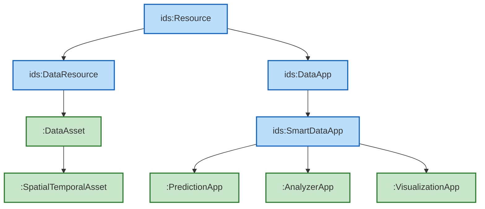
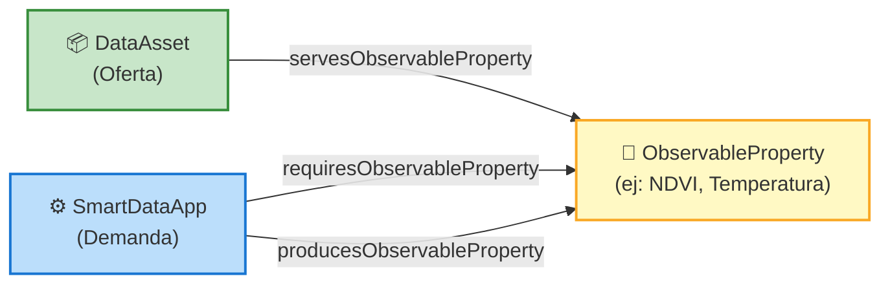
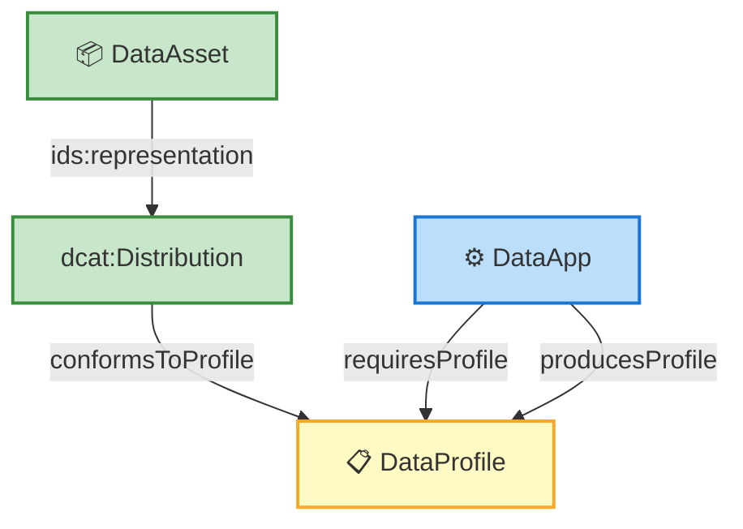
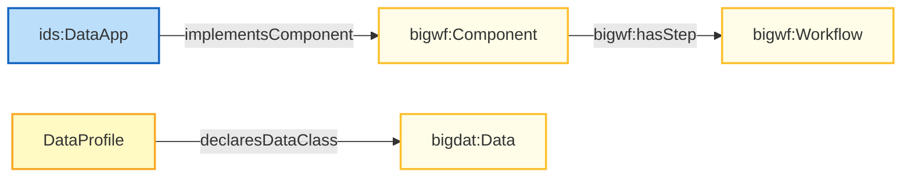
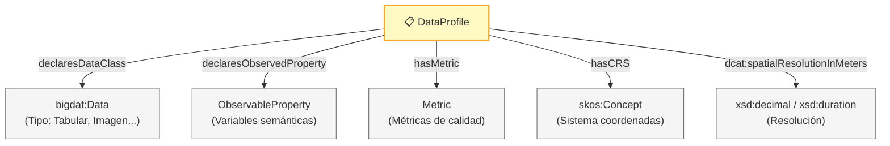
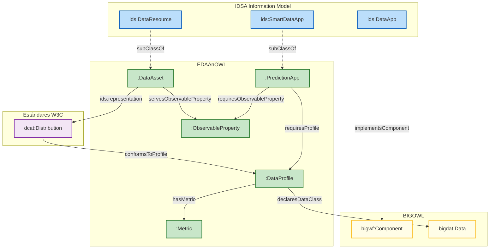

# EDAAnOWL - Diagramas de Arquitectura

Diagramas simplificados para explicar la ontología EDAAnOWL.

---

## 1️⃣ Jerarquía de Clases: IDSA → EDAAnOWL

Este diagrama muestra **solo la herencia de clases** (subClassOf).

**Leyenda:**
- 🔵 Azul = IDSA Information Model
- 🟢 Verde = EDAAnOWL (nuestras clases)
- Todas las flechas = `rdfs:subClassOf`

---

## 2️⃣ El Matchmaking Semántico

Cómo **DataAsset** (oferta) y **SmartDataApp** (demanda) se conectan mediante **ObservableProperty**.

---

## 3️⃣ El Matchmaking Estructural

Cómo los **DataProfiles** describen la estructura de datos.

---

## 4️⃣ Conexión con BIGOWL (Workflows)

Cómo las **DataApps** de IDSA se conectan con **Components** de BIGOWL.

---

## 5️⃣ DataProfile: Contenido

Qué incluye un **DataProfile**.

---

## 6️⃣ Diagrama Completo CON nombres de propiedades

Vista general con todas las propiedades etiquetadas.

---

## 📋 Resumen de Propiedades Principales

| Desde | Hacia | Propiedad | Significado |
|-------|-------|-----------|-------------|
| DataAsset | ObservableProperty | `servesObservableProperty` | "Este dataset contiene..." |
| SmartDataApp | ObservableProperty | `requiresObservableProperty` | "Esta app necesita..." |
| SmartDataApp | ObservableProperty | `producesObservableProperty` | "Esta app genera..." |
| dcat:Distribution | DataProfile | `conformsToProfile` | "Esta distribución tiene este perfil" |
| DataApp | DataProfile | `requiresProfile` | "Esta app necesita este perfil" |
| DataApp | DataProfile | `producesProfile` | "Esta app genera este perfil" |
| DataApp | bigwf:Component | `implementsComponent` | "Esta app implementa este componente" |
| DataProfile | bigdat:Data | `declaresDataClass` | "Este perfil es de tipo..." |
| DataProfile | Metric | `hasMetric` | "Este perfil tiene esta métrica" |

---

## 🎯 Mensaje Clave

> **EDAAnOWL = Puente entre IDSA y BIGOWL**
> 
> - **IDSA** → Gobernanza (contratos, políticas, endpoints)
> - **BIGOWL** → Ejecución (workflows, algoritmos)
> - **EDAAnOWL** → Matchmaking (perfiles, propiedades observables)
