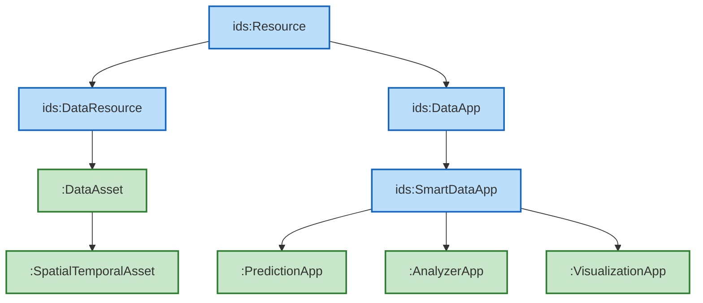
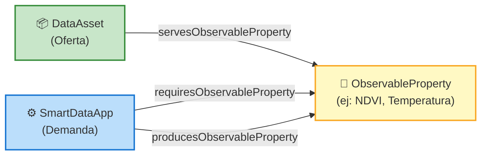
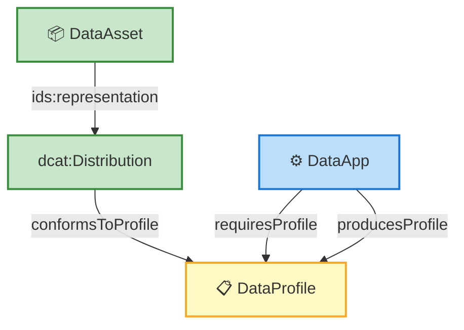
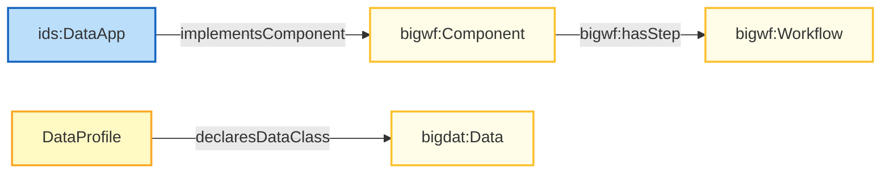
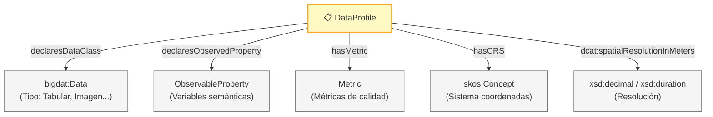
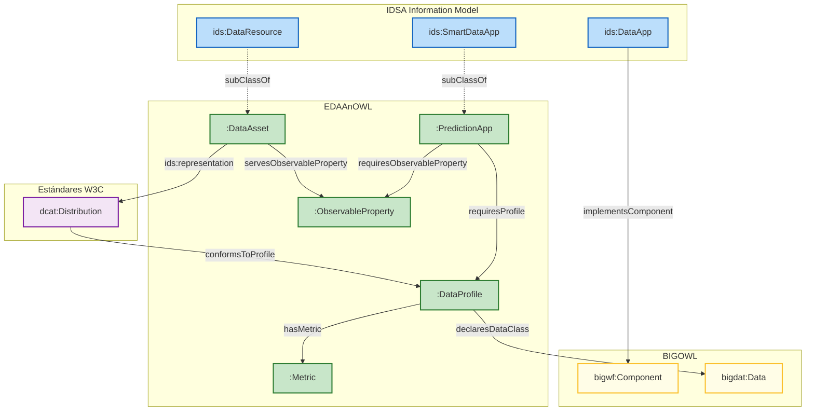
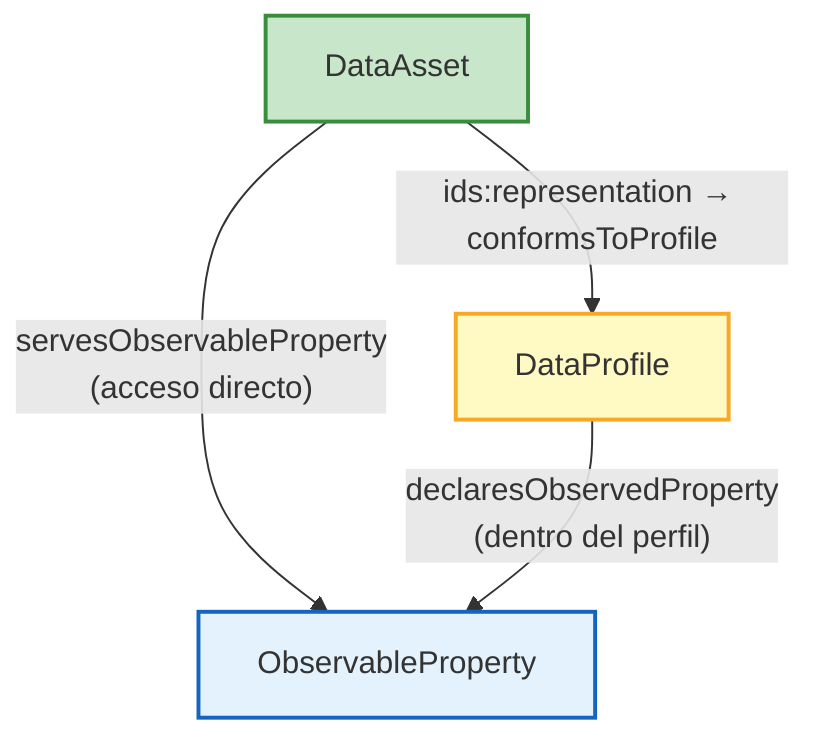
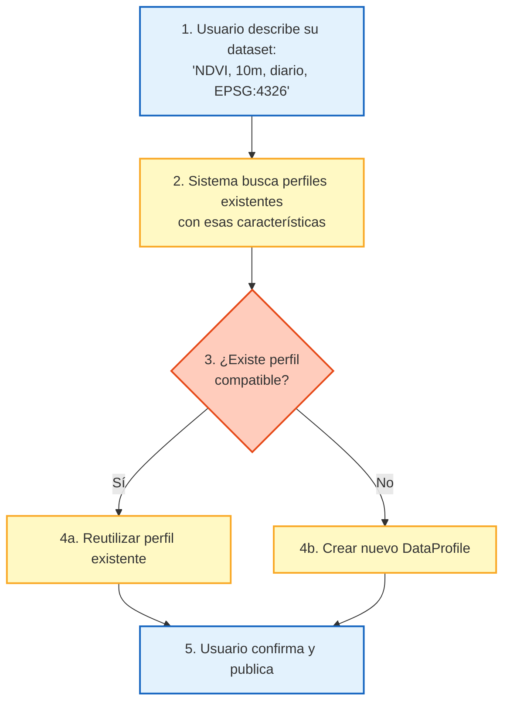
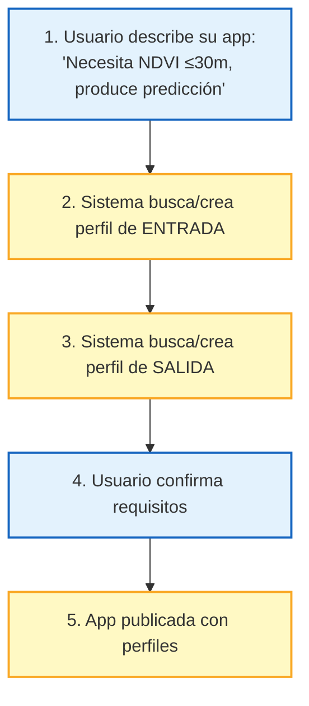
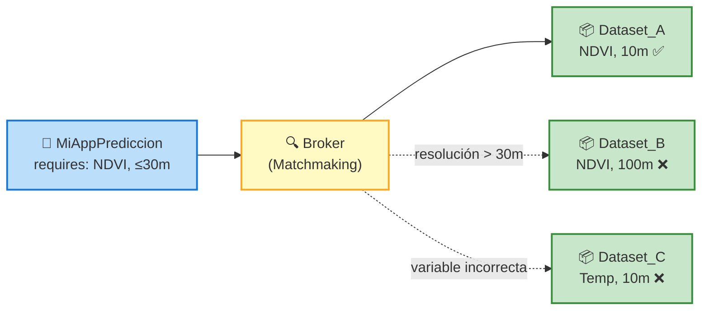

# EDAAnOWL - Diagramas de Arquitectura

Diagramas simplificados para explicar la ontología EDAAnOWL.

---

## 1️⃣ Jerarquía de Clases: IDSA → EDAAnOWL

Este diagrama muestra **solo la herencia de clases** (subClassOf).



**Leyenda:**
- 🔵 Azul = IDSA Information Model
- 🟢 Verde = EDAAnOWL (nuestras clases)
- Todas las flechas = `rdfs:subClassOf`

---

## 2️⃣ El Matchmaking Semántico

Cómo **DataAsset** (oferta) y **SmartDataApp** (demanda) se conectan mediante **ObservableProperty**.



---

## 3️⃣ El Matchmaking Estructural

Cómo los **DataProfiles** describen la estructura de datos.



---

## 4️⃣ Conexión con BIGOWL (Workflows)

Cómo las **DataApps** de IDSA se conectan con **Components** de BIGOWL.



---

## 5️⃣ DataProfile: Contenido

Qué incluye un **DataProfile**.



---

## 6️⃣ Diagrama Completo

Vista general con todas las propiedades etiquetadas.



---

## 📋 Resumen de Propiedades Principales

| Desde | Hacia | Propiedad | Significado |
|-------|-------|-----------|-------------|
| DataAsset | ObservableProperty | `servesObservableProperty` | "Este dataset contiene..." |
| SmartDataApp | ObservableProperty | `requiresObservableProperty` | "Esta app necesita..." |
| SmartDataApp | ObservableProperty | `producesObservableProperty` | "Esta app genera..." |
| dcat:Distribution | DataProfile | `conformsToProfile` | "Esta distribución tiene este perfil" |
| DataApp | DataProfile | `requiresProfile` | "Esta app necesita este perfil" |
| DataApp | DataProfile | `producesProfile` | "Esta app genera este perfil" |
| DataApp | bigwf:Component | `implementsComponent` | "Esta app implementa este componente" |
| DataProfile | bigdat:Data | `declaresDataClass` | "Este perfil es de tipo..." |
| DataProfile | Metric | `hasMetric` | "Este perfil tiene esta métrica" |

---

## 🎯 Mensaje Clave

> **EDAAnOWL = Puente entre IDSA y BIGOWL**
> 
> - **IDSA** → Gobernanza (contratos, políticas, endpoints)
> - **BIGOWL** → Ejecución (workflows, algoritmos)
> - **EDAAnOWL** → Matchmaking (perfiles, propiedades observables)

---

## 🧠 Las Tres Capas del Matchmaking

EDAAnOWL define **tres niveles diferentes** de compatibilidad entre datos y aplicaciones:

| Nivel | Concepto | Pregunta que responde | Ejemplo |
|-------|----------|----------------------|---------|
| **Semántico** | `ObservableProperty` | *¿De qué trata el dato?* | "NDVI", "Temperatura del suelo", "Precipitación" |
| **Estructural** | `DataProfile` | *¿Qué estructura/características tiene?* | "Tabular, 10m resolución, EPSG:4326, actualización diaria" |
| **Técnico** | `dcat:Distribution` | *¿Cómo se entrega?* | "CSV", "GeoTIFF", "application/json" |

### ¿Por qué tres niveles?

Dos datasets pueden compartir el mismo tema (semántico) pero ser incompatibles estructuralmente:

```
Escenario: App de predicción necesita NDVI

Dataset A: NDVI a 1km, proyección UTM, mensual
Dataset B: NDVI a 10m, EPSG:4326, diario

→ Ambos sirven NDVI (match semántico ✅)
→ Solo Dataset B es estructuralmente compatible con la app
```

---

## 🤔 ¿Por qué tener AMBOS: ObservableProperty Y DataProfile?

EDAAnOWL permite declarar `ObservableProperty` tanto directamente en `DataAsset` (`servesObservableProperty`) como dentro de `DataProfile` (`declaresObservedProperty`). Esta aparente duplicación tiene un propósito:

### Diagrama de la relación



### Roles diferentes

| Propiedad | Ubicación | Propósito |
|-----------|-----------|-----------|
| `servesObservableProperty` | DataAsset → ObservableProperty | **Descubrimiento rápido**: "¿De qué trata este dataset?" |
| `declaresObservedProperty` | DataProfile → ObservableProperty | **Contrato estructural**: "¿Qué variables incluye este perfil técnico?" |

---

## ⚖️ Pros y Contras del Diseño Actual

### ✅ Ventajas

| Ventaja | Descripción |
|---------|-------------|
| **Pre-filtro eficiente** | `servesObservableProperty` permite reducir el espacio de búsqueda antes de comparar perfiles completos |
| **Consultas simples** | Para catálogos orientados a humanos, `servesObservableProperty` permite consultas directas sin navegar a perfiles |
| **Flexibilidad** | Datasets simples pueden usar solo `servesObservableProperty` sin definir un `DataProfile` completo |
| **Composición avanzada** | Para matchmaking automatizado, `DataProfile` proporciona las características técnicas necesarias |

### ⚠️ Desventajas

| Desventaja | Descripción |
|------------|-------------|
| **Potencial inconsistencia** | Un DataAsset podría declarar `servesObservableProperty :NDVI` pero su DataProfile no incluir `:NDVI` en `declaresObservedProperty` |
| **Duplicación de información** | La misma información semántica puede estar en dos lugares |
| **Complejidad conceptual** | Requiere entender cuándo usar cada propiedad |

---

## 📊 Cuándo Usar Cada Enfoque

### Caso 1: Catálogo para humanos (Portal de datos)

```
Usuario busca: "datasets de temperatura en Andalucía"

→ Usar servesObservableProperty para filtrar rápidamente
→ No es necesario comparar DataProfiles
→ El usuario decide manualmente si el dataset le sirve
```

**Propiedades usadas**: `servesObservableProperty`, metadatos DCAT básicos

### Caso 2: Composición automática (Data Space inteligente)

```
Broker automático busca: "datasets compatibles con PredictionApp_X"

Proceso:
1. Pre-filtro semántico: 
   DataAsset.servesObservableProperty ∩ App.requiresObservableProperty
   
2. Filtro estructural:
   DataAsset.distribution.conformsToProfile compatible con App.requiresProfile
   (mismo tipo de datos, resolución adecuada, CRS compatible)
   
3. Verificación técnica:
   Distribution.mediaType aceptado por la app
```

**Propiedades usadas**: Todas (ObservableProperty + DataProfile + Distribution)

### Caso 3: Datasets simples sin perfil detallado

```
Dataset básico: "CSV con temperaturas mensuales"

→ Usar solo servesObservableProperty: "Temperatura"
→ No definir DataProfile complejo
→ Suficiente para descubrimiento, no para composición automática
```

**Propiedades usadas**: `servesObservableProperty`, `dcat:Distribution`

---

## 🔄 Reutilización de DataProfiles

Los DataProfiles están diseñados para ser **reutilizables**. Múltiples datasets pueden compartir el mismo perfil si tienen la misma estructura:

```turtle
# Un perfil reutilizable
:Sentinel2_NDVI_10m_Daily a :DataProfile ;
    :declaresDataClass bigdat:RasterImage ;
    :declaresObservedProperty :NDVI ;
    :hasCRS <http://www.opengis.net/def/crs/EPSG/0/4326> ;
    dcat:spatialResolutionInMeters 10 ;
    dcat:temporalResolution "P1D"^^xsd:duration .

# Múltiples datasets usan el mismo perfil
:Dataset_Andalucia ids:representation [
    :conformsToProfile :Sentinel2_NDVI_10m_Daily
] .

:Dataset_Cataluna ids:representation [
    :conformsToProfile :Sentinel2_NDVI_10m_Daily
] .
```

### Proceso para decidir si reutilizar

```
1. Usuario describe características de su dataset
2. Sistema busca perfiles existentes con esas características
3. Si existe perfil compatible → Reutilizar
4. Si no existe → Crear nuevo perfil
```

---

## 💡 Recomendación de Uso

| Situación | Recomendación |
|-----------|---------------|
| Dataset para catálogo público | Usar `servesObservableProperty` + `dcat:Distribution` básica |
| Dataset para composición automática | Usar ambos: `servesObservableProperty` + `DataProfile` completo |
| DataApp que consume/produce datos | Definir `requiresProfile` y `producesProfile` con detalle |
| Validación de compatibilidad | Comparar `DataProfile` completos (no solo ObservableProperty) |

> **Regla general**: El matchmaking semántico (`ObservableProperty`) es un **pre-filtro rápido**. 
> El matchmaking estructural (`DataProfile`) es la **verificación de compatibilidad real**.

---

## 🔧 Flujo Práctico: Cómo Usar DataProfile

### Escenario A: Publicar un DataAsset



#### Paso a paso

1. **Usuario proporciona metadatos**:
   - Tipo de datos: Raster/Imagen
   - Variable: NDVI
   - Resolución espacial: 10 metros
   - Resolución temporal: Diaria
   - CRS: EPSG:4326

2. **Sistema busca perfiles existentes**:
   ```sparql
   SELECT ?profile WHERE {
     ?profile a :DataProfile ;
              :declaresDataClass bigdat:RasterImage ;
              :declaresObservedProperty ?prop ;
              dcat:spatialResolutionInMeters ?res ;
              :hasCRS <http://www.opengis.net/def/crs/EPSG/0/4326> .
     ?prop skos:prefLabel "NDVI"@en .
     FILTER (?res <= 10)
   }
   ```

3. **Decisión**:
   - Si existe un perfil compatible → El usuario lo selecciona
   - Si no existe → El sistema crea uno nuevo

4. **Resultado final en RDF**:
   ```turtle
   :MiDataset a :DataAsset ;
       rdfs:label "NDVI Andalucía 2025" ;
       :servesObservableProperty :NDVI ;  # Para descubrimiento rápido
       ids:representation :MiDistribucion .

   :MiDistribucion a dcat:Distribution ;
       dcat:mediaType "image/tiff" ;
       dcat:accessURL <https://example.org/data/ndvi.tif> ;
       :conformsToProfile :Sentinel2_NDVI_10m_Daily .  # Perfil reutilizado

   :Sentinel2_NDVI_10m_Daily a :DataProfile ;
       :declaresDataClass bigdat:RasterImage ;
       :declaresObservedProperty :NDVI ;
       :hasCRS <http://www.opengis.net/def/crs/EPSG/0/4326> ;
       dcat:spatialResolutionInMeters 10 ;
       dcat:temporalResolution "P1D"^^xsd:duration ;
       :hasMetric [
           a :QualityMetric ;
           :metricName "cloudCoverage" ;
           :metricValue "15"^^xsd:decimal ;
           :metricUnit "%" 
       ] .
   ```

---

### Escenario B: Publicar una DataApp



#### Resultado final en RDF

```turtle
:MiAppPrediccion a :PredictionApp ;
    rdfs:label "Crop Yield Predictor" ;
    
    # Matchmaking semántico (pre-filtro)
    :requiresObservableProperty :NDVI ;
    :producesObservableProperty :CropYieldForecast ;
    
    # Matchmaking estructural (compatibilidad real)
    :requiresProfile :InputProfile_NDVI_Raster ;
    :producesProfile :OutputProfile_Forecast_Tabular ;
    
    # Conexión con BIGOWL
    :implementsComponent <https://w3id.org/BIGOWL/components/YieldPredictor> .

:InputProfile_NDVI_Raster a :DataProfile ;
    :declaresDataClass bigdat:RasterImage ;
    :declaresObservedProperty :NDVI ;
    dcat:spatialResolutionInMeters 30 ;  # Acepta hasta 30m
    dcat:temporalResolution "P1D"^^xsd:duration .

:OutputProfile_Forecast_Tabular a :DataProfile ;
    :declaresDataClass bigdat:TabularData ;
    :declaresObservedProperty :CropYieldForecast ;
    dcat:temporalResolution "P1M"^^xsd:duration .  # Predicción mensual
```

---

### Escenario C: Matchmaking Automático



#### Lógica del Broker

```
1. Pre-filtro semántico:
   App.requiresObservableProperty = :NDVI
   → Candidatos: Dataset_A (NDVI), Dataset_B (NDVI)
   → Descartados: Dataset_C (Temperatura)

2. Filtro estructural:
   App.requiresProfile.spatialResolution ≤ 30m
   → Dataset_A: 10m ✅ Compatible
   → Dataset_B: 100m ❌ Resolución insuficiente

3. Resultado: Solo Dataset_A es compatible
```

---

## 📝 Contenido Mínimo de un DataProfile

| Propiedad | Obligatoria | Descripción |
|-----------|-------------|-------------|
| `declaresDataClass` | ✅ Sí | Tipo BIGOWL (TabularData, RasterImage, TimeSeries...) |
| `hasMetric` | ✅ Sí (≥1) | Al menos una métrica descriptiva o de calidad |
| `declaresObservedProperty` | Recomendada | Variables semánticas que contiene |
| `hasCRS` | Si geoespacial | Sistema de coordenadas (EPSG) |
| `dcat:spatialResolutionInMeters` | Si geoespacial | Resolución espacial |
| `dcat:temporalResolution` | Si temporal | Resolución temporal (P1D, P1M...) |
