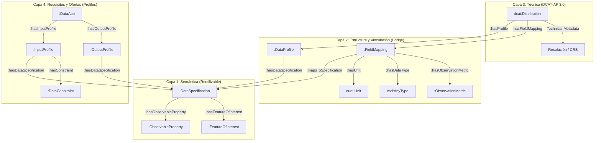
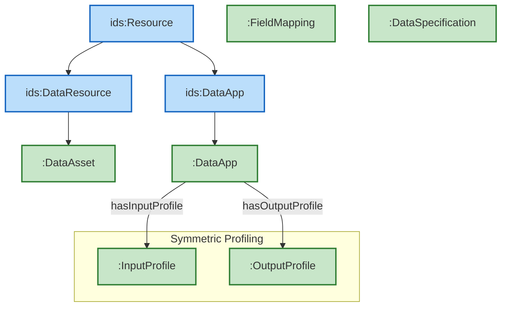
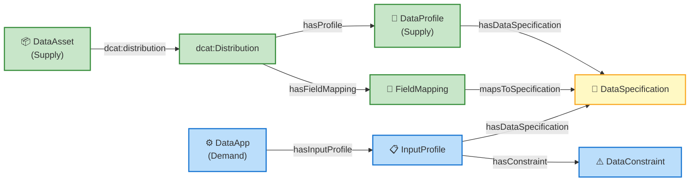

# EDAAnOWL v1.2.0 - Diagramas de Arquitectura y Capas

Este documento presenta los diagramas actualizados que reflejan la arquitectura **simétrica de 4 capas** adoptada en la versión 1.2.0.

---

## 1️⃣ La Arquitectura Simétrica de 4 Capas

EDAAnOWL v1.2.0 organiza la información en cuatro niveles para desacoplar totalmente la semántica de la implementación técnica.

```mermaid
graph TD
    subgraph Capa1 ["Capa 1: Semántica (Reutilizable)"]
        Spec[":DataSpecification"]
        OP[":ObservableProperty"]
        FOI[":FeatureOfInterest"]
        Spec -- ":hasObservableProperty" --> OP
        Spec -- ":hasFeatureOfInterest" --> FOI
    end

    subgraph Capa2 ["Capa 2: Estructura y Vinculación (Bridge)"]
        Prof[":DataProfile"]
        Mapping[":FieldMapping"]
        Unit["qudt:Unit"]
        DType["xsd:AnyType"]
        ObsMetric[":ObservationMetric"]
        Prof -- ":hasDataSpecification" --> Spec
        Mapping -- ":mapsToSpecification" --> Spec
        Mapping -- ":hasUnit" --> Unit
        Mapping -- ":hasDataType" --> DType
        Mapping -- ":hasObservationMetric" --> ObsMetric
    end

    subgraph Capa3 ["Capa 3: Técnica (DCAT-AP 3.0)"]
        Dist["dcat:Distribution"]
        Res["Resolución / CRS"]
        Dist -- ":hasProfile" --> Prof
        Dist -- ":hasFieldMapping" --> Mapping
        Dist -- "Technical Metadata" --> Res
    end

    subgraph Capa4 ["Capa 4: Requisitos y Ofertas (Profiles)"]
        App[":DataApp"]
        InProf[":InputProfile"]
        OutProf[":OutputProfile"]
        Cons[":DataConstraint"]
        
        App -- ":hasInputProfile" --> InProf
        App -- ":hasOutputProfile" --> OutProf
        InProf -- ":hasDataSpecification" --> Spec
        InProf -- ":hasConstraint" --> Cons
        OutProf -- ":hasDataSpecification" --> Spec
    end
```

---

## 2️⃣ Jerarquía de Clases: IDSA → EDAAnOWL (v1.2.0)

La versión 1.2.0 consolida el perfilado simétrico para aplicaciones e introduce nuevas propiedades de cumplimiento.

```mermaid
flowchart TD
    classDef idsa fill:#bbdefb,stroke:#1565c0,stroke-width:2px
    classDef edaan fill:#c8e6c9,stroke:#2e7d32,stroke-width:2px

    R["ids:Resource"]
    DR["ids:DataResource"]
    DA_IDSA["ids:DataApp"]

    R --> DR
    R --> DA_IDSA

    DataAsset[":DataAsset"]
    DataApp[":DataApp"]
    FieldMap[":FieldMapping"]
    DataSpec[":DataSpecification"]
    
    subgraph Profiles ["Symmetric Profiling"]
        InProf[":InputProfile"]
        OutProf[":OutputProfile"]
    end

    DR --> DataAsset
    DA_IDSA --> DataApp
    
    DataApp -- "hasInputProfile" --> InProf
    DataApp -- "hasOutputProfile" --> OutProf
    
    class R,DR,DA_IDSA idsa
    class DataAsset,DataApp,FieldMap,DataSpec,InProf,OutProf edaan
```

---

## 3️⃣ Matchmaking: Simetría entre Oferta y Demanda

En v1.2.0, el matchmaking es bidireccional, permitiendo descubrir qué activos alimentan una App y qué Apps pueden procesar un Activo.

```mermaid
flowchart LR
    classDef supply fill:#c8e6c9,stroke:#388e3c,stroke-width:2px
    classDef demand fill:#bbdefb,stroke:#1976d2,stroke-width:2px
    classDef bridge fill:#fff9c4,stroke:#f9a825,stroke-width:2px

    Asset["📦 DataAsset<br/>(Supply)"]
    Dist["dcat:Distribution"]
    Prof["📄 DataProfile<br/>(Supply)"]
    Mapping["🔗 FieldMapping"]
    Spec["🎯 DataSpecification"]
    
    App["⚙️ DataApp<br/>(Demand)"]
    InProf["📋 InputProfile"]
    Cons["⚠️ DataConstraint"]

    Asset -- "dcat:distribution" --> Dist
    Dist -- "hasProfile" --> Prof
    Prof -- "hasDataSpecification" --> Spec
    Dist -- "hasFieldMapping" --> Mapping
    Mapping -- "mapsToSpecification" --> Spec
    
    App -- "hasInputProfile" --> InProf
    InProf -- "hasDataSpecification" --> Spec
    InProf -- "hasConstraint" --> Cons

    class Asset,Dist,Prof,Mapping supply
    class App,InProf,Cons demand
    class Spec bridge
```

---

## 4️⃣ Resumen de Propiedades Clave v1.2.0

| Capa | Clase | Propiedad | Significado |
| :--- | :--- | :--- | :--- |
| **Binding** | FieldMapping | `:hasDataType` | Define el tipo técnico (xsd:float, etc) |
| **Binding** | FieldMapping | `:hasObservationMetric` | Define la estadística (Media, Máximo, etc) |
| **Requirement**| DataConstraint | `:requiresDataType` | **(Nuevo v1.2.0)** Exige un tipo de dato específico |
| **Requirement**| DataConstraint | `:constraintOperator` | **(Nuevo v1.2.0)** Operador formal (vía Vocabulario de Clases) |
| **Offer** | OutputProfile | `:hasDataSpecification`| **(Nuevo v1.2.0)** La App produce esta variable |

---

## 🎯 Mensaje Clave v1.2.0

> **Sincronización Técnica y Semántica**
> 
> Mientras que la v1.1.0 separaba el significado del mapeo, la **v1.2.0** permite que la demanda (Apps) y la oferta (Datasets) hablen el mismo lenguaje técnico a través de restricciones explícitas de tipos de datos y operadores formales, facilitando el encadenamiento automático de servicios en el espacio de datos.
