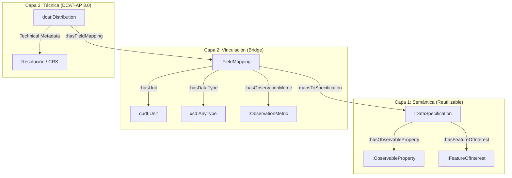
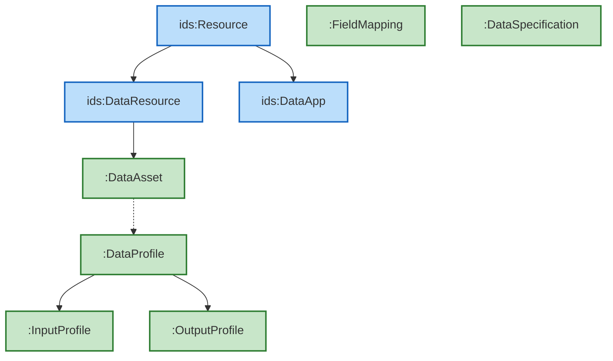
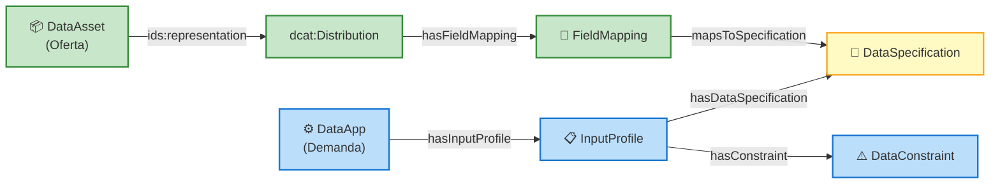
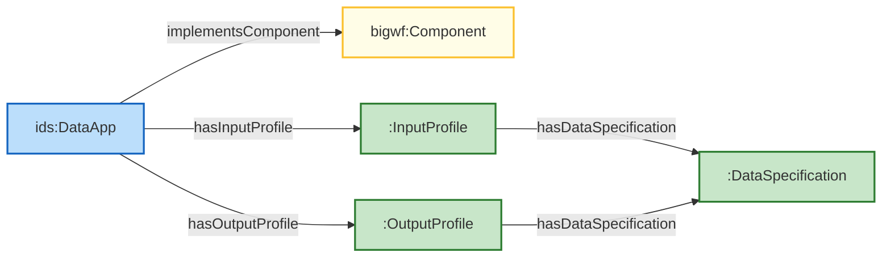

# EDAAnOWL v1.0.0 - Diagramas de Arquitectura

Este documento presenta diagramas actualizados que reflejan la arquitectura adoptada en la versión 1.0.0, enfocada en el desacoplamiento semántico y técnico.

---

## 1️⃣ La Arquitectura de 3 Capas

EDAAnOWL v1.0.0 organiza la información en tres niveles claros para maximizar la reutilización.

```mermaid
graph TD
    subgraph Capa1 ["Capa 1: Semántica (Reutilizable)"]
        Spec[":DataSpecification"]
        OP[":ObservableProperty"]
        FOI[":FeatureOfInterest"]
        Spec -- ":hasObservableProperty" --> OP
        Spec -- ":hasFeatureOfInterest" --> FOI
    end

    subgraph Capa2 ["Capa 2: Vinculación (Bridge)"]
        Mapping[":FieldMapping"]
        Unit["qudt:Unit"]
        DType["xsd:AnyType"]
        ObsMetric[":ObservationMetric"]
        Mapping -- ":mapsToSpecification" --> Spec
        Mapping -- ":hasUnit" --> Unit
        Mapping -- ":hasDataType" --> DType
        Mapping -- ":hasObservationMetric" --> ObsMetric
    end

    subgraph Capa3 ["Capa 3: Técnica (DCAT-AP 3.0)"]
        Dist["dcat:Distribution"]
        Res["Resolución / CRS"]
        Dist -- ":hasFieldMapping" --> Mapping
        Dist -- "Technical Metadata" --> Res
    end
```

---

## 2️⃣ Jerarquía de Clases: IDSA → EDAAnOWL (v1.0.0)

```mermaid
flowchart TD
    classDef idsa fill:#bbdefb,stroke:#1565c0,stroke-width:2px
    classDef edaan fill:#c8e6c9,stroke:#2e7d32,stroke-width:2px

    R["ids:Resource"]
    DR["ids:DataResource"]
    DA["ids:DataApp"]

    R --> DR
    R --> DA

    DataAsset[":DataAsset"]
    FieldMap[":FieldMapping"]
    DataSpec[":DataSpecification"]
    DataProf[":DataProfile"]
    InProf[":InputProfile"]
    OutProf[":OutputProfile"]

    DR --> DataAsset
    DataAsset -.-> DataProf
    DataProf --> InProf
    DataProf --> OutProf
    
    class R,DR,DA idsa
    class DataAsset,FieldMap,DataSpec,DataProf,InProf,OutProf edaan
```

---

## 3️⃣ Matchmaking: Demanda vs Oferta (v1.0.0)

Cómo una **DataApp** encuentra un **DataAsset** compatible comparando especificaciones y restricciones.

```mermaid
flowchart LR
    classDef supply fill:#c8e6c9,stroke:#388e3c,stroke-width:2px
    classDef demand fill:#bbdefb,stroke:#1976d2,stroke-width:2px
    classDef bridge fill:#fff9c4,stroke:#f9a825,stroke-width:2px

    Asset["📦 DataAsset<br/>(Oferta)"]
    Dist["dcat:Distribution"]
    Mapping["🔗 FieldMapping"]
    Spec["🎯 DataSpecification"]
    
    App["⚙️ DataApp<br/>(Demanda)"]
    InProf["📋 InputProfile"]
    Cons["⚠️ DataConstraint"]

    Asset -- "ids:representation" --> Dist
    Dist -- "hasFieldMapping" --> Mapping
    Mapping -- "mapsToSpecification" --> Spec
    
    App -- "hasInputProfile" --> InProf
    InProf -- "hasDataSpecification" --> Spec
    InProf -- "hasConstraint" --> Cons

    class Asset,Dist,Mapping supply
    class App,InProf,Cons demand
    class Spec bridge
```

---

## 4️⃣ Componentes de una DataApp (BIGOWL Integration)

```mermaid
flowchart LR
    classDef idsa fill:#bbdefb,stroke:#1565c0,stroke-width:2px
    classDef bigowl fill:#fffde7,stroke:#fbc02d,stroke-width:2px
    classDef edaan fill:#c8e6c9,stroke:#2e7d32,stroke-width:2px

    App["ids:DataApp"]
    Comp["bigwf:Component"]
    
    InProf[":InputProfile"]
    OutProf[":OutputProfile"]
    Spec[":DataSpecification"]

    App -- "implementsComponent" --> Comp
    App -- "hasInputProfile" --> InProf
    App -- "hasOutputProfile" --> OutProf
    InProf -- "hasDataSpecification" --> Spec
    OutProf -- "hasDataSpecification" --> Spec

    class App idsa
    class Comp bigowl
    class InProf,OutProf,Spec edaan
```

---

## 5️⃣ Resumen de Propiedades v1.0.0

| Dominio | Rango | Propiedad | Significado |
| :--- | :--- | :--- | :--- |
| **dcat:Distribution** | FieldMapping | `:hasFieldMapping` | El archivo tiene un mapeo de columna |
| **FieldMapping** | DataSpecification | `:mapsToSpecification` | Vincula columna a concepto semántico |
| **FieldMapping**| xsd:string | `:mapsField` | Nombre físico de la columna (ej: "temp_c") |
| **FieldMapping** | qudt:Unit | `:hasUnit` | Unidad de medida de esta columna |
| **InputProfile** | DataSpecification | `:hasDataSpecification`| La App requiere esta variable |
| **InputProfile** | DataConstraint | `:hasConstraint` | Requisitos adicionales (Unidad, Métrica) |
| **DataConstraint** | qudt:Unit | `:requiresUnit` | "Necesito los datos en..." |

---

## 🎯 Mensaje Clave v1.0.0

> **Semántica Pura ↔ Mapeo Técnico**
> 
> En v1.0.0, el **Fenómeno** (Humedad) vive en la `DataSpecification`, mientras que la **Unidad** (Porcentaje) vive en el `FieldMapping`. Esto permite que una App pida datos de "Heredad" y especifique por separado si los necesita en % o en escala 0-1.
