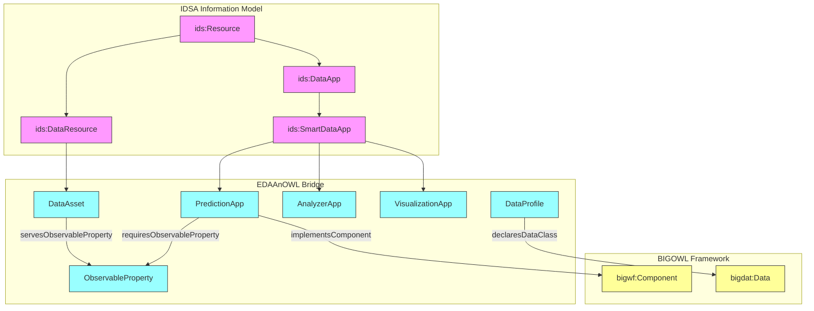

# EDAAnOWL v0.2.1

Welcome to the documentation for version 0.2.1 of the EDAAnOWL ontology.

This ontology provides a semantic model for describing and annotating **Data Assets** and **Data Apps** (Applications/Services) within a Data Space, aligning the **IDSA** Information Model and the **BIGOWL** ontology framework.

## 🚀 Key Changes in v0.2.0: Model Unification

This version **unifies and refines** the ontology model, resolving a key inconsistency from v0.1.0.

### Alignment Overview



## 🖼 Visual summary


Short: high-level mapping of IDSA ↔ EDAAnOWL ↔ BIGOWL and publication via DCAT/Policies.

### The Problem in v0.1.0

Version 0.1.0 introduced a powerful "Direct Semantic Model" (e.g., `:requiresObservableProperty`). However, it did so by creating a new class, `:AnalyticalService`, as a subclass of `ids:AppResource`.

This created two parallel and conflicting hierarchies for "applications":

1.  **v0.0.1 Hierarchy (Profile-based):** `ids:DataApp` -> `ids:SmartDataApp` -> `:PredictionApp` (which used `:requiresProfile`).
2.  **v0.1.0 Hierarchy (Semantic-based):** `ids:AppResource` -> `:AnalyticalService` (which used `:requiresObservableProperty`).

This was confusing and semantically inconsistent, as `ids:AppResource` (for generic services) and `ids:DataApp` (for connector-deployable apps) are _sibling_ classes in the IDSA model, not parent/child.

### The Solution in v0.2.0

Version 0.2.0 corrects this by unifying all application/service modeling onto the correct IDSA branch:

1.  **Removed `:AnalyticalService`:** The redundant class has been removed.
2.  **Unified on `ids:SmartDataApp`:** This is the standard IDSA class for deployable, data-processing applications.
3.  **Property Domains Moved:** The semantic properties (e.g., `:requiresObservableProperty`) now have their domain (`rdfs:domain`) declared on `ids:SmartDataApp`.

This change allows specialized classes (like `:PredictionApp`) to inherit _both_ sets of properties, enabling them to be described using both models.

## 🛠 Key changes in v0.2.1

This is a small maintenance/packaging release that does not change the ontology's classes or properties from v0.2.0. The main detectable changes between the `0.2.0` and `0.2.1` TTL serialisations are:

- Version bump and metadata: `owl:versionIRI`/`owl:versionInfo` updated to `0.2.1`, `owl:priorVersion` set to `0.2.0`, and `dct:modified` updated to `2025-11-12`.
- Added bibliographic metadata: `dct:bibliographicCitation` was added to the ontology header.
- Added a `schema:image` annotation pointing at the architecture diagram hosted on GitHub (annotation triple using `<https://schema.org/image>`).
- Imports for the packaged vocabularies were updated to point at the `0.2.1` vocabulary paths (e.g. `.../vocabularies/agro-vocab`). The vocabularies are the same than previous versions.

**The most notable change in this version** is that the documentation generated by widoco no longer describes the ontologies imported into EDAAnOWL, in this way the documentation is more specific to our own ontology.


---

## 🧐 How the Ontology Fulfills Requirements (v0.2.1 Model)

EDAAnOWL v0.2.0 provides **two complementary compatibility models** that can now be used together.

### Model 1: Profile-based Compatibility (from v0.0.1)

This model is ideal for structured data where _shape_ and _structure_ are key.

- An `ids:DataResource` **conforms to** (`:conformsToProfile`) a `:DataProfile`.
- An `ids:SmartDataApp` (like `:PredictionApp`) **requires** (`:requiresProfile`) a `:DataProfile`.
- The `:DataProfile` describes the data's "signature":
  - `:declaresDataClass` (e.g., `:tabular`, `:georaster`)
  - `:declaresObservedProperty` (e.g., `:yield`, `:precipitation`)

### Model 2: Direct Semantic Compatibility (Refined in v0.2.0)

This model is ideal for simple, direct semantic "matchmaking" based on business concepts.

- A `:DataAsset` (subclass of `ids:DataResource`) **serves** a variable (e.g., `:servesObservableProperty :ndvi`).
- An `ids:SmartDataApp` (like `:PredictionApp`) **requires** a variable (e.g., `:requiresObservableProperty :ndvi`).

### Example (Using BOTH models together)

An application can now be described with full precision, combining both models in a single instance:

```turtle
# The APPLICATION is a standard, deployable IDSA App
ex:CropPredictorApp a :PredictionApp ;
    dct:title "Crop Yield Predictor" ;
    :hasDomainSector :agriculture ;

    # 1. STRUCTURAL Requirement (Profile Model)
    # "I need data shaped like this (columns, CRS, etc.)"
    :requiresProfile ex:AgriInputProfile ;

    # 2. SEMANTIC Requirement (Direct Model)
    # "Specifically, that data must contain NDVI and Temperature."
    :requiresObservableProperty :ndvi, :temperature ;

    # 3. SEMANTIC Output (Direct Model)
    # "And I produce 'Crop Yield'."
    :producesObservableProperty :yield .

# The DATASET satisfies both requirements
ex:MySentinelData a :SpatialTemporalAsset ;
    dct:title "Sentinel-2 Data for Jaen" ;

    # 1. It MATCHES the structure
    :conformsToProfile ex:AgriInputProfile ;

    # 2. It PROVIDES the semantics
    :servesObservableProperty :ndvi, :temperature .
```

---

## ✅ Requirement Coverage (A3.2 / A4.1)

- R1 (IDSA Extension): Extends `ids:DataResource` as `:DataAsset` and leverages `ids:SmartDataApp` for apps; adds domain alignment via `:hasDomainSector`, support contacts, profiles, and semantic signatures.
- R2 (Atomic Services/Assets): Enables decomposition via `DataProfile` features and semantic I/O (`requires/producesObservableProperty`), and aligns with BIGOWL `Component`.
- R3 (Validation and Suggestion): Model includes all hooks to write SHACL shapes for matchmaking between assets and apps (profile-based and semantic-based). See section “Validation” in repository guidelines.
- R4 (Domain Alignment): Uses SOSA/SSN for `ObservableProperty`, SKOS concept schemes (sector, datatypes, observed properties) to align with external vocabularies.
- R5 (Workflow Generation): Bridges to BIGOWL `Component` and OPMW `WorkflowTemplate` through `:implementsComponent` and `:realizesWorkflow`.

---

## 🧩 Key Classes and Properties (Quick Reference)

| Class                                         | Origin        | Role in EDAAnOWL                               | Key Object Properties                                                                                                                                           | Key Data Properties                                                                        | Example                                                 |
| --------------------------------------------- | ------------- | ---------------------------------------------- | --------------------------------------------------------------------------------------------------------------------------------------------------------------- | ------------------------------------------------------------------------------------------ | ------------------------------------------------------- |
| ids:Resource                                  | IDSA          | Base for any asset/service                     | `:hasDomainSector`, `:topic`, `:spatialGranularityConcept`                                                                                                      | `:spatialGranularity` (deprecated), `:supportContact`                                      | `ex:r a ids:Resource`                                   |
| :DataAsset ⊑ ids:DataResource                 | EDAAnOWL      | Data asset with domain semantics               | `:servesObservableProperty`                                                                                                                                     | —                                                                                          | `ex:d a :DataAsset ; :servesObservableProperty :ndvi`   |
| ids:SmartDataApp                              | IDSA          | Data processing app/service                    | `:requiresProfile`, `:producesProfile`, `:requiresObservableProperty`, `:producesObservableProperty`, `:implementsComponent`, `:realizesWorkflow`, `:parameter` | —                                                                                          | `ex:a a ids:SmartDataApp ; :requiresProfile ex:p`       |
| :PredictionApp ⊑ ids:SmartDataApp             | EDAAnOWL      | Predictive app specialization                  | inherits above                                                                                                                                                  | —                                                                                          | `ex:pred a :PredictionApp`                              |
| :AnalyzerApp ⊑ ids:SmartDataApp               | EDAAnOWL      | Descriptive/diagnostic app                     | inherits above                                                                                                                                                  | —                                                                                          | `ex:ana a :AnalyzerApp`                                 |
| :VisualizationApp ⊑ ids:SmartDataApp          | EDAAnOWL      | Visualization/reporting app                    | inherits above                                                                                                                                                  | —                                                                                          | `ex:viz a :VisualizationApp`                            |
| :DataProfile                                  | EDAAnOWL      | Data “signature” (structure/semantics)         | `:declaresDataClass`, `:declaresObservedProperty`                                                                                                               | `:profileCRS`, `:profileCRSRef`, `:profileSpatialResolution`, `:profileTemporalResolution` | `ex:p a :DataProfile ; :declaresObservedProperty :ndvi` |
| :ObservableProperty ⊑ sosa:ObservableProperty | EDAAnOWL/SOSA | Semantic variable used by assets and apps      | —                                                                                                                                                               | —                                                                                          | `:ndvi a :ObservableProperty`                           |
| bigwf:Component                               | BIGOWL        | Workflow component implemented by apps         | `:producesResource`, `:consumesResource`                                                                                                                        | —                                                                                          | `ex:c a bigwf:Component`                                |
| ids:Representation                            | IDSA          | Representation consumed/produced in components | —                                                                                                                                                               | —                                                                                          | `ex:r a ids:Representation`                             |
| opmw:WorkflowTemplate                         | OPMW          | Abstract workflow realized by apps             | —                                                                                                                                                               | —                                                                                          | `ex:w a opmw:WorkflowTemplate`                          |

Notes:

- Prefer `:spatialGranularityConcept` (SKOS) over `:spatialGranularity` (string). The latter is deprecated.
- `:profileCRSRef` must be an IRI (`xsd:anyURI`).

---

## 📚 Mini Use Cases (Annotation Patterns)

1. Matchmaking (Semantic)

```turtle
ex:NDVIseries a :DataAsset ; :servesObservableProperty :ndvi .
ex:YieldPredictor a :PredictionApp ; :requiresObservableProperty :ndvi .
# A reasoner/SHACL can suggest: NDVIseries is a valid input for YieldPredictor
```

2. Matchmaking (Profile)

```turtle
ex:AgriProfile a :DataProfile ;
  :declaresDataClass bigdat:Data ;
  :declaresObservedProperty :temperature ;
  :profileCRS "EPSG:4326" ;
  :profileCRSRef <http://www.opengis.net/def/crs/EPSG/0/4326> .

ex:WeatherApp a ids:SmartDataApp ; :requiresProfile ex:AgriProfile .
ex:WeatherDataset a :DataAsset ; :conformsToProfile ex:AgriProfile .
```

3. Workflow Alignment

```turtle
ex:SoilMoistureComponent a bigwf:Component .
ex:SoilMoistureApp a ids:SmartDataApp ;
  :implementsComponent ex:SoilMoistureComponent ;
  :realizesWorkflow ex:SoilMoistureWorkflow .
```

---

## 🔎 Validation (SHACL hints)

- Ensure an `ids:SmartDataApp` requiring an observable is linked to at least one `:ObservableProperty`.
- Ensure an asset that claims `:conformsToProfile` has consistent CRS/resolution datatypes.
- Suggest candidate assets for apps where `requiresObservableProperty` ⊆ assets’ `servesObservableProperty`.

---

## 🔗 IDSA alignment (Recommended usage)

This ontology follows the IDSA taxonomy and views:

- Resource taxonomy: `ids:Resource` → `ids:DataResource` (used by `:DataAsset`) and `ids:DataApp`/`ids:SmartDataApp` (used by app specializations). See IDSA docs and figures (Resource taxonomy, Data App taxonomy/content view).
- 3C views: Concept (what it is), Content (what it contains → `ids:Representation`), Context (conditions of use → contract/policies).

Minimal Content view example (Representation on a Data Asset):

```turtle
ex:MyRaster a :DataAsset ;
  dct:title "Example Raster" ;
  ids:representation ex:GeoTIFFRepr ;
  :servesObservableProperty :ndvi .

ex:GeoTIFFRepr a ids:Representation ;
  dct:format "GeoTIFF" ;
  ids:mediaType <https://www.iana.org/assignments/media-types/image/tiff> ;
  dct:language "en" .
```

Notes:

- Use `ids:representation` (or `ids:defaultRepresentation`) to link resources to `ids:Representation`.
- Put format/media type/language at the `ids:Representation` node. Keep structural/semantic constraints in `:DataProfile`.
- Policies/contracts: use ODRL/IDSA contracts linked to the resource/app when needed.

References:

- IDSA IM (Resource): https://international-data-spaces-association.github.io/InformationModel/docs/index.html#Resource
- Figures: Resource taxonomy, 3C views, Representation, Data App content view/taxonomy (see the linked figures in IDSA docs).

---

## 🧪 Optional patterns (Context view)

Endpoints (IDs Resource Endpoint):

```turtle
# Minimal endpoint node (extend with IDSA endpoint properties as needed)
ex:MyEndpoint a ids:ResourceEndpoint ;
  dct:description "HTTPS endpoint for raster download" .

ex:MyRaster ids:resourceEndpoint ex:MyEndpoint .
```

Contracts/Policies (ODRL/IDSA):

```turtle
ex:BasicUsePolicy a odrl:Policy , ids:ContractOffer ;
  odrl:permission [
    a odrl:Permission ;
    odrl:action odrl:use
  ] .

ex:MyRaster ids:contractOffer ex:BasicUsePolicy .
```

Notes:

- Attach `ids:resourceEndpoint` and `ids:contractOffer` to resources/apps to complete the IDSA Context view.
- Use additional ODRL constraints/duties (e.g., attribution) as required by your governance model.
