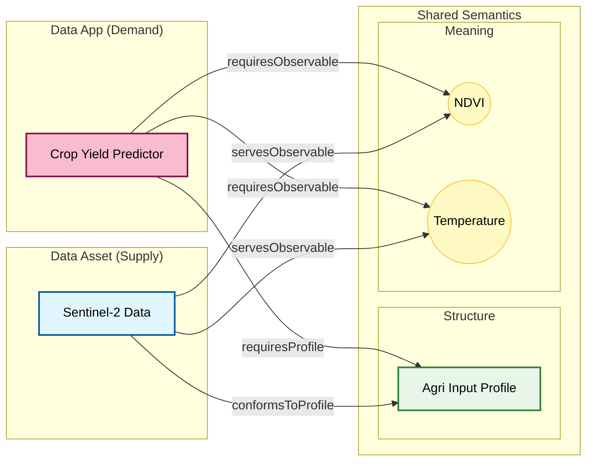

# EDAAnOWL v0.4.1

Welcome to the documentation for version 0.4.1 of the EDAAnOWL ontology.

## 🔧 Bug Fixes in v0.4.1

This patch release fixes critical inconsistencies found in v0.4.0:

- **Fixed OWL Restriction**: Removed incorrect `owl:minCardinality` restriction on `:DataAsset` for `:conformsToProfile`. The restriction was semantically invalid since `:conformsToProfile` domain changed to `dcat:Distribution` in v0.4.0.
- **Updated Test Examples**: All examples in `test-consistency.ttl` now correctly use the v0.4.0 pattern (profile on Distribution).
- **Updated Documentation**: Examples and descriptions corrected to reflect the v0.4.0 pattern.
- **Updated Demo Scripts**: Demo transformation scripts now generate RDF following the correct v0.4.0 pattern.

---

## 🚀 Key Changes in v0.4.0: IDSA Alignment

This ontology provides a semantic model for describing and annotating **Data Assets** and **Data Apps** (Applications/Services) within a Data Space, aligning the **IDSA** Information Model and the **BIGOWL** ontology framework.

## 🚀 Key Changes in v0.4.0: IDSA Alignment

This version brings **significant alignment improvements** with the IDSA (International Data Spaces) Information Model architecture:

### 1. New IDSA Classes

Formal declarations for IDSA classes now explicit in the ontology:

| Class | Parent | Purpose |
|-------|--------|---------|
| `ids:DataRepresentation` | `dcat:Distribution` | Physical representation of structured data |
| `ids:SoftwareRepresentation` | `dcat:Distribution` | Representation of software |
| `ids:AppRepresentation` | `ids:SoftwareRepresentation` | App representation |
| `ids:AppResource` | `ids:Resource` | Publishable catalog entry for applications |
| `ids:Artifact` | `ids:RepresentationInstance` | Concrete file/byte sequence of a representation |

### 2. IDSA 3C Architecture Alignment

This API aligns with the **IDSA 3C Model** (Content, Concept, Context) to provide a clear separation of concerns:

1.  **Concept** (`ids:Resource`, `dcat:Dataset`): The semantic description of "what" the data is (Title, Description, Topic, License).
2.  **Content** (`dcat:Distribution`): The technical description of "how" the data is formatted (MediaType, Format, Profile, Schema).
3.  **Context** (`ids:RepresentationInstance` / `ids:Artifact`): The concrete "instance" or bits (File size, Checksum, Download URL).

**Why this matters**:
Previous versions mixed these concerns. By moving properties like `conformsToProfile` to the **Content** layer (`dcat:Distribution`), we correctly assert that a *specific CSV distribution* conforms to a profile, not the abstract dataset.

### 3. New Properties for Data/App Flows

Specific properties for BIGOWL-IDSA workflow integration:

```turtle
# For data flows
ex:myStep :consumesDataRepresentation ex:inputDist ;
          :producesDataRepresentation ex:outputDist .

# For software/app flows
ex:myStep :consumesAppRepresentation ex:inputApp ;
          :producesAppRepresentation ex:outputApp .
```

### 3. ⚠️ BREAKING: `conformsToProfile` Domain Change

**Before (≤ 0.3.2)**:
```turtle
ex:myDataset :conformsToProfile ex:myProfile .  # Domain was ids:Resource
```

**After (≥ 0.4.0)**:
```turtle
ex:myDataset ids:representation ex:myDist .
ex:myDist :conformsToProfile ex:myProfile .  # Domain is now dcat:Distribution
```

**Rationale**: In DCAT/IDSA, technical profiles (structure, variables, resolution) correspond to the Distribution (concrete delivery form), not the abstract Resource.

### 4. Deprecated Properties

The following properties are now **deprecated** (with `owl:deprecated true`):
- `consumesResource` → Use `consumesDataRepresentation` or `consumesAppRepresentation`
- `producesResource` → Use `producesDataRepresentation` or `producesAppRepresentation`

---

## 🚀 Key Changes in v0.3.2: Vocabularies & Matchmaking

This version adds significant improvements for interoperability and agricultural domain coverage:


### 1. Standardized Metric Types (`:MetricType`)
- New **`:MetricType`** class and **`:metricType`** property for controlled metric vocabulary
- New **`metric-types.ttl`** vocabulary with ~20 standardized types:
  - Quality (DQV-aligned): `mt_completeness`, `mt_uniqueness`, `mt_accuracy`
  - Profiling: `mt_recordCount`, `mt_featureCount`, `mt_nullRatio`
  - Earth Observation: `mt_cloudCoverage`, `mt_noDataRatio`
  - Performance: `mt_executionTime`, `mt_modelAccuracy`, `mt_f1Score`

### 2. Extended Observable Properties
- Expanded from 6 to **~25 observable properties** covering:
  - Vegetation indices (`ndvi`, `evi`, `lai`, `chlorophyllContent`)
  - Meteorological (`temperature`, `precipitation`, `evapotranspiration`)
  - Soil properties (`soilMoisture`, `soilPH`, `electricalConductivity`)
  - Crop production (`yield`, `yieldForecast`, `biomass`)
  - Water management (`waterStress`, `irrigationNeed`)
  - Pest & disease (`pestIncidence`, `diseaseIncidence`, `repiloIncidence`)

### 3. Extended Agricultural Vocabulary
- Expanded from 6 to **~25 agricultural concepts**:
  - Mediterranean crops (`olive`, `vine`, `almond`, `citrus`)
  - Cereals (`wheat`, `maize`, `barley`, `rice`)
  - Practices (`irrigation`, `fertilization`, `pruning`, `pestControl`)
  - Diseases (`repilo`, `verticillium`, `tuberculosis`)

### 4. AGROVOC Alignment
- All vocabulary terms now include `skos:exactMatch` / `skos:closeMatch` to [FAO AGROVOC](http://aims.fao.org/aos/agrovoc/)
- Documentation on how to extend vocabularies with external references

### 5. Structural Refinement
- **`:ObservableProperty`** is now a subclass of both `sosa:ObservableProperty` and `skos:Concept`. This allows using SKOS concepts (like AGROVOC terms) directly as observable properties while maintaining SOSA semantics.
- **`:declaresObservedProperty`** now has a range of `:ObservableProperty` (instead of generic `skos:Concept`), enforcing stricter typing.

## 🚀 Key Changes in v0.3.1: Multilingual Support

This version adds **full bilingual support (English/Spanish)** to make the ontology more accessible to the international community.

### 1. Complete Spanish Translation
- **All `rdfs:label` annotations** now include both `@en` and `@es` versions
- **All `rdfs:comment` annotations** now include both `@en` and `@es` versions
- **Ontology metadata** translated:
  - `dcterms:abstract` (English and Spanish)
  - `dcterms:description` (English and Spanish)
  - `dcterms:title` (English and Spanish)
  - `widoco:introduction` (English and Spanish)

### 2. Coverage
- ✅ **24 Object Properties** translated
- ✅ **23 Data Properties** translated
- ✅ **11 Classes** translated
- ✅ **All core concepts** now available in both languages

### 3. Benefits
- **Better Accessibility**: Spanish-speaking researchers and developers can work in their native language
- **International Adoption**: Facilitates use in Spanish-speaking countries and organizations
- **Tool Compatibility**: Works seamlessly with Protégé and other ontology editors that support language preferences
- **Documentation Quality**: Improved clarity through bilingual descriptions

## 🛠 Key changes in v0.3.0 (Previous)

This was a major release focusing on Quality & Provenance...

---

## 🧐 How the Ontology Fulfills Requirements (v0.3.0 Model)

EDAAnOWL v0.3.0 provides **two complementary compatibility models** that can now be used together.

### Model 1: Profile-based Compatibility (from v0.0.1)

This model is ideal for structured data where _shape_ and _structure_ are key.

- A `dcat:Distribution` (linked via `ids:representation`) **conforms to** (`:conformsToProfile`) a `:DataProfile`.
- An `ids:DataResource` links to its Distribution via `ids:representation`.
- An `ids:SmartDataApp` (like `:PredictionApp`) **requires** (`:requiresProfile`) a `:DataProfile`.
- The `:DataProfile` describes the data's "signature":
  - `:declaresDataClass` (e.g., `:tabular`, `:georaster`)
  - `:declaresObservedProperty` (e.g., `:yield`, `:precipitation`)

### Model 2: Direct Semantic Compatibility (Refined in v0.2.0)

This model is ideal for simple, direct semantic "matchmaking" based on business concepts.

- A `:DataAsset` (subclass of `ids:DataResource`) **serves** a variable (e.g., `:servesObservableProperty :ndvi`).
- An `ids:SmartDataApp` (like `:PredictionApp`) **requires** a variable (e.g., `:requiresObservableProperty :ndvi`).

### Example (Using BOTH models together)

An application can now be described with full precision, combining both models in a single instance:

```turtle
# The APPLICATION is a standard, deployable IDSA App
ex:CropPredictorApp a :PredictionApp ;
    dct:title "Crop Yield Predictor" ;
    :hasDomainSector :agriculture ;

    # 1. STRUCTURAL Requirement (Profile Model)
    # "I need data shaped like this (columns, CRS, etc.)"
    :requiresProfile ex:AgriInputProfile ;

    # 2. SEMANTIC Requirement (Direct Model)
    # "Specifically, that data must contain NDVI and Temperature."
    :requiresObservableProperty :ndvi, :temperature ;

    # 3. SEMANTIC Output (Direct Model)
    # "And I produce 'Crop Yield'."
    :producesObservableProperty :yield .

# The DATASET satisfies both requirements
ex:MySentinelData a :SpatialTemporalAsset ;
    dct:title "Sentinel-2 Data for Jaen" ;
    ids:representation ex:MySentinelData_Repr ;

    # 2. It PROVIDES the semantics
    :servesObservableProperty :ndvi, :temperature .

# v0.4.0 Pattern: Profile on Distribution
ex:MySentinelData_Repr a :DataRepresentation ;
    dct:format "GeoTIFF" ;
    :conformsToProfile ex:AgriInputProfile .  # Profile linked to Distribution
```

### 🎨 Visualizing the Matchmaking Flow

The following diagram illustrates how an App and an Asset "meet" through their shared Profile and Observable Properties:



---

## ✅ Requirement Coverage (A3.2 / A4.1)

- R1 (IDSA Extension): Extends `ids:DataResource` as `:DataAsset` and leverages `ids:SmartDataApp` for apps; adds domain alignment via `:hasDomainSector`, support contacts, profiles, and semantic signatures.
- R2 (Atomic Services/Assets): Enables decomposition via `DataProfile` features and semantic I/O (`requires/producesObservableProperty`), and aligns with BIGOWL `Component`.
- R3 (Validation and Suggestion): Model includes all hooks to write SHACL shapes for matchmaking between assets and apps (profile-based and semantic-based). See section “Validation” in repository guidelines.
- R4 (Domain Alignment): Uses SOSA/SSN for `ObservableProperty`, SKOS concept schemes (sector, datatypes, observed properties) to align with external vocabularies.
- R5 (Workflow Generation): Bridges to BIGOWL `Component` and OPMW `WorkflowTemplate` through `:implementsComponent` and `:realizesWorkflow`.

---

## 🧩 Key Classes and Properties (Quick Reference)

| Class | Origin | Role in EDAAnOWL | Key Object Properties | Key Data Properties | Example |
| :-------------------------------------------- | :------------ | :--------------------------------------------- | :---------------------------------------------------------------------------------------------------------------------------------------------- | :------------------------------------------------------------------------------------------ | :------------------------------------------------------ |
| ids:Resource | IDSA | Base for any asset/service | `:hasDomainSector`, `:topic`, `:spatialGranularityConcept` | `:supportContact` | `ex:r a ids:Resource` |
| :DataAsset ⊑ ids:DataResource | EDAAnOWL | Data asset with domain semantics | `:servesObservableProperty` | — | `ex:d a :DataAsset ; :servesObservableProperty :ndvi` |
| ids:SmartDataApp | IDSA | Data processing app/service | `:requiresProfile`, `:producesProfile`, `:requiresObservableProperty`, `:producesObservableProperty`, `:implementsComponent`, `:realizesWorkflow`, `:parameter` | — | `ex:a a ids:SmartDataApp ; :requiresProfile ex:p` |
| :PredictionApp ⊑ ids:SmartDataApp | EDAAnOWL | Predictive app specialization | inherits above | — | `ex:pred a :PredictionApp` |
| :AnalyzerApp ⊑ ids:SmartDataApp | EDAAnOWL | Descriptive/diagnostic app | inherits above | — | `ex:ana a :AnalyzerApp` |
| :VisualizationApp ⊑ ids:SmartDataApp | EDAAnOWL | Visualization/reporting app | inherits above | — | `ex:viz a :VisualizationApp` |
| :DataProfile | EDAAnOWL | Data “signature” (structure/semantics) | `:declaresDataClass`, `:declaresObservedProperty`, `:hasCRS` | `dcat:temporalResolution`, `dcat:spatialResolutionInMeters` | `ex:p a :DataProfile ; :declaresObservedProperty :ndvi` |
| :ObservableProperty ⊑ sosa:ObservableProperty | EDAAnOWL/SOSA | Semantic variable used by assets and apps | — | — | `:ndvi a :ObservableProperty` |
| bigwf:Component | BIGOWL | Workflow component implemented by apps | `:producesResource`, `:consumesResource` | — | `ex:c a bigwf:Component` |
| ids:Representation | IDSA | Representation consumed/produced in components | — | — | `ex:r a ids:Representation` |
| opmw:WorkflowTemplate | OPMW | Abstract workflow realized by apps | — | — | `ex:w a opmw:WorkflowTemplate` |

Notes:

- Prefer `:spatialGranularityConcept` (SKOS) over `:spatialGranularity` (string).
- `:hasCRS` should point to an IRI (e.g., EPSG).

---

## 📚 Mini Use Cases (Annotation Patterns)

1. Matchmaking (Semantic)

```turtle
ex:NDVIseries a :DataAsset ; :servesObservableProperty :ndvi .
ex:YieldPredictor a :PredictionApp ; :requiresObservableProperty :ndvi .
# A reasoner/SHACL can suggest: NDVIseries is a valid input for YieldPredictor
```

2. Matchmaking (Profile)

```turtle
ex:AgriProfile a :DataProfile ;
  :declaresDataClass bigdat:Data ;
  :declaresObservedProperty :temperature ;
  :hasCRS <http://www.opengis.net/def/crs/EPSG/0/4326> .

ex:WeatherApp a ids:SmartDataApp ; :requiresProfile ex:AgriProfile .
ex:WeatherDataset a :DataAsset ;
    ids:representation ex:WeatherDataset_Repr .
ex:WeatherDataset_Repr a :DataRepresentation ;
    dct:format "text/csv" ;
    :conformsToProfile ex:AgriProfile .
```

---

## 🔎 Validation (SHACL hints)

- Ensure an `ids:SmartDataApp` requiring an observable is linked to at least one `:ObservableProperty`.
- Ensure an asset that claims `:conformsToProfile` has consistent CRS/resolution datatypes.
- Suggest candidate assets for apps where `requiresObservableProperty` ⊆ assets’ `servesObservableProperty`.

---

## 🔗 IDSA alignment (Recommended usage)

This ontology follows the IDSA taxonomy and views:

- Resource taxonomy: `ids:Resource` → `ids:DataResource` (used by `:DataAsset`) and `ids:DataApp`/`ids:SmartDataApp` (used by app specializations). See IDSA docs and figures (Resource taxonomy, Data App taxonomy/content view).
- 3C views: Concept (what it is), Content (what it contains → `ids:Representation`), Context (conditions of use → contract/policies).

Minimal Content view example (Representation on a Data Asset):

```turtle
ex:MyRaster a :DataAsset ;
  dct:title "Example Raster" ;
  ids:representation ex:GeoTIFFRepr ;
  :servesObservableProperty :ndvi .

ex:GeoTIFFRepr a ids:Representation ;
  dct:format "GeoTIFF" ;
  dcat:mediaType <https://www.iana.org/assignments/media-types/image/tiff> ;
  dct:language "en" .
```

Notes:

- Use `ids:representation` (or `ids:defaultRepresentation`) to link resources to `ids:Representation`.
- Put format/media type/language at the `ids:Representation` node. Keep structural/semantic constraints in `:DataProfile`.
- Policies/contracts: use ODRL/IDSA contracts linked to the resource/app when needed.

References:

- IDSA IM (Resource): https://international-data-spaces-association.github.io/InformationModel/docs/index.html#Resource
- Figures: Resource taxonomy, 3C views, Representation, Data App content view/taxonomy (see the linked figures in IDSA docs).

---

## 🧪 Optional patterns (Context view)

Endpoints (IDs Resource Endpoint):

```turtle
# Minimal endpoint node (extend with IDSA endpoint properties as needed)
ex:MyEndpoint a ids:ResourceEndpoint ;
  dct:description "HTTPS endpoint for raster download" .

ex:MyRaster ids:resourceEndpoint ex:MyEndpoint .
```

Contracts/Policies (ODRL/IDSA):

```turtle
ex:BasicUsePolicy a odrl:Policy , ids:ContractOffer ;
  odrl:permission [
    a odrl:Permission ;
    odrl:action odrl:use
  ] .

ex:MyRaster ids:contractOffer ex:BasicUsePolicy .
```

Notes:

- Attach `ids:resourceEndpoint` and `ids:contractOffer` to resources/apps to complete the IDSA Context view.
- Use additional ODRL constraints/duties (e.g., attribution) as required by your governance model.

---

## Modeling Decisions & Rationale

This version (v0.4.1) establishes clear semantics for linking Assets, Apps, and Profiles. The following design decisions answer *why* certain properties are attached to Assets (Abstract) vs. Distributions (Concrete) vs. Apps (Functional).

### 1. Supply Side: Why `:conformsToProfile` is on `dcat:Distribution`?

In v0.4.0+, the property `:conformsToProfile` was moved from `DataAsset` to `dcat:Distribution` (or `:DataRepresentation`).

*   **Rationale:** A Data Asset (e.g., "Sentinel-2 Imagery for 2024") is an abstract resource that can have multiple physical representations (e.g., a GeoTIFF file, a CSV summary, a JSON API).
*   Each representation has a different technical structure (schema, format, constraints).
*   Therefore, the **Profile** (which describes structure) belongs to the **Representation** (the specific file), not the abstract Asset.
*   **Pattern:** `DataAsset --ids:representation--> DataRepresentation --conformsToProfile--> DataProfile`

### 2. Supply Side: Why `:servesObservableProperty` is on `DataAsset`?

*   **Rationale:** This property describes the **semantic content** or "meaning" of the data (e.g., "This dataset contains Temperature").
*   The fact that a dataset measures "Temperature" is true regardless of whether it is delivered as CSV, XML, or JSON.
*   Therefore, this property belongs to the **Abstract Asset**, as it describes the fundamental nature of the information.
*   **Pattern:** `DataAsset --servesObservableProperty--> ObservableProperty`

### 3. Demand Side: Why `:requiresProfile` is on `ids:DataApp`?

*   **Rationale:** This property describes a **functional requirement** of the service/algorithm (e.g., "This prediction services needs an input with columns [Time, Value]").
*   Unlike data resources which "have" distributions, abstract IDSA Data Apps do not mandate a strict "input distribution" class in the high-level metadata.
*   We attach the requirement directly to the App to state: *"To function, this App requires data matching this structure."*
*   **Pattern:** `ids:DataApp --requiresProfile--> DataProfile`

### 4. Observable Properties on Apps (`:requiresObservableProperty` / `:producesObservableProperty`)

*   **Rationale:** Similar to profiles, these define the **functional contract** of the application at a semantic level.
*   **:requiresObservableProperty**: Specifies *what kind of information* the app needs to process (e.g., "I need Temperature data"), regardless of format.
*   **:producesObservableProperty**: Specifies *what kind of information* the app generates (e.g., "I produce a Drought Risk Index").
*   These belong to the **ids:SmartDataApp** because they describe the service's capability, independent of any specific execution or file format.

### 5. Workflow & Lineage (`:consumes...` / `:produces...`)

In complex workflows (BIGOWL alignment), we track the flow of concrete data and app artifacts.

*   **`:consumesDataRepresentation` / `:producesDataRepresentation`**:
    *   **Context:** Used when modeling a specific **Component** execution in a workflow.
    *   **Rationale:** A workflow component processes a *specific* file (Representation), not an abstract asset. This allows precise lineage tracking (e.g., "Component X read file A.csv").
    
*   **`:consumesAppRepresentation` / `:producesAppRepresentation`**:
    *   **Context:** Used for "App-as-Data" scenarios (e.g., Docker containers, model weights).
    *   **Rationale:** Some workflows deploy or modify applications. These properties link a workflow component to the specific **binary/artifact** of the app (`ids:AppRepresentation`), ensuring we know exactly *which version* of the code was functioning or being updated.
